# iMAPS ↔ FieldSync Bridge Architecture

---

## Scope of this document

This document holds **architecture and current invariants only**: system
boundaries, the source-namespace rules, the identity contracts, ownership
authority, sync direction, the migration compatibility principle, and the locked
behaviour that the application must preserve.

It deliberately does **not** hold:

- dated loop records, verification records and status snapshots. Those are in
  `FIELDSYNC_BRIDGE_HISTORY_ARCHIVE.md`, preserved verbatim.
- SQL. The schema is `CANONICAL_DATABASE_SCHEMA.md`, and every object there
  carries a `[SCHEMA-*]` marker this document can cite instead of duplicating.
- migration-by-migration history and acceptance command logs. Those are in
  `FIELDSYNC_BRIDGE_DATABASE_CHANGE_LOG.md` and
  `LOOP_10_ACCEPTANCE_RECORD.md` respectively.

## Purpose and evidence boundary

This is the **single canonical working reference** for all future iMAPS ↔ Supabase ↔ FieldSync bridge work. A fresh agent or team member must be able to restart from this document without relying on old chat history or scattered audit reports.

The canonical operational flow is:

**Planning Officer → iMAPS Technical Review → Site Inspection assignment → iMAPS bridge/system → Supabase → FieldSync Site Inspector → Supabase → iMAPS → Planning Officer Technical Review**

Admin is a side/support actor, not part of the assignment, field-work, or approval chain.

This document combines current implementation evidence, supplied schema evidence, locked business decisions, planned corrections, and live-verification boundaries. It does not claim that supplied exports or repository assumptions equal the current live deployment.

### Evidence classifications

Every material assertion should use one of these classifications when its status could be ambiguous:

- **CONFIRMED BUSINESS RULE** — explicitly settled by the team; do not reopen without directly contradictory new evidence or an explicit team change.
- **VERIFIED IMPLEMENTATION** — established by current source inspection or executed tests.
- **PROVIDED SCHEMA EVIDENCE** — established by supplied schema/table/RLS exports, but not necessarily the current live deployment.
- **LIVE VERIFIED** — checked against the current running environment with captured evidence.
- **PLANNED** — accepted future work that is not implemented.
- **BLOCKED** — cannot currently be verified or completed because a named prerequisite is unavailable.
- **LEGACY** — historical behavior, vocabulary, or planning retained only for context and not authoritative for new work.

# CONFIRMED BUSINESS RULES — TEAM DECISIONS

These decisions are locked unless the team explicitly changes them.

## Rule 1 — Final Submit

FieldSync **Final Submit** means the field inspection is completed. There is no required separate task lifecycle status `submitted`. `submitted_at` is a timestamp/metadata field only. Technical Review after FieldSync completion occurs in iMAPS.

## Rule 2 — Decision authority

Only the Planning Officer has inspection-result business decision authority. Admin does not approve or decline inspection results.

## Rule 3 — Reinspection

Reinspection always creates a **new inspection round and task**. The previous completed inspection remains historical and keeps its photos, GPS, checklist, findings, and results. It must not be reused as the new inspection task.

## Rule 4 — Site Inspector access

The Site Inspector operational system is FieldSync. The main iMAPS web system is intended for Admin and Planning Officer users. Site Inspectors must not have general iMAPS web application access.

## Rule 5 — Assigning officer

FieldSync must show which Planning Officer assigned the task. Never infer Admin as the assigner.

## Rule 6 — Delivery failure visibility

iMAPS → FieldSync delivery failures must be visible to the Planning Officer as operational/actionable assignment information and to Admin as system/support/oversight information.

## 1. System ownership

### iMAPS

- Laravel/React planning and administration system.
- Owns the local PostgreSQL/PostGIS database.
- Owns application and parcel creation, Technical Review, inspector assignment, and initial inspection scheduling.
- Creates the local `SiteInspection`, pushes its remote task through `PushInspectionToSupabase`, and pulls completed results through `PullCompletedInspections`.

### FieldSync

- Flutter mobile application for site inspectors.
- Owns **My Tasks**, the inspection steps, offline/local persistence, and remote synchronization.
- Reads assigned tasks from Supabase, records field work, and writes task progress, completion data, and photo evidence back to Supabase.

### Supabase

- Shared remote integration layer between iMAPS and FieldSync.
- Holds the application mirror (`supabase_zoning_applications`), parcel mirror (`supabase_parcels`), tasks (`field_jobs`), photos/evidence, and inspector identity used by the bridge.
- Supabase Auth UUIDs provide the cross-system inspector identity used for task assignment and filtering.

## 2. End-to-end flow

```mermaid
flowchart LR
    A[Planning Officer creates application] --> B[(zoning_applications)]
    B --> C[(parcels)]
    C --> D[Technical Review]
    D --> E[Assign inspector + parcel + schedule]
    E --> F[(SiteInspection)]
    F --> G[PushInspectionToSupabase]
    G --> H[(supabase_zoning_applications)]
    H --> I[(supabase_parcels)]
    I --> J[(field_jobs)]
    J --> K[FieldSync My Tasks]
    K --> L[Inspector performs inspection steps]
    L --> M[FieldSync updates field_jobs and photos]
    M --> N[PullCompletedInspections]
    N --> O[(Local SiteInspection updated)]
    O --> P[Planning Officer Technical Review]
    P --> Q{Approved / Declined / Reinspection Requested}
```



The verified sequence is:

1. A Planning Officer creates the application in local `zoning_applications` and associates one or more local `parcels`.
2. During Technical Review, the Planning Officer selects a Site Inspector, intended parcel, schedule, and optional assignment data.
3. iMAPS creates a local `SiteInspection` and dispatches `PushInspectionToSupabase`.
4. The iMAPS bridge push upserts the application mirror, selected parcel mirror, and related `field_jobs` task.
5. FieldSync loads My Tasks for the authenticated inspector and conducts the inspection through its inspection steps, including offline/local persistence and remote sync paths.
6. FieldSync updates the remote `field_jobs` row and photo evidence; Final Submit sets the task to `completed`.
7. `PullCompletedInspections` selects completed remote jobs and updates the matching local `SiteInspection` by `local_inspection_id`.
8. The Planning Officer performs the post-inspection Technical Review and decides Approved, Declined, or Reinspection Requested. Admin does not make this decision.

## 3. Human input vs system generated

Fields listed here describe ownership, not universal requiredness. A value is not mandatory unless the current validation or schema explicitly makes it so.

| Domain | Human-entered | System-generated/mapped |
|---|---|---|
| Application | Applicant, business/project data; application type; classification/land use | Local application ID; workflow/lifecycle fields; Supabase application UUID returned by the application-mirror row |
| Parcel | Selected parcel; property/location details; target coordinates where supplied | Local parcel ID; relationship to the local application; Supabase parcel UUID returned by the pushed parcel row |
| Inspection assignment | Planning Officer selects the Site Inspector, scheduled date, deadline where supplied, and assignment instructions where supplied | Local inspection ID; inspector Supabase Auth UUID resolved from the shared handshake key; assigning-officer identity fields (planned); `field_jobs` ID generated remotely; task lifecycle/progress fields |


## 4. Planning-Officer-triggered iMAPS → Supabase contract

`PushInspectionToSupabase` is the canonical current iMAPS bridge writer for this Planning-Officer-triggered assignment flow. It upserts by `local_application_id`, `local_parcel_id`, and `local_inspection_id` and uses the returned remote application and parcel UUIDs in `field_jobs`.

| iMAPS source | Supabase destination | FieldSync usage |
|---|---|---|
| `zoning_applications.id` | `supabase_zoning_applications.local_application_id` | Stable local-to-remote application correlation |
| `zoning_applications.reference_number` | `supabase_zoning_applications.reference_number` | Displayed as task/inspection reference |
| `zoning_applications.application_type` | `supabase_zoning_applications.application_type` | Task/application context |
| `zoning_applications.land_use_class` | `supabase_zoning_applications.land_use_class` | Mirrored application classification |
| Application applicant/contact/purpose/location fields | Corresponding columns in `supabase_zoning_applications` | Applicant and application context in task screens |
| `parcels.id` | `supabase_parcels.local_parcel_id` | Stable local-to-remote parcel correlation |
| Pushed application row UUID | `supabase_parcels.supabase_application_id` | Associates parcel mirror to the application mirror |
| Parcel property/location/classification/coordinate fields | Corresponding columns in `supabase_parcels`; the stored parcel pin (`parcels.longitude`, `parcels.latitude`) also produces the pushed `geom` POINT | Parcel identity, parcel details, map/GPS context |
| `site_inspections.id` | `field_jobs.local_inspection_id` | Stable task correlation and local completion lookup |
| Pushed application row UUID | `field_jobs.supabase_application_id` | Application relationship read with a task |
| `site_inspections.parcel_id` | `field_jobs.supabase_parcel_id`, via the corresponding pushed parcel row | Identifies the intended parcel and loads parcel context |
| `users.handshake_key` for `site_inspections.inspector_id`, resolved against `profiles.handshake_key` | `field_jobs.assigned_inspector_id` using the matched profile/Auth UUID | Compared with the authenticated inspector's user ID for My Tasks filtering |
| `site_inspections.scheduled_date` | `field_jobs.scheduled_date` | Task schedule |
| `site_inspections.deadline_date` | `field_jobs.deadline_date` | Task deadline |
| `site_inspections.assigned_notes` | `field_jobs.assignment_instructions` | **LOOP 2 PART 1 VERIFIED LOCALLY:** iMAPS now writes `assigned_notes` into `assignment_instructions`; `inspector_notes` omitted from payload entirely |
| `status` assignment policy: new remote row uses `assigned`; preserve any existing remote value unchanged on retry | `field_jobs.status` | FieldSync task lifecycle; UI maps `assigned` to Pending |

The source currently writes additional verified application fields (`representative_name`, `contact_number`, `email`, `purpose`, and `barangay`) and parcel fields (`parcel_code`, `location_address`, `barangay`, `owner_name`, `lot_number`, `tct_number`, `tax_dec_number`, `lot_area_sqm`, `land_use_class`, `property_index_number`, `arp_number`, `survey_number`, `latitude`, `longitude`, and `geom`). Requiredness is intentionally not inferred here.

## 5. Inspector identity contract

The canonical structural identity chain is:

**iMAPS `users.id` → `users.handshake_key` → Supabase `profiles.handshake_key` → `profiles.id` / Supabase Auth UUID → `field_jobs.assigned_inspector_id` → FieldSync `auth.currentUser.id`.**

The contract requires one unambiguous handshake mapping: each non-null/non-empty handshake key must identify at most one local iMAPS user and exactly one intended Supabase profile when assigned. Missing, duplicate, or mismatched mappings must fail visibly rather than select an arbitrary account.

Current source implements this shape by generating one handshake key, storing it on the local user and remote profile, resolving `SiteInspection.inspector_id` to the local `User`, querying `profiles` by handshake key in `PushInspectionToSupabase`, and assigning the returned profile/Auth UUID to `field_jobs.assigned_inspector_id`.

Operationally:

1. iMAPS provisions a Site Inspector in Supabase Auth and receives the Auth user UUID.
2. After profile creation, iMAPS writes the generated handshake key to the matching remote profile and stores the same key on the local user.
3. The local `SiteInspection.inspector_id` remains a local user foreign key.
4. The push resolves that local user, queries `profiles.handshake_key`, and fails loudly if no matching profile UUID is returned. Remote handshake-key uniqueness is a live-schema precondition because the query uses `limit=1` rather than detecting duplicates.
5. FieldSync obtains `client.auth.currentUser.id` and filters `field_jobs.assigned_inspector_id` to that UUID for My Tasks and completed-job reads.

The current bridge no longer uses `users.supabase_uuid` for assignment resolution. The migration whose historical filename mentions `supabase_uuid` now repairs `users.handshake_key` and its uniqueness instead; filename and implementation therefore differ.

### Provided 2026-09-16 schema evidence

**iMAPS schema provided:**

- `users.id`: bigint primary key;
- `users.email`, `users.name`, `users.role`, and `users.is_active`;
- `users.handshake_key`: nullable;
- the role CHECK includes `Planning Officer`, `Admin`, and `Site Inspector`;
- `site_inspections.inspector_id`: foreign key → `users.id`, `ON DELETE SET NULL`;
- email uniqueness is shown, but no UNIQUE constraint/index on `users.handshake_key` is shown.

Therefore, local handshake uniqueness remains a **schema gap in this provided database snapshot**, notwithstanding repository repair migration history.

**Supabase table export provided:**

- `profiles.id`: UUID primary key;
- `profiles.full_name`, `profiles.role`;
- `profiles.handshake_key`: nullable UNIQUE;
- `field_jobs.assigned_inspector_id`: UUID.

The structural remote handshake mapping is supported by the provided definition. The supplied files alone did not identify specific accounts; the later safe row-level fingerprint evidence recorded under **Loop 0 → Loop 1A transition** now closes account mapping for the two current known inspectors. Do not extrapolate that evidence to other accounts without the same safe matching process.

**ACCOUNT ROW MAPPING = CLOSED FOR CURRENT KNOWN INSPECTORS.** Display names and emails are descriptive only; the handshake bridge defines identity. Raw handshake values must not be recorded in this document.

### Profile/RLS identity risk from provided Supabase export

**HIGH / VERIFY AND HARDEN BEFORE PRODUCTION ACCEPTANCE**

The provided `profiles` policy allows users to update their own profile with `USING (auth.uid() = id)` and `WITH CHECK (auth.uid() = id)`. The same profile row contains `role` and `handshake_key`, and no column-specific protection is shown in the provided policy export. The provided `field_jobs` policies also include an Admin-role-dependent insert policy.

Unless another trigger, grant restriction, or permission layer not shown in the export prevents it, self-modification of profile role or handshake identity could undermine bridge authorization and identity. This is supplied policy evidence, not proof of exploitability in the live deployment. Verify and harden it before production acceptance; do not mutate policies as part of documentation work.

A separate least-privilege concern remains: the provided application/parcel SELECT policies use `true` for authenticated users. Their live scope and business acceptability require verification.

## 6. Parcel contract

- One zoning application can contain multiple parcels (`ZoningApplication` has many `Parcel` records).
- Every inspection task must identify the intended parcel rather than implicitly selecting an arbitrary application parcel.
- Standalone inspector assignment now requires `parcel_id`.
- iMAPS validates that the selected parcel's `zoning_application_id` matches the assigned inspection's `zoning_application_id`.
- `PushInspectionToSupabase` limits the loaded application parcels to `SiteInspection.parcel_id`, pushes that parcel mirror, and sets `field_jobs.supabase_parcel_id` to the corresponding remote parcel UUID.

## 7. Task lifecycle ownership

### iMAPS responsibility

- Creates and initializes the assignment.
- Supplies the initial assignment identity, application, parcel, inspector, schedule, deadline, and notes.
- **VERIFIED IMPLEMENTATION (Loop 1A):** current code initializes a new remote row with canonical machine status `assigned`; before Loop 1A it used legacy `Pending`.

### FieldSync responsibility

- Owns task progress after assignment.
- Updates the remote lifecycle as inspectors open and complete steps, synchronize work, and submit results.

Retries and re-pushes must preserve the existing `field_jobs.status`. The iMAPS bridge writer first reads the existing remote status and retains it in the upsert payload; a bridge retry must not blindly reset a FieldSync-managed lifecycle state to `assigned` or the legacy value `Pending`.

The canonical normal lifecycle is `assigned` → `in_progress` → `completed`. `cancelled` is reserved/unsupported because no cancellation workflow or writer is confirmed: preserve an existing value, exclude it from active My Tasks categories, surface diagnostics, and require a Team Leader decision before any client writes or product behavior are added. Existing remote state remains authoritative on retries.

## 7.1 Two separate state machines

### A. Inspector task lifecycle

Machine states:

`assigned` → `in_progress` → `completed`

Human-facing FieldSync categories:

**Pending → Ongoing → Completed**

| Machine state | My Tasks category | Meaning |
|---|---|---|
| `assigned` | Pending | Assigned field work has not started |
| `in_progress` | Ongoing | Inspector still has unfinished field work |
| `completed` | Completed | Inspector field work is finished |

`submitted_at` is metadata/a timestamp, not a lifecycle state. Scheduling is also metadata, not lifecycle. A self-scheduled `assigned` task appears under **Pending → Scheduled subsection**. Once work starts, `in_progress` takes precedence and the task appears in **Ongoing**. A self-scheduled `in_progress` task must never remain inside Pending.

### B. iMAPS post-inspection business lifecycle

`completed inspection received` → **Planning Officer Technical Review**

The Planning Officer then decides:

- **Approved**; or
- **Declined**; or
- **Reinspection Requested**.

`Reinspection Requested` → **NEW `SiteInspection`** → **NEW `local_inspection_id`** → **NEW `field_jobs` row** → new FieldSync **Pending** task.

The previous Completed task remains Completed.

## 7.2 My Tasks invariants

- FieldSync retains exactly three top-level visible categories: **Pending**, **Ongoing**, and **Completed**.
- Do not add **Under Review** as a fourth lifecycle/category.
- Do not place Planning Review inside Ongoing.
- **Ongoing** means the inspector still has unfinished field work.
- **Completed** means inspector field work is finished.
- Planning Review may optionally appear later as read-only secondary metadata under a Completed task, such as **Awaiting Review**, **Approved**, **Declined**, or **Reinspection Requested**, but only after a deliberate shared review contract is added.
- Planning Review must never affect `field_jobs.status`, `TaskItem.category`, `current_step`, or inspection progress.

## 7.3 Reinspection invariants and verified blockers

**Round 1:** `SiteInspection A` → `local_inspection_id A` → `field_jobs A` → Completed → immutable historical evidence.

If the Planning Officer requests reinspection:

**Round 2:** **NEW `SiteInspection B`** → **NEW `local_inspection_id B`** → **NEW `field_jobs B`** → fresh Pending task, progress, GPS, photos, checklist, and findings.

Never perform: Completed Round 1 → reset to Pending → reuse the same `local_inspection_id`.

Current blockers, recorded without fixing them here:

- **VERIFIED IMPLEMENTATION (corrected 2026-09-27 — Loop 8 audit):** this statement was **stale**. The current batch path does **not** use `updateOrCreate`. `TechnicalReviewController::submitBatch()` and `updateStatus()` both call `TechnicalReview::create()` once per parcel per review round, and the new round is created by `createInspectionRound()`, which uses `SiteInspection::newRound()` for `Requires Reinspection` (a genuinely new row) and otherwise creates or fills the latest non-completed round. A `Requires Reinspection` decision on a non-completed round is rejected rather than silently reusing it. See Loop 8 record below.
- **VERIFIED IMPLEMENTATION:** bridge upsert by a reused `local_inspection_id` then reuses the same `field_jobs` row.
- **VERIFIED IMPLEMENTATION:** FieldSync currently permits completed-task rework.
- **VERIFIED IMPLEMENTATION:** GPS rework can regress `completed` → `in_progress`.
- **PLANNED:** server-side historical immutability is not yet enforced.

## 7.4 Assignment data ownership — REQUIRED CONTRACT CORRECTION

| Field | Owner | Other-system behavior |
|---|---|---|
| `assignment_instructions` | iMAPS / Planning Officer | FieldSync reads it only |
| `inspector_notes` | FieldSync / Site Inspector | iMAPS reads it as inspection-result data |

Current collision:

`site_inspections.assigned_notes` → `field_jobs.inspector_notes` → overwritten by FieldSync inspector notes → may later be overwritten again by an iMAPS bridge retry.

This is a **REQUIRED CONTRACT CORRECTION**. The two ownership domains must be separated with an additive shared contract.

## 7.5 Assigning Planning Officer contract

FieldSync must display the assigning Planning Officer. The recommended additive fields are:

- `assigned_by_imaps_user_id` — stable source identity in iMAPS;
- `assigned_by_name` — display snapshot for FieldSync and audit.

Planning Officers do not need Supabase Auth accounts merely to provide FieldSync display identity. Never infer Admin as the assigner.


## 8. Local PostgreSQL schema reality

PostgreSQL dump reconciliation showed that the migration ledger and actual deployed schema had historical drift.

### Columns already present in the reconciled dump

- `site_inspections.parcel_id`
- `site_inspections.deadline_date`
- `site_inspections.assigned_notes`

These are historical reconciliation findings, not proof of the supplied 2026-09-16 snapshot or current live database. In particular, repository repair history describes local handshake uniqueness, while the supplied 2026-09-16 iMAPS schema does not show that UNIQUE constraint; Loop 0 must reconcile and live-verify the difference.

### Columns absent from the reconciled dump

- `site_inspections.findings`
- `site_inspections.recommendation`
- `site_inspections.remarks`
- `site_inspections.is_compliant`

The reconciled dump already contains `users.handshake_key`; the later repair enforces reproducibility and uniqueness. No current bridge-required identity column is absent from that dump.

### Phase 1 reconciliation

- `2026_09_10_000000_add_bridge_columns_to_site_inspections_table.php` now guard-adds `parcel_id`, its parcel foreign key, `deadline_date`, `assigned_notes`, and nullable completion columns `findings`, `recommendation`, `remarks`, and `is_compliant`; rollback is intentionally non-destructive.
- `2026_07_19_060544_add_deadline_date_to_site_inspections_table.php` was repaired from malformed historical content into a valid guarded, non-destructive migration.
- `2026_09_10_000001_repair_supabase_uuid_on_users_table.php` (historical filename) forward-repairs nullable `users.handshake_key` and its unique index, with duplicate non-empty key detection before adding uniqueness.
- `2026_09_10_000002_add_site_inspector_to_users_role_check.php` safely reproduces the PostgreSQL role CHECK with `Site Inspector` included.

The actual reconciled dump accepted the `Site Inspector` role, while repository migrations previously did not reproduce that constraint correctly. The repair validates the replacement PostgreSQL CHECK before dropping the historical constraint.

## 9. Completed Phase 1 fixes

### `0dbbb3d5103b672f3e021add4ef3ff298c2ca853`

**`fix: stabilize FieldSync bridge integration`**

- Added the guarded bridge repair migration and parcel foreign-key/schema alignment.
- Aligned `SiteInspection` fillable fields with parcel, scheduling, notes, and completion data.
- Persisted a shared handshake key locally and on the Supabase profile when registering a Site Inspector.
- Required and validated exact parcel ownership during standalone assignment.
- Made remote task re-push retry-safe by retaining existing FieldSync status.
- Removed destructive parent-application deletion from completion pulling so remote history and evidence remain available.

### `abb9148f7d151fd5294ea33778c4e6c44cd25413`

**`fix: reconcile iMAPS bridge schema drift`**

- Extended the repair migration for missing nullable completion fields.
- Repaired the malformed historical deadline migration.
- Added the forward-safe `users.handshake_key` schema and unique-index repair with duplicate detection.
- Added PostgreSQL-safe reproducibility for the `Site Inspector` role constraint.

Together, the commits complete the verified Phase 1 scope: repair migration, parcel FK/schema alignment, completion-field schema repair, handshake-key schema repair, Site Inspector role reproducibility, malformed deadline migration repair, `SiteInspection` fillable alignment, inspector profile mapping, parcel-safe assignment, retry-safe remote status, and removal of destructive parent deletion.

## 10. FieldSync → Supabase → iMAPS current return contract

`PullCompletedInspections` currently selects remote `field_jobs` whose `status` is completed, locates the local `SiteInspection` through `field_jobs.local_inspection_id`, and persists:

- `status`
- `submitted_at`
- `inspection_result`
- `is_compliant`
- `findings`
- `observations`
- `discrepancies`
- `recommendations`
- `remarks`
- `inspector_notes`
- `checklist_data`
- `confirmed_latitude`, `confirmed_longitude`, `gps_accuracy_m`, and `gps_confirmed_at`
- local `completed_at`, set once from the iMAPS pull time (`now()`) when absent

The pull currently leaves the completed remote application, parcel, job, and evidence records in place. The guarded local rich-result migration and `SiteInspection` model support the selected fields above.

FieldSync and current remote readers/writers expose additional verified data that is **not yet persisted into local iMAPS by `PullCompletedInspections`**:

- `checklist_completed_count`
- `checklist_total_count`
- `photo_paths`
- `photo_count`
- photo evidence metadata read from `field_job_photos`, including `photo_url`, `latitude`, `longitude`, `captured_at`, and FieldSync's per-photo `notes`
- progress/rework evidence such as `current_step`, `step_timestamps`, `started_at`, and `rework_started_at`

Durable local ownership of this remaining reverse-sync dataset was historically labeled **Phase 5**. That label is now **LEGACY**; schedule the work only through an explicit loop/issue. The presence of direct Supabase reads in current iMAPS UI code does not mean these values are stored in local PostgreSQL.

## 11. Live Supabase items still unverified

The following are **LIVE VERIFY**. Source references or assumptions are not proof of the currently deployed Supabase definition, and these items are not classified as broken without defect evidence:

- **LIVE VERIFY:** deployed `field_jobs` columns and data types
- **LIVE VERIFY:** unique constraints, including the keys required by current upserts
- **LIVE VERIFY:** exact foreign-key names
- **LIVE VERIFY:** PostgREST relationship names used by nested selects
- **LIVE VERIFY:** delete cascade behavior
- **LIVE VERIFY:** `field_job_photos` foreign key and relationship
- **LIVE VERIFY:** `profiles` identity relationship to Supabase Auth, `profiles.handshake_key` uniqueness, and task identity
- **LIVE VERIFY:** RLS policies for inspectors and Admin/service operations
- **LIVE VERIFY:** CHECK constraints, including task lifecycle constraints
- **LIVE VERIFY:** custom triggers, including profile-creation behavior

## 11.1 iMAPS-owned bridge delivery lifecycle

Bridge delivery state is separate from the inspection lifecycle:

**Pending Delivery → Delivered to FieldSync**

or

**Pending Delivery → Delivery Failed**

Example: the Planning Officer creates an assignment; local `SiteInspection` creation succeeds; the bridge push is then Pending Delivery. A successful push becomes Delivered to FieldSync. A queue, profile-resolution, configuration, or Supabase push failure becomes Delivery Failed.

- The Planning Officer sees the affected assignment and an actionable delivery status.
- Admin sees aggregate, repeated, and system-level delivery failures for support and oversight.
- FieldSync has no responsibility when a task never reaches Supabase.
- These delivery states must not be stored as or confused with `field_jobs.status`.

## 11.2 Admin role — support, not approval

Admin is a side/support actor.

**Admin may own:**

- Site Inspector account provisioning;
- user management;
- audit visibility;
- analytics and system oversight;
- bridge-health monitoring;
- failed/repeated delivery monitoring;
- inspector identity-mapping issues;
- infrastructure/configuration alerts;
- diagnostic/support ticket review.

**Admin must not own:**

- Site Inspection assignment;
- Site Inspector selection;
- inspection scheduling;
- FieldSync task lifecycle;
- inspection approval;
- decline decisions;
- reinspection business decisions.

The Planning Officer owns those business actions and decisions.

## 11.3 Diagnostics and support connection

**PROVIDED SCHEMA EVIDENCE:** the supplied Supabase export includes `diagnostic_reports` with fields including:

- `id`;
- `reference_code`;
- `inspector_id`;
- `title`;
- `summary`;
- `module`;
- `status`;
- `technical_description`;
- `repro_steps`;
- `affected_file`;
- `recommended_action`;
- `created_at`;
- `updated_at`.

The supplied table description identifies these as **Inspector-submitted issue reports for MPDO Admin review**. The future support loop is:

**FieldSync Inspector → submits diagnostic/support issue → `diagnostic_reports` → iMAPS Admin/support oversight → triage/technical follow-up**

This support path is separate from inspection approval and Planning Officer Technical Review.

The provided RLS evidence shows inspectors can create and view their own diagnostic reports. No explicit authenticated Admin read/update policy was shown in that export. Therefore an Admin diagnostic UI/access path is **CONTRACT/ACCESS WORK REQUIRED**; do not claim it already works in iMAPS.

## 11.4 Reports & Support write boundary and durable application identity

`diagnostic_reports` is a **shared** surface. One table carries two report types
that mean different things to different roles, and the write boundary between them
is part of the architecture, not a UI preference.

### 11.4.1 The two report types

**Technical Issue** — a problem with the FieldSync app itself.

1. Inspector-authored.
2. Carries **no** job, application, namespace or support-category linkage. A
   technical row with dormant application linkage is invalid, not merely unused.
3. Handled by Admin/support triage.
4. Never generates a Planning Officer notification.

**Application Support** — a request about one specific application.

5. Inspector-authored.
6. Carries the **exact** `field_job_id` at the moment of filing.
7. Carries the durable `supabase_application_id` and the required
   `bridge_source_id`.
8. Carries a `support_category` from a controlled vocabulary.

### 11.4.2 Filing coherence

9. At filing, the job, application and namespace must agree, and the job must
   belong to `auth.uid()`. A report may not pair the caller's own job with another
   application's UUID.
10. Inspector report INSERT requires `inspector_id = auth.uid()` and initial
    `status = submitted`.
11. `technical_description`, `affected_file` and `recommended_action` are
    Admin/support review fields and **cannot** be supplied by an ordinary inspector
    INSERT.
12. `repro_steps` **remains inspector-authored.** It is not an Admin-only field and
    must not be redefined as one.
13. Ownership of the application is **not** a prerequisite for filing. An unowned
    application may still file a valid support report.

### 11.4.3 Namespace-safe resolution

14. Current iMAPS application resolution **MUST** prove all of the following before
    any local integer identity is used:

    report.bridge_source_id
      == field_job.bridge_source_id
      == remote application mirror.bridge_source_id
      == BridgeSourceIdentity::id()

    Fail closed on any disagreement or NULL. Never resolve `local_inspection_id` or
    `local_application_id` without first proving the current source namespace. A
    reference number is never used to recover a namespace.

### 11.4.4 Retention lifecycle

15. `field_job_id` is `ON DELETE SET NULL`. A job may be deleted without being
    blocked by a report, and the report survives.
16. `supabase_application_id` is `ON DELETE RESTRICT`. It is the durable anchor, so
    it is never nulled and never cascades.
17. After job deletion the application context **survives**, but the originating
    inspection and round are **unavailable and never inferred**. The UI states this
    explicitly rather than showing a blank or a guess.
18. Generic mirror cleanup must **skip** any application mirror referenced by a
    retained Application Support report. Deliberate disposal of report-bearing
    synthetic data requires separate, explicit authorization.

### 11.4.5 Bridge identity is not client-writable

19. Ordinary authenticated clients may **not** rewrite `field_jobs` identity:
    `id`, `local_inspection_id`, `supabase_application_id`, `supabase_parcel_id`,
    `bridge_source_id`. This is enforced in the database, because RLS alone cannot
    distinguish an operational update from an identity rewrite.
20. Trusted `service_role` bridge operations and ordinary operational FieldSync
    updates remain allowed.

### 11.4.6 Read authority

21. Planning Officer visibility is Application Support on **currently owned**
    applications only. There is no general Technical Issue access, and no disabled
    or empty Technical Issue tab is shown, because it invites the reader toward a
    forbidden surface.
22. An Admin reads both types. A Site Inspector has no iMAPS web read path and sees
    only their own submitted reports inside FieldSync.

### 11.4.7 Notification boundary

23. Technical Issue: **no** Planning Officer notification, and no hidden or
    broadcast alternative.
24. Application Support: an Admin may notify **exactly one** current Planning
    Officer, resolved server-side at click time so a changed owner receives it
    rather than a stale client id.
25. No owner means no notification and no button. There is never a broadcast
    fallback.

## 12. Development rules

1. Never reset FieldSync lifecycle state during an iMAPS bridge retry.
2. Never delete the remote parent application as completion cleanup.
3. Every field inspection must retain exact parcel identity.
4. `assigned_inspector_id` must use the inspector Supabase Auth UUID.
5. Do not expose Supabase service credentials.
6. Any iMAPS bridge payload change must be checked against current FieldSync readers.
7. Any FieldSync remote-schema/read change must be checked against the iMAPS bridge writer.
8. Historical migration drift must be repaired with reviewed, forward-safe migrations where possible.
9. Do not treat the migration ledger or a supplied export alone as proof of the actual deployed schema.
10. Do not edit unrelated UI or features during bridge work.
11. Before **any Controller modification**, the Team Leader must be notified and approval must be received.
12. Reporting is a shared surface: never resolve an application, inspection, or report without proving the current bridge source namespace first.

## 13. Phase history — LEGACY planning context

This table preserves historical phase labels only. The loop roadmap below is authoritative for all future sequencing.

| Historical phase | Scope | Status |
|---|---|---|
| Phase 1 | Core bridge stabilization | **DONE** |
| Phase 2 | Team-safe Git handoff | **DONE** |
| Phase 3 | Canonical bridge architecture | **SUPERSEDED BY THIS CANONICAL DOCUMENT** |
| Phase 4 | Exact Planning Officer input contract | **SUPERSEDED BY LOOP ROADMAP** |
| Phase 5 | Rich reverse sync | **UNRESOLVED; schedule through an explicit loop/issue** |
| Phase 6 | Live Supabase and end-to-end verification | **REPRESENTED BY LOOPS 0 AND 10** |

## 14. Definition of done

Final bridge completion requires all of the following to be demonstrated:

- [ ] The correct application is pushed.
- [ ] The correct parcel is pushed.
- [ ] The correct inspector receives the task.
- [ ] Schedule, deadline, and notes are preserved.
- [ ] The FieldSync task appears correctly.
- [ ] The task lifecycle is not reset by an iMAPS bridge retry.
- [ ] FieldSync Steps 1–6 complete successfully.
- [ ] Offline/reconnect synchronization succeeds.
- [ ] Detailed inspection results return to iMAPS.
- [ ] Photos, checklist data, and results remain available.
- [ ] No destructive remote cleanup occurs.
- [ ] Live Supabase foreign keys, RLS policies, and constraints are verified.
- [ ] The real workflow is tested end to end.

---

## 15. Alignment matrix — field-by-field mapping

This matrix maps every bridge-relevant column across the four systems: local PostgreSQL (`site_inspections`), Supabase (`field_jobs`), FieldSync local SQLite, and FieldSync Supabase reads/writes. Columns are grouped by domain.

### 15.1 Application mirror — `supabase_zoning_applications`

| Column | iMAPS Push writes | Migration 002 defines | FieldSync reads | Status |
|---|---|---|---|---|
| `id` (uuid PK) | auto-generated | ✅ | via relation | ✅ OK |
| `local_application_id` | ✅ `application->id` | ❌ NOT DEFINED | — | ⚠️ LIVE VERIFY |
| `reference_number` | ✅ | ✅ unique | ✅ `referenceNumber` | ✅ OK |
| `applicant_name` | ✅ | ✅ | ✅ `applicantName` | ✅ OK |
| `application_type` | ✅ | ✅ nullable | ✅ via relation | ✅ OK |
| `land_use_class` | ✅ written | ❌ NOT DEFINED | ❌ not read directly | ⚠️ LIVE VERIFY |
| `declared_land_use` | — (not pushed) | ✅ nullable | ❌ not read | OK (unused) |
| `representative_name` | ✅ written | ❌ NOT DEFINED | — | ⚠️ LIVE VERIFY |
| `contact_number` | ✅ written | ❌ NOT DEFINED | ✅ via relation | ⚠️ LIVE VERIFY |
| `email` | ✅ written | ❌ NOT DEFINED | ✅ via relation | ⚠️ LIVE VERIFY |
| `purpose` | ✅ written | ❌ NOT DEFINED | ✅ via relation | ⚠️ LIVE VERIFY |
| `barangay` | ✅ | ✅ nullable | ✅ via relation | ✅ OK |
| `address` | — (not pushed) | ✅ nullable | ❌ not read | OK (unused) |
| `lot_area_sqm` | — (not pushed) | ✅ nullable | ❌ not read | OK (unused) |
| `zoning_classification` | — (not pushed) | ✅ nullable | ❌ not read | OK (unused) |
| `status` | — (not pushed) | ✅ default 'pending' | — | OK (managed separately) |

**Upsert conflict target:** PushInspectionToSupabase uses `?on_conflict=local_application_id`. This column is **NOT defined in migration 002**. Must exist on live Supabase for the push to succeed.

### 15.2 Parcel mirror — `supabase_parcels`

| Column | iMAPS Push writes | Migration 002 defines | FieldSync reads | Status |
|---|---|---|---|---|
| `id` (uuid PK) | auto-generated | ✅ | via relation | ✅ OK |
| `local_parcel_id` | ✅ `parcel->id`; upsert key | ❌ NOT DEFINED | — | ⚠️ LIVE VERIFY |
| `supabase_application_id` | ✅ | ✅ FK, cascade | — | ✅ OK |
| `parcel_number` | — | ✅ nullable | — | OK (unused) |
| `parcel_code` | ✅ | ❌ NOT DEFINED | iMAPS detail UI reads | ⚠️ LIVE VERIFY |
| `location_address` | ✅ | ❌ NOT DEFINED | — | ⚠️ LIVE VERIFY |
| `barangay` | ✅ | ❌ NOT DEFINED | — | ⚠️ LIVE VERIFY |
| `lot_number` | ✅ | ✅ nullable | — | ✅ OK |
| `block_number` | — | ✅ nullable | — | OK (unused) |
| `survey_number` | ✅ | ✅ nullable | — | ✅ OK |
| `lot_area_sqm` | ✅ | ❌ NOT DEFINED (`land_area_sqm` exists instead) | ✅ FieldSync + iMAPS read `lot_area_sqm` | 🔴 CONTRACT DRIFT |
| `land_area_sqm` | — | ✅ nullable | ❌ active clients do not read this spelling | ⚠️ NAMING DRIFT |
| `latitude` | ✅ | ✅ nullable | ✅ via relation | ✅ OK |
| `longitude` | ✅ | ✅ nullable | ✅ via relation | ✅ OK |
| `geom` | ✅. WKT **POINT** `POINT(<longitude> <latitude>)` or null | ❌ NOT DEFINED | `distance_to_parcel_boundary()` RPC for GPS proximity; `sync_parcel_latlng()` trigger derives `latitude`/`longitude` via `ST_X`/`ST_Y` | ✅. **CONFIRMED 2026-09-30** - see "Parcel geometry contract" below |
| `geojson_boundary` | — | ✅ nullable | — | OK (unused) |
| `owner_name` | ✅ | ✅ nullable | — | ✅ OK |
| `tct_number` | ✅ | ✅ nullable | — | ✅ OK |
| `tax_dec_number` | ✅ | ❌ NOT DEFINED | — | ⚠️ LIVE VERIFY |
| `land_use_class` | ✅ | ❌ NOT DEFINED (`land_classification` exists instead) | ✅ via relation | 🔴 CONTRACT DRIFT |
| `land_classification` | — | ✅ nullable | ❌ active clients do not read this spelling | ⚠️ NAMING DRIFT |
| `property_index_number` | ✅ | ❌ NOT DEFINED | ✅ via relation | ⚠️ LIVE VERIFY |
| `arp_number` | ✅ | ❌ NOT DEFINED | — | ⚠️ LIVE VERIFY |

**Upsert conflict target:** `PushInspectionToSupabase` uses `?on_conflict=local_parcel_id`, which correctly preserves distinct parcels for a multi-parcel application. Migration 002 defines neither `local_parcel_id` nor its UNIQUE constraint, so both remain **LIVE VERIFY**. A repository schema dump contains `local_parcel_id` and a unique key, but that dump is historical evidence only.

### 15.3 Task — `field_jobs`

| Column | iMAPS Push writes | Migration 002 CHECK/defines | FieldSync writes | FieldSync reads | Status |
|---|---|---|---|---|---|
| `id` (uuid PK) | auto-generated | ✅ | — | ✅ `id` | ✅ OK |
| `local_inspection_id` | ✅ `$inspection->id` | ✅ unique | — | ✅ for filtering | ✅ OK |
| `assigned_inspector_id` | ✅ resolved UUID | ✅ FK → profiles | — | ✅ filtering | ✅ OK |
| `assigned_by_imaps_user_id` | ❌ planned additive writer | ❌ NOT DEFINED | read-only | planned display | REQUIRED CONTRACT ADDITION |
| `assigned_by_name` | ❌ planned additive writer | ❌ NOT DEFINED | read-only | planned display | REQUIRED CONTRACT ADDITION |
| `supabase_application_id` | ✅ | ✅ FK | — | ✅ via relation | ✅ OK |
| `supabase_parcel_id` | ✅ | ✅ FK | — | ✅ via relation | ✅ OK |
| `scheduled_date` | ✅ formatted Y-m-d | ✅ nullable date | — | ✅ displayed | ✅ OK |
| `deadline_date` | ✅ formatted Y-m-d | ❌ NOT DEFINED | — | ✅ displayed | ⚠️ LIVE VERIFY |
| `priority` | — | ✅ default 'normal' | — | — | OK |
| **`status`** | ✅ new row writes `'assigned'`; retry preserves existing value unchanged | CHECK: `assigned/in_progress/completed/cancelled` | writes `'in_progress'` / `'completed'` | reads current | LOOP 1A VERIFIED; Loop 1B mapping decided; live catalog verification still required |
| `findings` | — | ✅ nullable | ✅ `provider.notes` | ✅ displayed | ✅ OK |
| `observations` | — | ✅ nullable | ✅ generated string | ✅ displayed | ✅ OK |
| `discrepancies` | — | ✅ nullable | ✅ `provider.discrepancies` | ✅ displayed | ✅ OK |
| `recommendations` | — | ✅ nullable | ✅ `provider.recommendations` | ✅ displayed | ✅ OK |
| `is_compliant` | — | ✅ nullable boolean | ✅ `_selectedStatus == 'Compliant'` | ✅ displayed | ✅ OK |
| **`inspection_result`** | — | CHECK: `'With discrepancy'`, `'For review'`, `'Requires reinspection'` (sentence case) | writes `'With Discrepancy'`, `'For Review'`, `'Requires Reinspection'` (Title Case) | ✅ displayed | 🔴 CRITICAL |
| **`inspector_notes`** | ❌ omitted from iMAPS payload (Loop 2 Part 1 fix) — FieldSync owns this column exclusively | ✅ nullable | ✅ writes `provider.notes` | ✅ displayed | ✅ LOOP 2 PART 1 VERIFIED — iMAPS no longer writes this column; inspector value is safe from overwrite |
| `assignment_instructions` | ✅ writes `$inspection->assigned_notes` (Loop 2 Part 1 fix) | ✅ nullable text — APPLIED/LIVE VERIFIED | read-only; never written by FieldSync outbox | ✅ parcel_detail_screen + completed_inspection_detail_screen; null/empty shows nothing | LOOP 2 PART 1 VERIFIED LOCALLY |
| `confirmed_latitude` | — | ✅ nullable | ✅ GPS confirm | ✅ displayed | ✅ OK |
| `confirmed_longitude` | — | ✅ nullable | ✅ GPS confirm | ✅ displayed | ✅ OK |
| `gps_accuracy_m` | — | ✅ nullable | ✅ GPS confirm | ✅ displayed | ✅ OK |
| `gps_confirmed_at` | — | ✅ nullable | ✅ GPS confirm | ✅ displayed | ✅ OK |
| `checklist_data` | — | ✅ jsonb nullable | ✅ JSON array | ✅ displayed | ✅ OK |
| `checklist_completed_count` | — | ✅ int default 0 | ✅ computed | ✅ displayed | ✅ OK |
| `checklist_total_count` | — | ✅ int default 0 | ✅ computed | ✅ displayed | ✅ OK |
| `photo_paths` | — | ✅ text[] nullable | ✅ storage paths | ✅ displayed | ✅ OK |
| `photo_count` | — | ✅ int default 0 | ✅ computed | ✅ displayed | ✅ OK |
| `submitted_at` | — | ✅ nullable | ✅ ISO timestamp | ✅ displayed | ✅ timestamp metadata only; never a task status |
| `remarks` | — | ❌ NOT DEFINED | — | ✅ Pull + frontend read | ⚠️ LIVE VERIFY |
| `current_step` | — | ❌ NOT DEFINED | ✅ writes step number | ✅ reads for resume | ⚠️ LIVE VERIFY |
| `step_timestamps` | — | ❌ NOT DEFINED | ✅ writes per-step times | ✅ reads for display | ⚠️ LIVE VERIFY |
| `started_at` | — | ❌ NOT DEFINED | ✅ GPS confirm sets once | ✅ reads | ⚠️ LIVE VERIFY |
| `rework_started_at` | — | ❌ NOT DEFINED | ✅ lazy write on edit | ✅ reads for badge | ⚠️ LIVE VERIFY |
| `is_self_scheduled` | — | ❌ NOT DEFINED | — | ✅ reads for filter | ⚠️ LIVE VERIFY |
| `reviewed_by` | — | ❌ **NOT DEFINED LIVE** — a 2026-09-25 read-only catalog check found no such column; the "FK nullable" claim came from a schema dump only | — | — | **SUPERSEDED BY LOOP 8** — Planning Review identity is transported in the new `field_job_reviews` table, not as `field_jobs` columns. Do not add them to `field_jobs`. |
| `reviewed_at` | — | ❌ **NOT DEFINED LIVE** — no such column live; "nullable" came from a schema dump only | — | — | **SUPERSEDED BY LOOP 8** — see `field_job_reviews.reviewed_at` |

---

## 16. Internal inconsistencies found

### 🟡 LOOP 1 IN PROGRESS — Status value collision (producer and compatibility contract resolved; client implementation remains)

**Location:** `PushInspectionToSupabase.php` line 132 ↔ supplied migration `002_core_tables.sql` field_jobs CHECK constraint ↔ FieldSync `TaskItem` categorization.

**Evidence:**
- Supplied migration 002 defines: `CHECK (status IN ('assigned', 'in_progress', 'completed', 'cancelled'))`.
- Before Loop 1A, PushInspectionToSupabase wrote: `'status' => $existingJob['status'] ?? 'Pending'`.
- **VERIFIED IMPLEMENTATION (Loop 1A):** it now writes `'status' => $existingJob['status'] ?? 'assigned'` and preserves a non-null existing remote value verbatim.
- **LIVE VERIFIED row evidence:** MyTofu has `assigned = 1`, `in_progress = 14`, `completed = 28`, and legacy `Pending = 34` (77 total). This proves canonical values are accepted by the deployed table and that live schema/data drift from the supplied CHECK evidence exists.
- **VERIFIED REPOSITORY INVENTORY (Loop 1B):** active task writers use `assigned`, `in_progress`, and `completed`; no active writer was found for status `submitted`, `Pending`, `pending`, `in-progress`, `ongoing`, `onprocess`, or `cancelled`. iMAPS does contain unrelated local `SiteInspection` `Pending` values, application workflow statuses, UI labels, and a legacy dashboard reader for `in-progress`; those are not remote status writers.

**Loop 1B result:** Client-side compatibility mapping does not require a schema change. Legacy rows remain untouched. New writers must emit only canonical normal lifecycle values. Live default/nullability/CHECK inspection is still required before any schema or data migration and before production acceptance, but it does not block the bounded Loop 1C read-mapping change. Human-facing Pending remains a UI category, not a new machine value.

### 🔴 CRITICAL — `inspection_result` CHECK casing mismatch

**Location:** Migration 002 CHECK constraint ↔ `review_submit_screen.dart` `_statusOptions`.

- Migration 002: `'Compliant', 'With discrepancy', 'For review', 'Requires reinspection'`.
- FieldSync writes: `'Compliant', 'With Discrepancy', 'For Review', 'Requires Reinspection'`.

Three of four values can fail if the CHECK is enforced. Choose one stored representation and enforce it everywhere. Recommended: retain FieldSync's existing user-facing Title Case values and update the CHECK via a forward migration, or map labels to stable machine enums before writing.

### ✅ RESOLVED (Loop 2 Part 1) — `inspector_notes` write-write collision

- **Previous state:** iMAPS wrote Planning Officer assignment instructions into `field_jobs.inspector_notes`; FieldSync later wrote inspector Findings notes into the same column; submission destroyed the assignment instructions.
- **Fix applied (VERIFIED LOCALLY):**
  - `assignment_instructions text` column added to `field_jobs` — APPLIED / LIVE VERIFIED in Supabase.
  - `PushInspectionToSupabase.php`: `assigned_notes` now maps to `assignment_instructions`; `inspector_notes` is **omitted entirely** from the upsert payload — iMAPS will never again touch (read, set, or null) the inspector's notes column.
  - FieldSync: `TaskItem` reads `assignment_instructions` into `assignmentInstructions`; displayed in `parcel_detail_screen` and `completed_inspection_detail_screen` — null/empty shows nothing; no fallback to `inspector_notes`.
  - `supabase_service.dart`: `assignment_instructions` added to the explicit column list in `fetchMyJobs`.
  - `sync_outbox_service.dart`: confirmed to not write `assignment_instructions`.
- **Tests:** 5 PHPUnit + 11 Dart tests pass; Loop 1 regression suites (7 PHP + 38 Dart) pass.
- **Remaining:** Phase E (live retry acceptance), Phase F (full regression), Phase G (Loop 2 Part 1 closure).

### 🟡 HIGH — Migration 002 is incomplete versus the code contract

The following actively used columns are absent from migration 002 and require live verification or additive migrations:

- `field_jobs`: active-code fields `deadline_date`, `current_step`, `step_timestamps`, `started_at`, `rework_started_at`, `is_self_scheduled`, and `remarks`; ✅ `assignment_instructions` — APPLIED / LIVE VERIFIED (Loop 2 Part 1); still required future fields: `assigned_by_imaps_user_id` and `assigned_by_name`.
- `supabase_zoning_applications`: `local_application_id`, `land_use_class`, `representative_name`, `contact_number`, `email`, `purpose`.
- `supabase_parcels`: `local_parcel_id`, `parcel_code`, `location_address`, `barangay`, `lot_area_sqm`, `geom`, `tax_dec_number`, `land_use_class`, `property_index_number`, `arp_number`. Migration 002 instead defines the unused spellings `land_area_sqm` and `land_classification`.
- Missing table definition: `field_job_photos`, used by FieldSync and the iMAPS inspection detail UI.

**Impact:** The repository migration ledger cannot prove that a clean Supabase deployment supports the current code. Applying it without a live inventory risks failed writes or an undocumented divergent schema.

**Recommendation:** Inventory the deployed schema first, then document or add only forward-safe bridge columns and constraints. Do not reset or drop existing data.

### 🟡 HIGH — Parcel mirror schema and upsert key drift from migration 002

The current push uses `?on_conflict=local_parcel_id`, consistent with the documented one-application-to-many-parcels model. Migration 002 does not define that column or a UNIQUE constraint for it. It also defines `land_area_sqm` and `land_classification`, while active writers/readers use `lot_area_sqm` and `land_use_class`, plus several columns absent from migration 002. PostgREST upsert conflict targets require a matching unique or primary-key constraint.

**Impact:** A deployment created only from migration 002 cannot accept the current parcel payload/upsert or satisfy active parcel selects. On a drifted live deployment, a missing unique constraint makes the upsert fail, while naming drift makes payloads or embeds fail with missing-column errors.

**Recommendation:** Verify every active parcel column in section 15.2 and confirm that live `local_parcel_id` has the correct type and a UNIQUE constraint. Adopt one canonical area/classification spelling and migrate/map all writers and readers. Do not make `supabase_application_id` unique because an application can contain multiple parcels.

### 🟢 MEDIUM — Local `recommendation` versus `recommendations`

Local `site_inspections` contains the legacy singular `recommendation` and the newer plural `recommendations`. FieldSync and PullCompletedInspections use the plural field. Confirm whether the singular field is still consumed; if not, mark it legacy and clean it up separately.

---

## 17. Settled contracts and remaining contract decisions

The following are no longer open questions:

- task lifecycle machine values are `assigned` → `in_progress` → `completed`;
- FieldSync labels remain Pending → Ongoing → Completed;
- assignment instructions and inspector notes require separate ownership fields;
- reinspection creates a new `SiteInspection`, `local_inspection_id`, and `field_jobs` row;
- Final Submit completes inspector field work; `submitted_at` is only a timestamp;
- Planning Officer, not Admin, owns inspection-result decisions.

Remaining explicit contract decisions include:

1. legacy task-status mapping and `cancelled` behavior;
2. the stored `inspection_result` vocabulary/casing;
3. which remote evidence must also be durable in local PostgreSQL;
4. optional round/lineage metadata for new reinspection rows;
5. a future optional Planning Review metadata contract that cannot alter task lifecycle;
6. delivery-state persistence with Planning Officer actionable visibility and separate Admin support/oversight visibility.

For rich reverse sync, current code persists result fields, checklist JSON, and GPS evidence, but not checklist summary counts, photos, or progress/rework timestamps. Photos should remain durable evidence with approved URL/path and retention semantics rather than duplicating binaries without an explicit requirement.


---

## 18. End-to-end readiness and preflight sequence

### 18.1 Current readiness verdict

The bridge is **not ready for a production E2E acceptance run**. Its intended flow and active code contract are documented, but the deployed Supabase contract has not been inventoried and the three critical inconsistencies in section 16 remain unresolved. Local runtime dependencies and configuration are also unavailable, so no live workflow has been executed as part of this audit.

Documentation completion does not establish runtime readiness. A green E2E verdict requires evidence from every checkpoint below.

### 18.2 Required preflight order

Perform these steps in order so a failed prerequisite cannot be hidden by a later partial success:

1. **Protect existing data.** Capture a recoverable Supabase backup or approved rollback point. Do not reset the project or replay migration 002 against production without reconciling it to the deployed schema.
2. **Inventory live Supabase.** Export table columns and types, defaults, NOT NULL rules, CHECK/UNIQUE/FK constraints, indexes, relationship names exposed by PostgREST, triggers, RLS policies, grants, storage buckets, and storage-object policies for all bridge tables.
3. **Reconcile schema evidence.** Compare the live inventory with section 15, migration 002, the repository schema dump, iMAPS payloads/selects, and FieldSync reads/writes. Treat the live catalog—not a historical migration or dump—as authoritative.
4. **Resolve blocking contracts.** At minimum, align the new-task status, normalize or map `inspection_result`, separate assignment instructions from inspector-authored notes, verify/enforce the `local_parcel_id` parcel upsert key, and standardize/map parcel area/classification names. Apply only reviewed, forward-safe migrations.
5. **Verify photo infrastructure.** Confirm the table contract in section 19, the `field_jobs` relationship, inspector SELECT/INSERT/UPDATE permissions needed by idempotent upserts, the `inspection-photos` bucket, object upload/update/read policies, and URL accessibility for iMAPS reviewers.
6. **Restore both runtimes.** Install locked Laravel/Node/Flutter dependencies; configure local PostgreSQL, queue processing, Supabase URL/keys, and FieldSync environment values; clear stale Laravel configuration caches. Never expose the service-role key to FieldSync or browser code.
7. **Prepare an isolated fixture.** Create or select one application, one exact parcel, one local `SiteInspection`, and one inspector whose local mapping resolves to the expected Supabase Auth/profile UUID. Record IDs before the test.
8. **Exercise the iMAPS → Supabase push.** Run the queue worker and dispatch the Planning-Officer-triggered bridge push. Verify exactly one application mirror, parcel mirror, and `field_jobs` row; validate UUID links, inspector identity, dates, instructions, assigning officer, and initial `assigned` status.
9. **Test retry idempotency.** Re-run the bridge push after FieldSync has changed the job to `in_progress`. Verify no duplicate mirrors/jobs are created and lifecycle/progress/output fields are not reset.
10. **Exercise FieldSync online.** Sign in as the assigned inspector, confirm only authorized tasks are visible, open the task, confirm GPS, complete Steps 1–6, capture photos and notes, and validate incremental remote writes.
11. **Exercise offline/reconnect.** Repeat representative checklist, photo, findings, and final-submit actions without connectivity; restore connectivity; drain the outbox; verify ordered synchronization, deterministic photo retries, no duplicate photo rows/objects, and no lost edits.
12. **Submit and inspect remotely.** Verify `completed`, submission/result fields, checklist payload and counts, GPS evidence, photo paths/count, photo metadata, timestamps, and retained assignment instructions under the agreed ownership model.
13. **Exercise reverse sync.** Run `php artisan sync:pull-inspections`; verify the intended fields update the matching local record by `local_inspection_id`, explicit remote null behavior is accepted, and a second pull is idempotent.
14. **Verify review and retention.** Confirm iMAPS can render the completed report and photos, completed records remain available to FieldSync history, and no application/parcel/job/evidence parent is destructively removed.
15. **Run authorization negatives.** Verify another inspector cannot read or modify the job/photos, unauthenticated clients cannot access protected data, and service operations use server-side credentials only.
16. **Capture evidence.** Save sanitized request/response samples, row counts and IDs, screenshots or logs for each checkpoint, schema-policy exports, and the exact revisions tested. Mark section 14 complete only after every assertion passes.

### 18.3 Stop conditions

Stop the E2E run and fix the contract before continuing if any of these occur:

- a push violates a CHECK/NOT NULL/foreign-key constraint;
- an upsert reports no matching UNIQUE/exclusion constraint;
- a retry creates a duplicate or resets FieldSync-owned state;
- inspector identity does not resolve to the authenticated UUID;
- RLS allows cross-inspector access or blocks the assigned inspector's required operation;
- photo metadata, storage objects, or reviewer access diverge;
- reverse sync targets the wrong local inspection or loses previously accepted evidence.

---

## 19. Expected `field_job_photos` contract

Migration 002 does not create `field_job_photos`. A repository schema dump contains a table with most of the required shape, but it is historical evidence only and is **not proof of the live deployment**. The active FieldSync writer and both clients' readers require the following effective contract:

| Column/contract | Expected definition or behavior | Evidence and caveat |
|---|---|---|
| `id` | UUID primary key; client-supplied deterministic UUID must be accepted | FieldSync upserts on `id` to make retries idempotent; a generated default may remain for other writers |
| `field_job_id` | UUID NOT NULL FK → `field_jobs.id` with `ON DELETE CASCADE` | Required for the nested PostgREST relationship and ownership checks |
| `photo_url` | TEXT NOT NULL | Stored after upload and read by iMAPS/FieldSync |
| `latitude` | DOUBLE PRECISION nullable | Capture metadata |
| `longitude` | DOUBLE PRECISION nullable | Capture metadata |
| `captured_at` | TIMESTAMPTZ nullable or default `now()` | Capture timestamp read by both clients |
| `notes` | TEXT nullable | Active FieldSync upload writes per-photo notes; this column is absent from the inspected schema dump and therefore requires **LIVE VERIFY** |
| `created_at` | TIMESTAMPTZ default `now()` | Present in the repository schema dump; useful audit metadata |
| Parent relationship | PostgREST must expose `field_jobs` → `field_job_photos` through the FK | Both clients use nested `field_job_photos (...)` selects |
| Delete behavior | Deleting a job cascades to metadata rows; normal completion must not delete the job | Dump evidence shows cascade; **LIVE VERIFY** |
| Retry behavior | Upsert conflict on `id` updates the same row | Requires the PK/UNIQUE key and an applicable UPDATE RLS policy, not only INSERT |

### 19.1 Required RLS behavior

With RLS enabled, an authenticated inspector should be able to:

- SELECT photos only when the parent job's `assigned_inspector_id = auth.uid()`;
- INSERT photos only for a parent job assigned to `auth.uid()`;
- UPDATE an existing owned photo row, because FieldSync uses `upsert(..., onConflict: 'id')` on retry;
- optionally DELETE only owned photos if product behavior explicitly requires deletion.

The inspected schema dump includes inspector SELECT and INSERT policies but no photo UPDATE policy. Consequently, first upload may work while an idempotent retry that reaches the UPDATE branch may fail. This is a **HIGH, LIVE VERIFY** item. Any server-side iMAPS read must use an approved server credential or a separate least-privilege policy. The current iMAPS inspection-detail utility performs this read in browser code, so the configured browser key and effective RLS access must be audited; a service-role key must never be exposed there.

### 19.2 Storage contract

Active FieldSync code uploads to the `inspection-photos` bucket and stores a public URL in `photo_url`/`photo_paths`. The live project must therefore verify:

- the bucket exists;
- authenticated assigned inspectors can create and overwrite only authorized objects;
- deterministic object paths are compatible with retries;
- object MIME/size limits match captured files;
- URLs stored for iMAPS remain readable for the required retention period;
- public-bucket use is an explicit privacy decision. If evidence must be private, replace public URLs with durable object paths and generate authorized signed URLs at read time.

No repository SQL inspected during this audit establishes that bucket or its object policies. Storage remains **LIVE VERIFY**.

---

## 20. Consolidated risk summary

| Severity | Risk | Current evidence | Required closure |
|---|---|---|---|
| 🟡 Loop 1 open | New-task producer formerly used `Pending` while canonical/migration lifecycle accepts `assigned` | Loop 1A now writes `assigned` and preserves retry status; live mixed inventory includes 34 `Pending` rows | Loop 1B must decide explicit legacy mappings and verify live/default/CHECK compatibility; do not rewrite rows implicitly |
| 🔴 Critical | `inspection_result` casing/value mismatch | FieldSync Title Case differs from migration CHECK sentence case | Adopt stable machine values or align/map every writer, CHECK, reader, and existing row |
| ✅ Resolved (Loop 2 Part 1) | Assignment instructions and inspector findings shared `inspector_notes` | `assignment_instructions` column added (LIVE VERIFIED); iMAPS now writes `assignment_instructions`; `inspector_notes` omitted from iMAPS payload; FieldSync reads `assignment_instructions` read-only | Phase E live retry acceptance remaining |
| 🟡 High | Profile role/handshake fields may be self-modifiable | Provided own-profile UPDATE policy shows no column-specific protection | Verify all grants/triggers live and harden identity-sensitive columns before production acceptance |
| 🟡 High | Completed inspection history is mutable | FieldSync rework/GPS paths can regress `completed` to `in_progress`; no server guard verified | Restrict completed edits, protect transitions server-side, and handle stale outbox actions |
| 🟡 High | Active contract exceeds migration 002 | Multiple required columns and photo table are absent | Inventory live schema and add reviewed forward-safe migrations/documentation |
| 🟡 High | Parcel mirror contract drifts from migration 002 | Upsert key/columns are missing and active `lot_area_sqm`/`land_use_class` spellings differ from migration | Inventory all parcel columns; enforce `local_parcel_id` uniqueness; standardize or map names |
| 🟡 High | Photo retry may be blocked by RLS | Active writer uses upsert; inspected dump shows SELECT/INSERT but no UPDATE policy | Verify live policies and add an ownership-scoped UPDATE policy if absent |
| 🟡 High | Photo storage/privacy contract is undocumented | Code assumes `inspection-photos` and public URLs | Verify bucket/policies/retention; approve public access or move to signed URLs |
| 🟡 High | Live FK names and PostgREST relationships may differ from client selects | FieldSync uses explicit FK-qualified embeds; iMAPS uses nested photo relation | Verify names in the live catalog and run each select under the real role |
| 🟡 High | Browser-side inspection-detail access may be over-broad or blocked by RLS | iMAPS reads remote jobs/photos through a browser Supabase client; effective key/policies are unverified | Confirm only a public/anon key is exposed and design least-privilege reviewer access |
| 🟡 High | Rich remote evidence is only partially durable in local PostgreSQL | Pull omits counts, photos, and progress/rework timestamps | Approve an explicit future loop/issue and persist only required durable evidence/metadata |
| 🟡 High | Reinspection implementation violates the confirmed new-round contract | Controller `updateOrCreate`, bridge upsert reuse, and completed-task rework can reuse/regress Round 1 | Create a new local and remote row per round; enforce completed-history immutability and prove isolation |
| 🟢 Medium | Singular `recommendation` coexists with plural `recommendations` locally | Legacy/new naming both exist | Confirm consumers, deprecate safely, and migrate separately if unused |
| 🟢 Medium | Repository dump and migration ledger represent different schema eras | Dump includes objects absent from migration 002 and may include later drift | Label artifacts by provenance/date; generate a reconciled migration baseline after live inventory |
| 🟢 Medium | Historical migration filename no longer describes its implementation | `repair_supabase_uuid...` now repairs `handshake_key` | Preserve ledger integrity, but document the mismatch and use accurate names for future migrations |
| 🟢 Medium | Runtime and E2E evidence are unavailable | No executable local environment or live test completed | Restore dependencies/configuration and execute section 18 with captured evidence |

### 20.1 Audit disposition

The static contract audit is complete enough for team review: ownership, mappings, inconsistencies, decisions, live-verification boundaries, and the acceptance sequence are now recorded. The bridge itself remains **blocked for production E2E acceptance** until live Supabase inventory and E2E evidence close the Critical and High risks above.

This document deliberately does not claim that documentation findings are deployed fixes. As of this audit, no application code, Supabase migration, RLS policy, storage configuration, or production data has been changed.

# LOOP 1B STATUS COMPATIBILITY DECISION

## Status-consumer inventory

**VERIFIED REPOSITORY INVENTORY:** Occurrences relevant to `field_jobs.status` were classified so local and display vocabulary is not mistaken for the remote task state:

| Classification | Repository evidence | Decision |
|---|---|---|
| **A. Remote FieldSync task machine state** | `PushInspectionToSupabase` creates `assigned` and preserves existing values; `PullCompletedInspections` selects only `eq.completed`; FieldSync audit records writes of `in_progress` and `completed` | Canonical remote normal lifecycle is `assigned` → `in_progress` → `completed` |
| **B. Local `SiteInspection` status** | Local migration defaults `site_inspections.status` to `Pending`; assignment controllers create local `Pending`; pull copies a completed remote result locally | Separate local state. Its `Pending` does not authorize remote `field_jobs.status = 'Pending'` |
| **C. iMAPS application workflow status** | Application and Technical Review statuses such as Pending Review, Technical Review, approval/decline/reinspection, and release states | Separate business workflow; never map these into the inspector task lifecycle |
| **D. UI display label** | FieldSync Pending/Ongoing/Completed categories; iMAPS badges and compliance text | Labels only; a Pending label is not necessarily a stored remote value |
| **E. Compatibility/legacy branch** | iMAPS detail UI recognizes `submitted` as completed-equivalent; inspector statistics still reads `in-progress`; FieldSync's current substring categorizer accepts/falls back across old values | Transitional reads only. These branches must not become new-write contracts |
| **F. Unrelated status** | Queue/job, user, document, application, draft, checklist, and generic “submitted/completed/ongoing” prose | Out of the `field_jobs` status contract |

The only identified iMAPS method that can generically insert a caller-provided `field_jobs` payload is `SupabaseService::createFieldJob`; no repository call site supplies a noncanonical status. No active iMAPS writer was found for `submitted`, `Pending`, `pending`, `in-progress`, `ongoing`, `onprocess`, or `cancelled`. The established FieldSync audit likewise identifies active writes only for `in_progress` and `completed`.

## Explicit transitional compatibility map

New writes are case-sensitive and must use only `assigned`, `in_progress`, or `completed` for the normal lifecycle. “Safe to preserve” means an existing value may remain untouched and the Loop 1A retry contract may echo it; it does **not** mean the value is valid for new writes.

| Stored value | Canonical? | Legacy / unsupported? | FieldSync category during transition | Safe to preserve temporarily? | Eventual migration | New writes |
|---|---|---|---|---|---|---|
| `assigned` | Yes | No | Pending | Yes | No | Allowed for assignment creation |
| `Pending` | No | Legacy | Pending | Yes | Recommended only after row-level proof and backup/review | Reject |
| `pending` | No | Legacy variant | Pending | Yes | Recommended under the same proof gate | Reject |
| `in_progress` | Yes | No | Ongoing | Yes | No | Allowed when work starts/resumes |
| `in-progress` | No | Legacy compatibility value | Ongoing | Yes | Recommended after inventory | Reject |
| `ongoing` | No | Legacy compatibility value | Ongoing | Yes | Recommended after inventory | Reject |
| `onprocess` | No | Legacy value with unconfirmed meaning; no active or historical writer was found in available source/audit evidence | Unknown/Needs Attention with diagnostic telemetry until row evidence proves active unfinished work | Yes | No migration decision until meaning and affected rows are verified | Reject |
| `completed` | Yes | No | Completed | Yes | No | Allowed only on Final Submit/completion |
| `Completed` | No | Legacy case variant | Completed | Yes | Recommended after inventory | Reject |
| `submitted` | No | Legacy read compatibility only | Completed | Yes | Recommended to `completed` after backup/review | Reject |
| `cancelled` | Not in normal lifecycle | Reserved/unsupported | Exclude from Pending/Ongoing/Completed and flag visibly/diagnostically | Yes | No mapping or migration until Team Leader decision | Reject until a cancellation contract exists |
| SQL `NULL` | No | Invalid/ambiguous | Exclude and show Unknown/Needs Attention; log diagnostics | Preserve for diagnosis; do not coerce in client | Repair only after row investigation | Reject; status should be explicit |
| Empty, whitespace, or any unknown value | No | Invalid/unknown | Exclude and show Unknown/Needs Attention; log diagnostics | Preserve for diagnosis; do not coerce in client | Decide case-by-case after inventory | Reject |

### Legacy `Pending` policy

The 34 LIVE VERIFIED MyTofu `Pending` rows remain untouched. During transition, clients interpret exact `Pending` and `pending` as not-started tasks in the Pending category. New writers must not create either value; `assigned` is the canonical replacement. A future data migration is permitted only after proving each candidate represents not-started field work and after backup, query review, owner approval, and rollback planning. Scheduling remains metadata: only an assigned/pending-equivalent task can appear in the Pending/Scheduled subsection.

### Legacy `submitted` policy

There is no normal lifecycle state `submitted`, and no active remote writer for it was found in the iMAPS repository or the existing FieldSync audit. Final Submit is the confirmed transition to `completed`; therefore exact `submitted` is **LEGACY READ COMPATIBILITY ONLY** and is interpreted as Completed field work. It must never be written by new code. Existing rows, if any, remain unchanged in this loop. iMAPS's existing completed-equivalent UI checks support this interpretation, while `PullCompletedInspections` currently fetches only exact `completed`; that reverse-sync limitation must be considered before any discovered `submitted` rows are retired or migrated.

### `in-progress`, `ongoing`, and `onprocess` policy

No active writer was found for these three spellings. Exact `in-progress` has an existing iMAPS dashboard compatibility read and is a clear separator variant of canonical `in_progress`. `ongoing` is the established human category for unfinished inspector work. Those two values may be read as Ongoing during transition and must never be written. `onprocess` is preserved by Loop 1A tests, but neither the repository history nor the available FieldSync audit identifies its producer or confirms its business meaning. It therefore remains an unresolved legacy value and maps to Unknown/Needs Attention with diagnostics, not Ongoing, until live row evidence or a Team Leader decision establishes that it means active unfinished work. Any later data migration requires live inventory and row-level confirmation.

### `cancelled`, unknown, and null policy

No confirmed cancellation workflow or active writer exists. `cancelled` is therefore reserved/unsupported, not Pending and not silently completed. Preserve any existing row, exclude it from the three ordinary active categories, expose an Unknown/Needs Attention presentation or dedicated diagnostic path, and obtain a Team Leader product decision before defining cancellation visibility, reactivation, or a closed-state category.

Unknown, empty, and null statuses must not look like valid new assignments. The least-risk transition is to retain the task in fetched data, classify it as Unknown/Needs Attention outside ordinary category membership, and log diagnostic context without secrets. This prevents accidental work on malformed tasks while keeping them discoverable for support. Do not coerce, rewrite, or default them in the client. If the present three-tab UI cannot render a separate diagnostic surface safely in Loop 1C, exclude the task from normal lists and emit actionable logging rather than falling back to Pending.

## Shared-schema compatibility and read-only live verification

**Loop 1B classification: A — NO SCHEMA CHANGE NEEDED FOR CLIENT MAPPING.** LIVE VERIFIED rows prove the deployed table accepts `assigned`, `in_progress`, and `completed`, so the bounded Loop 1C read/category mapping is not schema-blocked. Legacy `Pending` rows can remain because Loop 1C is read-only with respect to normalization.

Live catalog evidence is still unavailable for the `field_jobs.status` default, nullability, and actual CHECK definition. Supplied migration evidence says the CHECK allows `assigned`, `in_progress`, `completed`, and `cancelled`, but the 34 live `Pending` rows prove that evidence does not exactly describe current live enforcement. Accordingly, live verification is required before deciding whether a forward-safe schema correction is needed, before migrating legacy values, and before production acceptance. The same applies to the known `inspection_result` CHECK mismatch.

Run the following **SELECT-only** statements manually in the Supabase SQL Editor; they require no secrets and perform no mutations:

```sql
-- A/E. Global status vocabulary, counts, and explicit NULL count.
select
  case when status is null then '<NULL>' else status end as status_value,
  count(*) as row_count
from public.field_jobs
group by status
order by status nulls first;

select count(*) as null_status_rows
from public.field_jobs
where status is null;

-- B. Deployed status column type, default, and nullability.
select
  table_schema,
  table_name,
  column_name,
  data_type,
  udt_schema,
  udt_name,
  is_nullable,
  column_default
from information_schema.columns
where table_schema = 'public'
  and table_name = 'field_jobs'
  and column_name = 'status';

-- C. Every CHECK constraint on field_jobs (inspect any expression mentioning status).
select
  n.nspname as table_schema,
  c.relname as table_name,
  con.conname as constraint_name,
  pg_get_constraintdef(con.oid, true) as constraint_definition,
  con.convalidated as is_validated
from pg_catalog.pg_constraint con
join pg_catalog.pg_class c on c.oid = con.conrelid
join pg_catalog.pg_namespace n on n.oid = c.relnamespace
where n.nspname = 'public'
  and c.relname = 'field_jobs'
  and con.contype = 'c'
order by con.conname;

-- D. CHECK constraints whose deployed definition mentions inspection_result.
select
  n.nspname as table_schema,
  c.relname as table_name,
  con.conname as constraint_name,
  pg_get_constraintdef(con.oid, true) as constraint_definition,
  con.convalidated as is_validated
from pg_catalog.pg_constraint con
join pg_catalog.pg_class c on c.oid = con.conrelid
join pg_catalog.pg_namespace n on n.oid = c.relnamespace
where n.nspname = 'public'
  and c.relname = 'field_jobs'
  and con.contype = 'c'
  and pg_get_constraintdef(con.oid, true) ilike '%inspection_result%'
order by con.conname;

-- F (optional). Counts by assigned inspector without exposing credentials.
select
  assigned_inspector_id,
  case when status is null then '<NULL>' else status end as status_value,
  count(*) as row_count
from public.field_jobs
group by assigned_inspector_id, status
order by assigned_inspector_id, status nulls first;
```

## Exact Loop 1C entry contract

Loop 1C is authorized only to implement explicit FieldSync read categorization and scheduling precedence, without row migration or new status vocabulary:

1. Match the stored value against explicit case-sensitive compatibility entries; do not use broad substring matching or silently trim/coerce malformed values.
2. Map exact `assigned`, `Pending`, and `pending` to **Pending**.
3. Map exact `in_progress`, `in-progress`, and `ongoing` to **Ongoing**; emit legacy diagnostics for noncanonical values.
4. Map exact `completed`, `Completed`, and legacy `submitted` to **Completed**; `submitted` remains read-only compatibility and is never written.
5. Map `onprocess`, `cancelled`, SQL null, empty/whitespace, and every unrecognized value to **Unknown/Needs Attention** outside Pending/Ongoing/Completed; log diagnostics and never silently map them to Pending. `onprocess` awaits evidence of meaning; `cancelled` remains reserved pending a Team Leader decision.
6. Apply lifecycle before scheduling: (1) completed-equivalent, (2) in-progress-equivalent, (3) assigned/pending-equivalent, then (4) scheduling subsection only within Pending. Thus `is_self_scheduled + in_progress` is Ongoing, never Pending/Scheduled.
7. Preserve exactly three normal My Tasks categories. Unknown/Needs Attention is a safety/diagnostic presentation, not a fourth lifecycle and not Planning Review.
8. Keep new remote writes canonical: only `assigned`, `in_progress`, and `completed`; no compatibility value may be emitted.
9. Add focused tests for every table row, unknown/null, whitespace/substring near-misses, and scheduling precedence. Do not begin row migration or schema work in Loop 1C.

# LOOP 1D-R2A DURABLE NORMAL INSPECTION RETENTION

**STATUS: LOOP 1D-R2A — CLOSED / VERIFIED LOCALLY.** Post-reboot adaptive sequential validation completed successfully on 2026-09-17. This acceptance remains intact. Overall Loop 1D-R subsequently closed after R2B validation, recorded below.

- **Persistence decision:** local-only `inspection_job_retention(job_id TEXT PRIMARY KEY NOT NULL, retained_at TEXT NOT NULL)`. Exact field-job UUID identity; durable normal-inspection local-job retention, NOT lifecycle or sync status. Existing drafts/current_step/is_synced lacked reliable start/retirement semantics: entry did not persist a draft and post-submit Step 6 persistence was asynchronous.
- **SQLite:** version 9 → 10 adds only this table. Fresh creation and upgrade share additive `CREATE TABLE IF NOT EXISTS`; existing tables/data are not reset. The existing explicit local-data wipe also clears markers. No remote schema migration.
- **Start:** ParcelDetail's unlocked NORMAL step-entry handler awaits exact-job cache + marker persistence before navigation. Passive Task Overview/draft loading, displayed Dashboard cards, Tasks rows and Profile statistics do not retain. Entry failure blocks navigation; draft initialization is awaited. Repeated entry is idempotent.
- **Dashboard:** preserves the real fetched payload by UUID and forwards the selected payload to ParcelDetail. DBHelper factors the existing cache mapping so actual applicant/parcel/cache metadata is retained, not a fabricated id/status row. No extra network request or fetchMyJobs cache side effect. Tasks/offline entry uses its exact cached row.
- **Resume/lifetime:** normal unfinished draft loading remains in InspectionProvider.startInspection. Markers survive leave/save/restart/offline/omission. No abandon workflow exists, so there is no age/timeout/inferred abandonment cleanup. Accepted Final Submit is the release boundary.
- **Cache:** omission protection is the union of unfinished-work marker IDs and pending-completion IDs. Unrelated jobs remain replaceable; included jobs accept normal metadata updates. Retention alone never projects completed. Pending-completion conflict/category behavior is unchanged.
- **Offline:** one transaction inserts the durable submit, updates exactly one matching cached row to completed, and removes its marker. Failure of any write rolls back all effects. The missing-row guard stays strict. Pending completion then supplies protection until acknowledgement.
- **Online:** after successful normal remote submission, ReviewSubmit calls idempotent local finalization outside the remote retry/enqueue catch. It updates local completed and removes the marker transactionally. Failure returns false, logs and displays a warning without resubmitting the successful business action. Later canonical remote `completed` caching removes the marker defensively; omission never does.
- **Completed rework bypass identified but intentionally excluded from R2A because completed rework lifecycle is a separately known blocker.** OUT OF R2A SCOPE — existing completed-rework path, to be handled by the later Completed Immutability/Reinspection loop. CompletedInspectionDetail and hydrateForRework are unmodified; normal retention is excluded in rework mode.
- **R2A production scope used:** DBHelper, ParcelDetail, HomeDashboard and ReviewSubmit only, under `C:\Users\Ralph Lauren\imaps_fieldsync_main\lib`. No R2A edits to InspectionProvider or SupabaseService.

- **Tests added:** `C:\Users\Ralph Lauren\imaps_fieldsync_main\test\inspection_job_retention_test.dart` (13 tests), plus 2 loopback online tests in `C:\Users\Ralph Lauren\imaps_fieldsync_main\test\offline_completion_persistence_test.dart`. Covers metadata/UUID prerequisite, normal entry/resume, passive viewing, migration preservation, idempotency, restart, omission/isolation, metadata updates, recovery, rollback at all three writes, pending handoff and online cleanup without duplicate PATCH.
- **Evidence limits:** widget tests exercise real ParcelDetail navigation using a Dashboard-shaped payload; Dashboard forwarding is source-asserted, not a rendered Home journey. Entry uses an unlocked Review step to avoid GPS/map I/O. Migration exercises file-backed FFI SQLite with production DDL/shared migration, not native SQLCipher startup. Online submission uses the real service against loopback plus local finalization; ReviewSubmit placement is source-asserted. No live E2E claim.
- **Final passing evidence (2026-09-17):** post-reboot adaptive validation on the constrained 8 GB Windows host ran four separate Flutter invocations sequentially, each with `--no-pub --concurrency=1 --reporter compact`. Runner results: `task_category_ground_truth_test.dart` **38 passed**, `downstream_scheduled_alignment_test.dart` **8 passed**, `offline_completion_persistence_test.dart` **36 passed**, `inspection_job_retention_test.dart` **13 passed**. Each file independently exited **0**, with **0 failures** and no crash/OOM. Exact aggregate: **95 passed**. This successful final gate supersedes the earlier resource-blocked attempts; no production or test changes were required.
- **Historical resource limitation (resolved for this validation):** earlier combined run crashed with Dart VM `Out of memory`; an earlier sequential retry failed to start `DartWorker` with about 196 MiB free RAM. Those attempts remain recorded as runtime failures, not assertion failures or passing runs. Historical logs: `C:\Users\RALPHL~1\AppData\Local\Temp\fieldsync-r2a-final-tests.txt` and `C:\Users\RALPHL~1\AppData\Local\Temp\r2a-downstream_scheduled_alignment_test.txt`. The later successful adaptive run above supplies closure evidence.
- **Adaptive resource checks:** initial available RAM / commit headroom: **1303.2 / 3954.4 MiB**. After category: **1173.0 / 4008.2**; downstream: **1375.7 / 3920.8**; offline completion: **1400.0 / 3845.2**; retention: **1472.8 / 3834.0**. Waited three seconds after each suite and confirmed no remaining Dart/Flutter workers. Post-analyzer check: **1331.2 / 3605.9 MiB**. No processes were terminated; no resource-stop condition occurred at these checkpoints.
- **Analyzer/diff:** final analyzer: 0 errors / 4 warnings / 38 infos / 42 diagnostics, matching baseline; exit 1 from existing diagnostics. Both repositories passed `git diff --check`; LF/CRLF notices only.
- **Safety:** temporary databases and loopback only. No live Supabase/MyTofu/real-job mutation, iMAPS application/Controller edits, remote migrations, staging, commits or pushes. Unrelated dirty state preserved.
- **R2A handoff (historical):** R2A closed with R2B next and overall Loop 1D-R still open. R2B has since completed as recorded below. R2A persistence was neither reopened nor redesigned; its retention suite passed again.

# LOOP 1D-R2B PROTECTED UNSUPPORTED-STATUS AVAILABILITY

**STATUS: LOOP 1D-R2B — CLOSED / VERIFIED LOCALLY.**

- **Original defect:** DBHelper's protected unsupported-status branch threw `StateError` inside the list projection. One conflicting job aborted `fetchMyJobs()` for Tasks, Home Dashboard and Profile, and aborted raw-list caching.
- **Contract / two dimensions:** exact same-job local completed-equivalent evidence plus at least one durable unacknowledged `submit_inspection` preserves effective lowercase `completed`. Unsupported remote lifecycle is a sync disagreement, not unfinished inspector work. No cancellation business semantics or fourth category is introduced.
- **Minimum production change:** only `C:\Users\Ralph Lauren\imaps_fieldsync_main\lib\core\services\db_helper.dart`, replacing the throwing branch with a projected map copy. SupabaseService already delegates to this shared projection and needed no R2B edit. TasksScreen, HomeDashboard and Profile production code are unchanged by R2B.
- **Conflict evidence:** returned maps contain `_localPendingCompletionConflict: true` and `_remoteStatusSnapshot` with the exact original remote value, including null/empty/whitespace. Other fetched fields and original input maps are preserved. Existing `debugPrint` logs job ID, unsupported classification and active local protection, never arbitrary status text, credentials or inspection payloads. No new diagnostic subsystem.
- **Per-job matrix:** protected `onprocess`, `cancelled`, null, empty string, whitespace and `unknown_value` all return effective Completed plus evidence without blocking unrelated jobs. Recognized stale `assigned`, `Pending`, `pending`, `in_progress`, `in-progress`, `ongoing` project completed without conflict metadata. Remote `completed`, `Completed`, `submitted` remain unchanged without conflict metadata. Unprotected unsupported statuses remain raw and excluded from ordinary lifecycle categories.
- **Cache:** the same shared rule keeps protected cached lifecycle completed; raw four-job refresh retains unrelated Pending/Ongoing/Completed rows without conflict rollback. Explicit SQLite column mapping excludes diagnostic keys. No new schema/migration or business status; SQLite v10 and R2A retention/handoff/online cleanup remain intact.
- **Lifetime / acknowledgement:** evidence describes the current fetched contradiction, not permanent SQLite history. Repeated unsupported fetches retain evidence; the next agreeing completed fetch has no marker. Existing same-job EXISTS protection covers pending/failed/syncing/conflict. A synced first submission plus failed second submission stays protected; after both are synced, raw cancelled and ordinary unsupported cache semantics resume. Outbox payloads and acknowledgement behavior are unchanged.
- **Consumer availability / statistics:** the actual loopback-backed `fetchMyJobs()` returns all four jobs (A completed + cancelled snapshot, B assigned, C in_progress, D completed). This shared boundary serves all three unchanged consumers. The real Profile `InspectorDashboardStats.fromTasks` sequence also passes and counts effective local Completed normally. No UI redesign or rendered three-screen E2E claim.
- **Tests:** extended `C:\Users\Ralph Lauren\imaps_fieldsync_main\test\offline_completion_persistence_test.dart` using the existing temporary file-backed FFI SQLite and loopback Supabase harness. Six obsolete throw expectations were replaced with protected-conflict assertions; 11 additional tests cover unprotected matrix, whole-list/raw-cache isolation, Profile aggregation, repeated/current evidence lifetime, recognized stale metadata absence and multiple-action acknowledgement. Completed-equivalent cases also assert no metadata. Direct projection proves source-map immutability; request-method recording proves conflict fetch/cache paths issue GET only (no PATCH/insert/delete/RPC).
- **Final sequential validation:** each invocation used `--no-pub --concurrency=1 --reporter compact`, with five-second waits and memory checks between suites. Category **38**, downstream **8**, offline completion **47**, retention **13** = **106 passed, 0 failed**, exit **0** each, no OOM. Existing coverage remains green under the new locked conflict contract. Initial final-run RAM/commit headroom: **1249.4/1871.4 MiB**; final post-retention: **1534.8/2129.4 MiB**. No resource threshold stop. Two Dart processes remained visible across the validation checkpoints; their roles were not classified, and no processes were terminated.
- **Analyzer / diff:** confirmed `flutter analyze --no-pub`: **0 errors / 4 warnings / 38 infos / 42 diagnostics**, baseline unchanged, expected exit **1**. Both repositories passed `git diff --check`, exit **0**, with existing LF/CRLF notices only; statuses inspected and unrelated dirty state preserved. Test logs: `C:\Users\RALPHL~1\AppData\Local\Temp\r2b-final-<suite>.txt`; confirmed analyzer log: `C:\Users\RALPHL~1\AppData\Local\Temp\r2b-confirm-analyze.txt`.
- **Scope / limitations:** no live Supabase/MyTofu mutation, remote lifecycle conversion, iMAPS application/Controller edit, staging, commit or push. No native SQLCipher/device/production E2E claim. Step-6 asynchronous timestamp crash window, completed rework and cancellation business behavior remain out of scope. R2A remains CLOSED / VERIFIED LOCALLY.
- **Overall disposition:** **LOOP 1D-R — CLOSED / VERIFIED LOCALLY** because R2A and R2B are both closed. Loop 1 remains OPEN / IN PROGRESS.
- **R2B handoff (historical):** remaining Loop 1D was not started by R2B. The separately authorized verification below subsequently found an offline-start defect; R2B acceptance remains intact.

# LOOP 1D-R3 OFFLINE START LIFECYCLE

**STATUS: LOOP 1D-R3 — CLOSED / VERIFIED LOCALLY.**

- **Root cause:** `DBHelper.enqueueAction` durably accepted offline start work but updated cached lifecycle only for `submit_inspection`, so accepted `gps_confirm`/`mark_ongoing` left `local_jobs.status = assigned` and restart reconstruction stayed Pending.
- **Exact lifecycle-bearing action types:** `gps_confirm` (ID `gps_confirm_<jobId>`, GPS-verification fallback) and `mark_ongoing` (ID `mark_ongoing_<jobId>`, exit/save ongoing fallback). Recognition is exact string equality in the shared enqueue boundary; no substring/fuzzy matching. Retention, progress and other actions are deliberately not start signals. SupabaseService and GPS screens are unchanged.
- **Atomic contract:** queue insert/replace and lifecycle update commit together in the existing single `enqueueAction` transaction. Deterministic replacement semantics are unchanged. Missing exact `local_jobs` row throws and rolls back both effects without a fake row. Failed queue replacement (insert abort, lifecycle-update abort/ignore) rolls back, preserving any pre-existing queued action unchanged.
- **Status matrix:** `assigned`, `Pending`, `pending`, `in_progress`, `in-progress`, `ongoing` → canonical `in_progress`. Completed-equivalent `completed`/`Completed`/`submitted` and unsupported `cancelled`/`onprocess`/null/empty/whitespace/unknown are never modified, never downgraded and never promoted; their existing enqueue semantics remain. Retention is NOT retired by start acceptance; it is retired later by accepted Final Submit.
- **Restart behavior:** after accepted offline start plus close/reopen of file-backed FFI SQLite, `local_jobs.status` is `in_progress`; `TaskItem.fromJob` category is Ongoing, including self-scheduled (`is_self_scheduled` metadata intact, never Pending/Scheduled). Partial `local_inspections` progress and the retention marker survive.
- **Tests:** `test/offline_start_verification_test.dart` now passes with an explicit Ongoing assertion after real `enqueueGpsConfirm`, fixture step persistence and repeated `enqueueMarkOngoing`; new `test/offline_start_atomicity_test.dart` adds 40 focused cases: both types × six supported statuses (restart, retention, deduplication, isolation, canonical payload), both types × nine completed/unsupported values (status preserved, action enqueued), rollback on insert/update/ignore/missing with prior action restored, and missing-row rejection without fake rows. No live Supabase/MyTofu/GPS/photo mutation; loopback-free, no drain, no widget navigation.
- **Validation:** sequential `--no-pub --concurrency=1 --reporter compact`, memory-checked between suites. R3 files: verification **1/1**, atomicity **40/40**. Accepted regression suites rerun with actual counts: category **38**, downstream **8**, offline completion **47**, retention **13** = **106**. Aggregate this validation: **147 passed, 0 failed**, exit **0** each, no OOM or threshold stop (final RAM/headroom 1611/2195 MiB). Analyzer baseline unchanged: **0 errors / 4 warnings / 38 infos / 42 diagnostics**, expected exit **1**. Both repositories passed `git diff --check` (exit 0). Logs: `C:\Users\RALPHL~1\AppData\Local\Temp\r3-*.txt`.
- **Boundaries:** SQLite v10 and R2A/R2B protection are untouched. Online local-cache convergence is NOT claimed fixed. Stale `syncing` recovery was not touched and remains documented as unverified. No new schema/migration, staging, commit or push; unrelated dirty state preserved.
- **Exact next action:** return to **LOOP 1D — Remaining Lifecycle Verification** (online start convergence, delivery acknowledgement, reconnect triggers, interrupted syncing recovery, restart matrix, photo ordering, full convergence). It must NOT be resumed automatically. Loop 1 remains OPEN. Do not start Loop 2.

# LOOP 1D-V1 — INTERRUPTED OUTBOX RECOVERY

**STATUS: DEFECT FOUND / REPAIR REQUIRED — verification stopped; no repair implemented.** This record supersedes earlier *unverified* stale-syncing notes only. R3, R2A/R2B and Loop 1D-R remain CLOSED / VERIFIED LOCALLY. Loop 1D and Loop 1 remain open.

- **VERIFIED IMPLEMENTATION — defect:** a committed `syncing` claim survives file-backed SQLite close/reopen but never becomes actionable through ordinary automatic, manual/global, or manual/per-job drains. **NO STALE-SYNCING RECOVERY FOUND** in the inspected startup/connectivity/drain paths and source searches. `getActionableActions()` selects only `pending`/`failed`; Sync Center display includes `syncing`, which does not imply retry eligibility.
- **Source:** `C:\Users\Ralph Lauren\imaps_fieldsync_main\lib\core\services\db_helper.dart` selection at 725–731, claim at 773–780, acknowledgement at 783–800; `C:\Users\Ralph Lauren\imaps_fieldsync_main\lib\core\services\sync_outbox_service.dart` startup/connectivity at 165–172, drain selection at 421–430, claim-before-remote and acknowledgement at 455–466. Startup immediately calls the same drain; connectivity schedules it after 900 ms. A process death cannot run the catch/finally path that would normally mark an execution failure retryable.
- **Focused evidence:** `C:\Users\Ralph Lauren\imaps_fieldsync_main\test\interrupted_drain_verification_test.dart` uses production DDL, a temporary file-backed FFI DB, the real `markActionSyncing`, and real automatic/manual/per-job drains. It verifies pending eligibility, commits the claim, ages its timestamp, reopens SQLite, and requires either `synced` or renewed retry eligibility. **0 passed / 1 failed, exit 1** at the recovery assertion: `Interrupted action remains syncing; 0 eligible rows after automatic/manual/per-job drain.` No setup/compiler/network failure. This intentionally failing acceptance test is retained, not skipped or inverted to make the defect pass.
- **Evidence boundary:** DB reopen models the durable interrupted state; no OS process was killed, no native startup/connectivity event was simulated, and no remote delivery/ack-loss scenario was executed. The incomplete loopback draft was replaced before this run; it supplied no evidence. No Supabase initialization, credentials, or live mutations were used.
- **Case coverage:** C confirmed locally for `mark_ongoing`. A pending eligibility is a test precondition; B failed retry eligibility, E synced exclusion and F conflict exclusion are source-level only in this V1 pass, not fresh delivery tests. D remote-success/local-ack-loss and cross-job delivery isolation remain unverified after the stop condition. The shared status selector also excludes syncing GPS/submit rows, but those action executions were not newly tested.
- **Concurrency:** source has a synchronous static `_draining` guard set before its first await and cleared in finally; same-isolate reentrant drains return. This is not a durable database claim/lease or proof of cross-isolate/process exclusion. No concurrency execution test was added.
- **Duplicate delivery boundary:** no exactly-once guarantee is established. Source conflict checks include `gps_confirm`/`submit_inspection`, exclude `mark_ongoing`, and use an in-memory known-good timestamp map. Lost acknowledgements may therefore require reconciliation rather than unconditional replay. Per-action remote idempotency, duplicate side effects and version-conflict outcomes remain unverified; do not infer them from this local test.
- **Regression validation:** all six accepted suites rerun sequentially with `--no-pub --concurrency=1 --reporter compact`: offline-start verification **1**, atomicity **40**, category **38**, downstream **8**, offline completion **47**, retention **13** = **147 passed / 0 failed**, exit 0 each. An additional initial atomicity baseline also passed (not double-counted). Memory gates before runs: stop below 350 MiB available RAM or 1 GiB free virtual-memory headroom; no gate stop occurred.
- **Static validation:** analyzer output contains **0 errors / 4 warnings / 38 infos / 42 diagnostics**, matching the accepted baseline; terminal reported 42 issues (native exit capture was interrupted by PowerShell error handling). Both repositories passed `git diff --check`, exit 0, before this documentation update. Logs are `C:\Users\RALPHL~1\AppData\Local\Temp\fieldsync-v1-*.log`.
- **Smallest next repair — PLANNED, NOT AUTHORIZED HERE:** stale-syncing recovery at a serialized startup/drain boundary, preserving payloads/IDs/retry history and conflict exclusion, without reclaiming live in-flight work. Before replay, resolve the remote-success/local-ack-lost ambiguity and validate duplicate/conflict behavior. Do not merely include every `syncing` row in ordinary selection. Re-run this acceptance test plus cases A–F and isolation/concurrency checks after an explicitly authorized repair.
- **Scope:** only the new verification test and this bridge document were edited for V1; pre-existing dirty production work is unrelated and preserved. No production/iMAPS application/Controller changes, migration, staging, commit, push, online-start/photo verification, or Loop 2 work.

# LOOP 1D-R4 — INTERRUPTED OUTBOX RECOVERY

**STATUS: BLOCKED / DESIGN CONTRACT REQUIRED — audit completed; STOPPED BEFORE PRODUCTION IMPLEMENTATION.** The mandatory replay-safety gate failed. V1 remains DEFECT FOUND / REPAIR REQUIRED. R3/R2A/R2B and earlier closures remain accepted. No production, test or schema changes in R4.

## Seven-action inventory

Source root: `C:\Users\Ralph Lauren\imaps_fieldsync_main`. Evidence: `lib\core\services\sync_outbox_service.dart` 185–399, 591–820; `lib\core\services\supabase_service.dart` 97–115, 349–408, 445–687, 699–748, 795–804.

Classifications are strict **current-contract** classifications. C means unresolved end-to-end stale replay, not that future safe recovery is impossible. No unconditional A is established; partial field updates are B candidates only after a guarded-reconciliation contract.

| Exact type | Local action ID | Remote verbs/targets | Class |
|---|---|---|---|
| `gps_confirm` | `gps_confirm_<jobId>` | PATCH `field_jobs` GPS/status; separate PATCH null started_at; POST INSERT `activity_log` | **C**: new GPS time, unguarded evidence/status overwrite, duplicate audit risk. |
| `mark_ongoing` | `mark_ongoing_<jobId>` | PATCH `field_jobs.status` NOT ILIKE completed; separate PATCH null started_at | **C**: no version check; predicate is not assigned-only; two writes may partially land. |
| `submit_inspection` | persisted UUID v4 | Photo operations below; PATCH `field_jobs` completion/evidence; POST INSERT `activity_log` | **C**: new submitted_at, clears rework marker, no exact revision/action receipt. |
| `checklist_update` | `checklist_update_<jobId>` | PATCH checklist_data and two counts in `field_jobs` | **C; B candidate**: same payload repeats assignments, but no atomic revision predicate. |
| `current_step_update` | `current_step_update_<jobId>` | PATCH current_step/optional step_timestamps in `field_jobs` | **C; B candidate**: stale replay can overwrite newer progress. |
| `findings_update` | `findings_update_<jobId>` | PATCH four findings/note fields in `field_jobs` | **C; B candidate**: stale replay can overwrite newer findings. |
| `photos_update` | `photos_update_<jobId>` | GET photo IDs; Storage upload POST/upsert; POST UPSERT `field_job_photos` on id; PATCH job photo_paths/count | **C**: stable identities, but ID-only resume and mutable local files do not prove evidence integrity. |

All except mark_ongoing use a pre-execution version GET: nullable durable `cachedUpdatedAtSnapshot` or in-memory `_knownGoodUpdatedAt`. The map is lost on restart; payload snapshot survives. Null snapshot skips checks; forceSyncAnyway bypasses checks. GET then PATCH by job ID is NOT compare-and-set. Version mismatch cannot distinguish this interrupted write from another writer. Local action IDs are not sent to remote mutation/audit helpers. Unknown types only log/skip, not an eighth supported operation.

## Repeat effects / reconciliation

- All seven PATCH an existing job: no direct duplicate field_jobs inserts. Counts are assignments, not increments. No helper directly accumulates a numeric quantity.
- GPS/submit INSERT non-deduplicated activity rows; logging errors are swallowed. Provided `full.sql` 201–210 defaults ID to random UUID and unread to false. Repeats can duplicate activity/unread entries. Other five helpers do not directly insert remote audit events. Deployed trigger/webhook/push effects are unverified; absence is not claimed.
- Photo key: base64url(local path), padding removed. Storage: `inspection-photos`, object `inspections/<jobId>/photo_<key>.jpg`. Metadata ID: UUID v5(namespace `6ba7b811-9dad-11d1-80b4-00c04fd430c8`, storage path). Same path/job upserts same object/row, not new retry identities. But file content is not hashed/immutable; ID-only resume does not verify metadata/bytes. Missing files are skipped; remote URLs reused.
- `fetchJobDetail` exposes job fields/photo metadata; `fetchJobUpdatedAt` exposes version. Neither proves a particular action and all its side effects landed. GPS timestamp existence or completed status alone is insufficient. Equal fields can establish current satisfaction only under an approved policy; differing fields do not prove non-delivery. Activity can be deleted and lacks action identity.

## R4 crash and design boundary

Zero photos: still needs version-safe delivery. Some photos: recorded IDs can resume; storage-success/row-failure retries overwrite the same object if the file exists. All photos: IDs do not prove completion PATCH. Completion PATCH success: submission time/rework fields changed; audit may or may not exist. ACK lost: replay can change time/audit or overwrite a newer revision. No real-photo E2E claim.

**Missing contract:** atomic operation/revision receipt and side-effect deduplication, OR explicitly approved state-satisfaction reconciliation with conditional writes, newer-revision conflict handling, partial-operation and audit-loss policy. No remote action identity or version is invented. A local lease column alone cannot solve remote ACK ambiguity.

**Ownership proposal only:** one-time pre-claim startup snapshot serialized under `_draining`, ordered before every drain entry, could separate previous claims from current claims in the single-isolate architecture without schema/age-only reset. Repeated start must not resnapshot live claims. Current fields contain no execution owner. No cross-process exactly-once claim.

State machine unchanged: pending/failed → syncing → synced; error → failed; version conflict → conflict; abandoned syncing remains stuck. No recovery transition installed. Local lifecycle, completion protection, IDs/payload/retry history untouched. Same-job actions can coexist; created-at ordering cannot resolve stale earlier work superseded by completion.

**Validation:** no R4 tests added/run; V1 acceptance unchanged. V1's one intentional failure, 147 passing regressions and analyzer 0/4/38/42 remain PRIOR evidence. No live mutation, migration, staging, commit or push. Only canonical documentation changed. R4 NOT closed; agree on missing replay/reconciliation contract before implementation. Do not resume general Loop 1D or Loop 2.

# LOOP 7 PHOTO / STORAGE / AUTHORIZATION AUDIT

**STATUS: LOOP 7 AUDIT COMPLETE — IMPLEMENTATION NOT STARTED**

****Date:** 2026-09-25`r`n**Scope:** Read-only reconciliation of FieldSync photo writes, SQLCipher state, Supabase metadata/Storage policies, iMAPS photo reading, and retry/delete behavior. No PostgreSQL, Supabase, Auth, RLS, Storage, FieldSync, or iMAPS application mutation was performed during this audit.

## Verified live boundary

- **LIVE VERIFIED:** `public.field_job_photos` has RLS enabled. Its live `notes` column exists and is nullable. Live metadata contains 87 rows; 19 contain notes.
- **LIVE VERIFIED:** `field_job_photos.id` is the primary key and `field_job_id` references `field_jobs` with `ON DELETE CASCADE`.
- **POLICY-DEFINITION VERIFIED:** inspector SELECT and INSERT policies are scoped to the assigned inspector. The live `r4p1_inspectors_update_assigned_job_photos` policy remains present for assigned-job updates. No `field_job_photos` DELETE policy is live.
- **LIVE VERIFIED:** the `inspection-photos` bucket is live and private. Storage SELECT/INSERT/UPDATE policies are present, including `r4p1_inspectors_update_assigned_inspection_objects`; no Storage DELETE policy is live.
- **LIVE VERIFIED:** 85 of 87 metadata rows contain raw `inspections/...` object paths; 2 retain legacy public-bucket URL values. All 85 raw-path rows have backing Storage objects. No duplicate metadata rows exist per raw path.
- **LIVE VERIFIED:** 19 Storage objects are currently orphaned from metadata. The source audit does not prove the exact historical cause of each orphan.
- **LIVE VERIFIED:** `profiles.role` currently has 2 inspector accounts and 0 admin accounts. The Storage SELECT policy's `role = 'admin'` branch therefore matches no current live profile.
- **LIVE VERIFIED:** the current iMAPS reader uses browser-side Supabase/anon access for `field_job_photos`, renders stored `photo_url` values as image sources, and does not generate signed URLs. The live RLS boundary does not authorize that browser identity to read inspector-owned metadata or private Storage bytes.

## Current FieldSync writer boundary

- **VERIFIED SOURCE:** `SupabaseService.uploadInspectionPhotos()` derives the Storage path as `inspections/<jobId>/photo_<base64url(localPath)>.jpg` and derives the metadata ID as UUIDv5 using the fixed namespace plus that Storage path. It uses Storage `upsert: true`, metadata upsert on `id`, and preserves `notes`, coordinates, and `captured_at`.
- **VERIFIED SOURCE:** the outbox recovery path calls `verifyOutboxRecoveryPhotos()`, compares deterministic metadata/object identity and bytes, reuses an existing object where safe, inserts missing metadata, and guards the later job update. This is same-ID overwrite/retry behavior, not content-addressed storage: the key is derived from the local path, not image bytes.
- **VERIFIED SOURCE:** the older active `InspectionProvider.syncToServer()` path still uses `photo_<local_photos.id>.jpg`, `getPublicUrl()`, and metadata upsert keyed by the local photo UUID. This is a second identity convention and can produce public-URL metadata rather than the newer raw-path convention.
- **VERIFIED SOURCE:** `local_photos` persists the local UUID, job UUID, local path, notes, coordinates, capture timestamp, and `is_synced`. It has no remote row ID or separate remote Storage-path column.
- **VERIFIED SOURCE:** `pending_actions` persists the complete photo map payload and retry state. `photos_update` uses deterministic action ID `photos_update_<jobId>`; final `submit_inspection` currently uses a new UUID per enqueue.
- **VERIFIED SOURCE:** local `local_photos.is_synced` is set only by the legacy `syncToServer()` path after its Storage upload and metadata upsert succeed. The newer outbox path acknowledges the outbox action after its guarded execution; it does not use `local_photos.is_synced` as its remote acceptance marker.
- **VERIFIED SOURCE:** a missing local file is skipped in the legacy `syncToServer()` path and marked synced without a remote write. The recovery path instead returns an explicit missing-evidence conflict unless its guarded resume conditions are satisfied.
- **VERIFIED SOURCE:** `removePhoto()` removes the in-memory item and local `local_photos` row, then makes best-effort Storage and metadata deletion calls. There is no delete outbox action. Offline deletion can therefore leave remote evidence behind.
- **VERIFIED SOURCE:** `clearSyncedPhotoCache()` deletes only local files and local rows already marked `is_synced = 1`; it does not delete remote metadata or Storage objects. Completed-task retention does not provide a remote photo-retention policy.

## Retry and orphan classification

- **VERIFIED SOURCE:** deterministic identity is **SAME-ID OVERWRITE / TRUE RETRY IDEMPOTENCY for the newer path**, not content-addressed idempotency. The same local path and job ID produce the same object path and UUIDv5 metadata ID; changed bytes at that same path overwrite the same object.
- **INFERENCE:** the 19 orphan objects are consistent with a partial legacy upload where Storage succeeded but metadata upsert did not, followed by a retry using a different identity convention. The source does not prove that this caused every orphan.
- **INFERENCE:** legacy public-URL drift, the older `photo_<local-id>.jpg` path, and best-effort delete without a delete outbox can also leave remote objects or metadata without a current local mapping.
- **TEAM DECISION REQUIRED:** before any cleanup, define whether an object is authoritative only when metadata exists, whether legacy public URLs are migrated to raw paths, and whether orphan cleanup is allowed for completed historical evidence.

## Private-bucket / iMAPS reader decision boundary

- **LIVE VERIFIED + VERIFIED SOURCE:** the bucket is private, while iMAPS currently performs browser-side metadata reads and direct image rendering. This is structurally incompatible with the current private Storage/RLS contract.
- **RECOMMENDED TECHNICAL DIRECTION:** keep the bucket private; store durable raw object paths; have the authorized iMAPS Laravel server generate short-lived signed URLs for Admin/Planning Officer readers. The React reader should consume the authorized server response rather than query `field_job_photos` with the browser anon identity. This is a technical direction, not a finalized business decision.
- **TEAM DECISION REQUIRED:** choose between the Laravel signed-URL path (best fit with existing iMAPS session roles), a separately authenticated Supabase reviewer identity, or a public bucket. Public permanent URLs are incompatible with the verified private-bucket privacy posture and are not recommended.
- **VERIFIED SOURCE:** the likely future iMAPS reader surface is `resources/js/Components/ParcelInspectionStatus.jsx` plus `resources/js/utils/supabaseApi.js`; `resources/js/Pages/Applications/Show.jsx` supplies the local inspection context. A server-side secure implementation would likely require a bounded Laravel endpoint/service around `TechnicalReviewController::getSupabaseInspectionData()` or a new equivalent, with signed URL generation and Admin/Planning Officer authorization. No source change is authorized in this audit.

## Delete and retention decision

- **VERIFIED SOURCE:** the UI permits photo removal before or during the active inspection workflow, including completed-task rework through the shared photo step. The local file itself is not deleted by `removePhoto()`; the local DB row is deleted, and remote deletion is best effort.
- **POLICY-DEFINITION VERIFIED:** no remote metadata DELETE policy and no Storage DELETE policy are live. Do not add either policy until the Team Leader defines whether completed evidence is immutable, correction-only, or deletable by an authorized role.
- **TEAM DECISION REQUIRED:** the absence of DELETE policies is currently consistent with a conservative retention posture, but it is not yet a complete functional delete contract. Loop 5 completed-history protection must remain intact.

## Local runtime note

- **LIVE VERIFIED:** `npm run dev` reports Laravel at `http://127.0.0.1:8000` and Vite at `http://localhost:5173`; `APP_URL` is `http://localhost`. Laravel's dev server is bound to `127.0.0.1:8000`. `localhost` also resolves to the same local server in the user's environment, but one browser origin must be used consistently during auth/session E2E to avoid cookie-origin confusion.

## Audit disposition

- **VERIFIED SOURCE / LIVE VERIFIED:** Loop 7 audit evidence is complete. No source, schema, RLS, Storage, Auth, or application implementation was started.
- **PENDING LIVE E2E:** assigned-inspector upload, cross-inspector denial, private-bucket read behavior, Admin/Planning Officer iMAPS viewing, and any future delete/retention contract.
- **AUTOMATED TEST GAP:** current tests cover deterministic recovery fixtures, same-path retry behavior, missing local/object cases, metadata mismatch, notes, offline/outbox recovery, and private photo presentation. They do not prove live RLS behavior for two real inspector identities, signed URL generation, orphan reconciliation, or a finalized delete policy.

# LOOP 7 CONTRACT DECISION — TEAM LEADER APPROVED

**Decision date:** 2026-09-25
**Scope:** Loop 7A/7B contract lock. Loop 7 remains open; this is not a Loop 7 closure.

## Approved direction

**PRIVATE BUCKET + RAW DURABLE OBJECT PATH + LARAVEL AUTHORIZATION + SHORT-LIVED SIGNED URL + ADMIN / PLANNING OFFICER REVIEW**

- `inspection-photos` remains private.
- The Storage object path is the canonical durable photo identity.
- Permanent public URLs are not the future canonical contract.
- No Supabase service-role/secret credential may reach the browser or FieldSync.
- iMAPS Admin and Planning Officer may view inspection-photo evidence through the existing Laravel session and role model.
- Laravel retrieves authorized photo metadata and generates short-lived signed URLs.
- React consumes only the Laravel-authorized result.
- Site Inspector remains excluded from iMAPS web under Loop 6.
- Guest/public users receive no inspection-photo metadata or bytes.

## Retention and deferred work

- Completed submitted photo evidence is retained.
- Pre-submit inspector correction/removal is allowed in principle, subject to a later bounded delete implementation.
- Remote delete implementation is deferred; no remote DELETE policy is authorized in this phase.
- The two historical public-URL rows remain untouched.
- The 19 orphan Storage objects remain untouched.
- Automatic cleanup and reconciliation are deferred.
- Legacy URL migration is deferred.
- FieldSync writer convergence and legacy writer correction are deferred to a later bounded Loop 7 phase.


# LOOP 7C — FIELDSYNC PHOTO WRITER CONVERGENCE

**Status:** IMPLEMENTED AND VERIFIED — LOOP 7C CLOSED; LOOP 7 REMAINS OPEN FOR 7D–7F

## Previous dual-writer problem

FieldSync had two reachable remote photo-write paths:

- the legacy `InspectionProvider.syncToServer()` path used `photo_<local_photos.id>.jpg`, metadata ID equal to the local UUID, `getPublicUrl()` values, and omitted `notes`;
- the newer deterministic path derived the Storage object from the field-job ID plus stable local path, derived a UUIDv5 metadata ID from that object path, and preserved notes, coordinates, and capture time.

The legacy path was reachable from `saveInspectionProgress()` and `saveAllInspectionState()` when online. It was not dead code.

## Canonical future identity

```text
local photo source
  → inspections/<field_job_id>/photo_<base64url(local_path)>.jpg
  → UUIDv5(fixed namespace, durable object path)
  → one field_job_photos row
```

Identity stability comes from the field-job ID and stable local path. The contract is not content-addressed: image bytes are not hashed, and changed bytes at the same local path use the same identity.

New canonical writes store the raw durable object path in `field_job_photos.photo_url` and `field_jobs.photo_paths`. Existing historical public-URL values are preserved when a matching metadata identity is resumed; no historical row is migrated or rewritten in 7C.

## One canonical writer entry point

`SupabaseService.uploadInspectionPhotos()` is the sole new remote photo writer used by:

- `InspectionProvider.saveStepPhotos()`;
- `InspectionProvider.syncToServer()` through a compatibility adapter;
- `SyncOutboxService` `photos_update` and `submit_inspection` actions;
- `ReviewSubmitScreen` final submission.

The canonical service owns Storage identity, metadata ID, notes/coordinates/capture-time projection, and metadata upsert. The legacy provider no longer uploads directly to Storage or writes `field_job_photos` itself.

`verifyOutboxRecoveryPhotos()` remains the Loop 7D recovery path. It uses the same identity helpers, but its broader recovery/ACK semantics were not redesigned in 7C.

## Legacy disposition

- `syncToServer()` remains as a compatibility adapter for historical local `local_photos` rows.
- Legacy local rows are translated to the canonical payload and routed through `uploadInspectionPhotos()`.
- Legacy historical URLs remain readable.
- Delete behavior was not changed.
- No historical metadata IDs, object names, public URLs, orphan objects, or legacy rows were migrated or deleted.

## Verification

- Deterministic identity tests passed.
- Legacy adapter metadata tests passed.
- Provider source contract confirmed no direct `field_job_photos` write and no old `photo_<local-id>` new-write formula.
- Focused photo, outbox, recovery, local completion, resolver, and presentation tests passed: 120 tests.
- Scoped Flutter analyze completed with four pre-existing style infos and no errors or warnings.
- `dart format --output=none --set-exit-if-changed` passed for changed Dart files.
- `git diff --check` passed.

## Deferred boundaries

- Loop 7D: full recovery correctness, ACK loss, partial Storage/metadata failures, missing local files, and `is_synced`/outbox acceptance convergence.
- Loop 7E: delete/retention behavior, completed evidence retention, local file cleanup, and any authorized remote delete contract.
- Loop 7F: migration/reconciliation of two legacy public-URL rows and 19 orphan Storage objects.

No Supabase, PostgreSQL, Storage, schema, RLS, Auth, or live data mutation was performed. Loop 7C does not close Loop 7.

**Loop 7C status:** **PASS — READY FOR LOOP 7D RECOVERY CONTRACT REVIEW.**


# LOOP 7D — PHOTO RECOVERY / ACK CORRECTNESS

**Status:** IMPLEMENTED AND VERIFIED — LOOP 7D CLOSED; LOOP 7 REMAINS OPEN FOR 7E–7F

## Previous recovery weaknesses

- `uploadInspectionPhotos()` trusted an existing `field_job_photos` row as if the Storage object also existed. Metadata-only presence was not remote-complete.
- A missing local file was silently skipped by the normal writer, allowing a reduced `photo_paths`/`photo_count` result and an outbox ACK without proving the photo was complete.
- `verifyOutboxRecoveryPhotos()` treated download failure as an absent object and could not distinguish a definite missing object from a network/existence-check failure.
- `local_photos.is_synced` was updated by the legacy provider adapter, but outbox `photos_update` and `submit_inspection` did not acknowledge their queued local photo IDs.
- An unknown metadata lookup could be treated as an absent row, risking an unintended rewrite of a historical stored value.

## Locked remote-complete contract

A photo is **REMOTE COMPLETE** only when both are true:

1. The canonical Storage object exists at `inspections/<field_job_id>/photo_<base64url(local_path)>.jpg`.
2. The canonical `field_job_photos` metadata row exists under UUIDv5 of that object path, for the expected field job.

`PhotoObjectState.exists` is a narrow HEAD check. `PhotoObjectState.missing` is a definite 400/404 absence. Transport/permission/server failures are `PhotoObjectState.unknown` and remain retryable; `unknown` is never converted into success or destructive repair.

A photo is **LOCAL ACKNOWLEDGED** only after remote completeness is established. A missing local source is acknowledged only when the canonical object and metadata are independently verified; otherwise the action remains failed or conflicted.

## Failure-window behavior

- **Storage succeeds, metadata fails:** the canonical object path and UUIDv5 row ID are retained; the action remains failed, the local photo remains unsynced, and retry reuses the same identity. After metadata succeeds, the local row is acknowledged.
- **Metadata exists, object missing:** the writer uploads the same canonical object path and preserves the existing metadata row/value; it does not create a second identity.
- **Object exists, metadata missing:** the writer inserts/upserts the same canonical metadata identity, preserving notes, coordinates, and capture time.
- **Remote success, local ACK lost:** retry verifies object + metadata and acknowledges the queued local photo without uploading a second object or creating a second metadata row.
- **Local file missing, remote complete:** recovery acknowledges from verified remote completeness.
- **Local file missing, remote incomplete:** recovery does not acknowledge; the outbox action becomes conflict or remains failed/retryable.
- **Existence check unknown:** the action remains failed/retryable and does not acknowledge.

## Outbox authority

`pending_actions.status` is the outbox action authority. An outbox action is marked `synced` only after its photo writer/recovery contract completes; the drain loop still owns conflict/failure transitions. `local_photos.is_synced` is a local projection of that proven completion, updated only after the canonical writer or recovery path succeeds. It is not treated as proof of remote completeness by itself.

`photos_update` and `submit_inspection` both use the same canonical photo contract. `submit_inspection` still uploads photos first and finalizes the job projection second; this ordering was not redesigned in 7D.

## Implementation

- `SupabaseService.photoObjectState()` performs the narrow Storage existence check and returns `exists`, `missing`, or `unknown`.
- `verifyOutboxRecoveryPhotos()` now distinguishes unknown from missing, repairs object/metadata mismatches with the same canonical identity, and preserves historical values.
- `uploadInspectionPhotos()` now verifies the canonical object before reusing a metadata identity, repairs a missing object when the local file exists, and never silently drops a missing local file.
- Rehydrated remote-URL photos are verified against their canonical object and metadata identity before being reused.
- `DBHelper.markPhotosSynced()` acknowledges only local photo IDs proven complete by the writer/recovery path; it does not create or delete rows.
- `SyncOutboxService` acknowledges queued local photo IDs only after `photos_update` or `submit_inspection` completes its remote write.

## Verification

- Focused Loop 7D/7C/outbox/recovery/local-photo/resolver/presentation tests: **129 passed**.
- Fault injection covers Storage success, Storage failure, metadata success, metadata failure, patch failure, ACK loss, missing local file, object exists, object missing, existence UNKNOWN, restart, same-identity retry, and submit parity.
- Scoped Flutter analyze completed with no errors or warnings; remaining output is style infos only.
- `dart format --output=none --set-exit-if-changed` passed.
- `git diff --check` passed.
- No live Supabase, PostgreSQL, Storage, Auth, RLS, or schema mutation was performed.

## Deferred boundaries

- Loop 7E: `removePhoto()`, Storage DELETE, `field_job_photos` DELETE, local-file deletion, completed-evidence retention, and post-submit correction/deletion remain unchanged.
- Loop 7F: 19 orphan Storage objects, 2 legacy public-URL metadata rows, historical metadata IDs, and historical object names remain untouched.
- Loop 7 remains open; 7D does not close it.

**Loop 7D status:** **PASS — READY FOR USER DEVICE RECOVERY E2E / LOOP 7E CONTRACT REVIEW.**


---

# ADMIN / PLANNING OFFICER PAGE AND INSPECTION VISIBILITY (AUDIT + PRIORITY CLOSURE)

## Why this section exists

The Admin/PO page audit found that a Planning Officer could not answer three
ordinary questions from the Applications list: *is there a field inspection on
this application, is it a reinspection, and who is the inspector?* Answering
required opening every application individually. This section records the
business rules that now govern that visibility, so the behaviour is not
regressed by a later "simplification".

## Application workflow status and inspection status are DIFFERENT concepts

- **Application status** (`zoning_applications.status`) is the office workflow:
  `Received`, `Technical Review`, `Under Sangguniang Bayan`, `For Release`,
  `Released`, `Denied`. It is owned by the Planning Officer.
- **Inspection status** (`site_inspections.status`) is the field task:
  `assigned` (handed to an inspector) and `completed` (returned and synced).
  It is owned by the Site Inspector through FieldSync.
- A dashboard or list label must never be derived by mixing the two vocabularies.
  The pre-closure Dashboard card "Inspections / Active schedule" did exactly
  that and was corrected to "Inspection Assignments / Assigned or not yet
  completed".

## Locally provable vs live FieldSync state

The single most important rule in this section:

> **iMAPS can prove that an inspection task was ASSIGNED. It cannot prove that
> field work has STARTED or how far it has progressed.**

A local `assigned` row means only that a task exists and an inspector owns it.
The inspector may not have opened it yet, may be offline with a queued task, or
may be mid-way through it. Therefore:

- **SAFE to show from local data:** assigned, completed, inspector name
  (`users.name` via the existing `inspector` relation), round count, reference
  number, parcel context.
- **NOT SAFE to show from local data, and therefore never shown on the
  Applications list:** "In Progress", "Ongoing", current step, GPS state,
  "waiting on GPS", last device activity, offline/queued counts.
- Live FieldSync progression remains a **separate** concern, read through the
  existing signed inspection reader on the Application Detail page only.

This is enforced in code, not just convention: `App\Support\InspectionSummary`
is the single place that produces the wording, and it is covered by tests that
assert no progress wording can ever be emitted.

## Approved Planning Officer inspection wording

One compact secondary line, omitted entirely when there is no inspection:

| Local state | Line |
| --- | --- |
| No inspection row | *(no line rendered)* |
| 1 round, `assigned` | `Site inspection: Assigned to <Inspector Name>` |
| 1 round, `completed` | `Site inspection: Completed - <Inspector Name>` |
| 2+ rounds, latest not completed | `Reinspection (Round N): Assigned to <Inspector Name>` |
| 2+ rounds, latest completed | `Reinspection (Round N): Completed - <Inspector Name>` |

The inspector name is **read from the existing `users` relation**, never copied
into a new column. The line is rendered in both Applications views (folder and
Kanban) and is always visible - never behind a hover or tooltip.

## Multiple `site_inspections` rows are SEPARATE ROUNDS

- One row per round. A second row is a **new reinspection task**; it does not
  reopen, overwrite, or invalidate the earlier round.
- `Parcel::siteInspection()` uses `latestOfMany()` and therefore exposes only
  the newest round. This is a **display choice, not a deletion**: earlier rounds
  remain real records in the database and are reachable through
  `Parcel::siteInspections()`.
- Never infer from `siteInspection()` that a previous round did not happen.
- The Applications list reports the round **count** so a reinspection is visible
  without opening the application.

## Deferred: previous-round history UI

Full inspection-round history on the Application Detail page is a **future
enhancement** and is deliberately not built yet. The current Detail page shows
the latest round as the primary card. The earlier completed round is not hidden
from the data model - only from the current UI - and this is recorded here so
the gap is explicit rather than implied.

## APPLICATION versus SITE INSPECTION — record identity

These are different records and must never be presented as the same thing.

- **APPLICATION** = one `zoning_applications` record: a zoning application with
  a reference number such as `APP-2026-00026`.
- **SITE INSPECTION** = one `site_inspections` row: a single field-inspection
  ROUND / task belonging to an application (and, where recorded, to one of its
  parcels).
- **An application can have multiple inspection rounds.**
- **A reinspection creates another inspection round. It does NOT create another
  zoning application.** The application keeps its identity and its completed
  round; a new round is opened alongside it.

### Why the distinction is easy to get wrong

Both pages group records by applicant, so one applicant folder can hold more
than one application, and one application can hold several rounds. In the local
data one application has 7 inspection rounds, and one applicant has 5 separate
applications. Round identity is therefore **scoped to the application**
(`site_inspections.zoning_application_id`, ordered by id) and is never derived
from the applicant, from a global counter, or from the raw inspection id alone.

### Rules for user-facing labels

- Prefer the **application reference number** and the round context over raw
  database ids. The internal id may remain visible as a quiet secondary
  reference for backend and debugging workflows, but it must not be the primary
  human-facing identity.
- The Applications page counts **applications**; the Site Inspections page counts
  **inspection records**. Neither calls them generic "documents".
- An inspection is labelled **Original Inspection** when it is the first round
  recorded for its application, and **Reinspection** for any later round. When
  that cannot be established, a neutral **Inspection** is preferred over a wrong
  label.
- Status wording must be locally provable. A locally `assigned` inspection is
  **Assigned**, never "Ongoing" or "In Progress", because an assignment records
  only that an inspector owns the task and not that field work has started. Only
  a locally `completed` row is described as **Completed**.

Worked example (local data, read-only, no applicant details recorded here): one
application `APP-2026-00026` holds two inspection rounds — the first is the
original inspection and is completed, the second is a reinspection and is still
assigned. That is **one application and two inspections**, not two applications.

## Applications is the parent module

`APPLICATIONS` is the parent module. `All Applications`, `Technical Review` and
`Drafts` are **sibling sections inside it**, not three unrelated top-level
modules:

```
APPLICATIONS
  |- All Applications
  |- Technical Review
  `- Drafts
```

- **Technical Review is a work queue, not a separate business module.** It is
  the review stage of application processing, reached from inside Applications.
- **Drafts are unfinished application records**, also inside Applications, not a
  standalone module.
- The header badge represents the **module** and is therefore always
  `APPLICATIONS` on all three. The page H1 names the **subsection** (Application
  Registry / Technical Review / Application Drafts). The two are deliberately
  different things and must not be conflated.
- A single shared component (`ApplicationsSubNav`) owns the sibling navigation so
  the three pages cannot drift apart. It renders on all three so an officer can
  move between Technical Review and Drafts without returning to All
  Applications first.
- The sub-navigation is Planning Officer workflow. A read-only role receives
  nothing there rather than a partial set, and the backend role middleware
  remains the security boundary.

## Technical Review queue

`/technical-review` is a **navigation-only** work queue. It answers "what needs
technical review?" and "which application do I open next?", and links to the
Application Detail page where the parcel decision and inspector assignment
already live. The queue deliberately renders **no Planning Officer decision
control**, so a role that can only read the route cannot acquire decision
authority by visiting it.

The queue pages **10 applications per page, server-side**
(`TechnicalReviewController::QUEUE_PAGE_SIZE`). Search and the application-type
filter are preserved across page changes, and a filter change resolves the
current page rather than stranding the officer on a page that no longer exists.
This page size belongs to the review queue only and does not alter pagination on
any other page.

## Admin vs Planning Officer role boundaries

- **Planning Officer owns** application encoding, drafts, technical review
  decisions, whether a site inspection is needed, inspector assignment,
  reinspection requests, and all application-status transitions.
- **Admin owns** system administration, user management, settings, activity
  logs, reports/analytics, and monitoring. Admin provides **shared read
  access** where useful (for example opening an application or the read-only
  Technical Review queue).
- **Admin does not silently become the technical-review or
  application-decision actor.** The four decision endpoints are
  `role:Planning Officer` and are additionally hidden from the UI for
  read-only roles, so an Admin is not offered a control that would 403.
- **Site Inspector owns** field inspection work and uses FieldSync only.

## Business continuity and work reassignment

**PHASE 1 IMPLEMENTED.** The business rule below is now enforced in code, not
only documented. Plain-language statement of the rule, for staff and for
inquiry:

> The system does not require account sharing, and nobody ever works under
> another person's login. If an assigned Planning Officer or Site Inspector is
> unavailable, an authorized colleague can take over that pending work, and they
> continue on their own account. The system records who originally held the
> work, who received it, why it was handed over, who authorized the transfer,
> and when. Administrators make sure the work keeps moving; they do not take
> over the officer's technical decisions or the inspector's field work.

- Employees must **never share accounts**. A login is a personal record of who
  acted.
- If a Planning Officer or Site Inspector is unavailable, pending work may be
  **reassigned to another qualified employee**, according to office policy.
- The **receiving employee works on their own account**. No impersonation, no
  shared credentials, no "acting as" login substitution.
- **Admin may facilitate continuity** (identify the gap, initiate or approve a
  reassignment) if office policy authorizes it.
- **Admin does NOT automatically inherit Planning Officer decision authority.**
  Technical and planning decisions remain Planning-Owned even when Admin
  facilitates the handover. Inspection work remains Site-Inspector-Owned.
- Any future implementation must preserve, per reassignment: **original
  assignee, new assignee, reason, the actor who reassigned, the timestamp, and
  the inspection/application context.**

### Where the Admin continuity action belongs

The Admin-side reassignment action is **application-level ownership**, so it
belongs on the application record, not in a system-administration module:

```
Application Detail
  -> Work Assignment
     -> Assigned Planning Officer
        -> Reassign
```

It is deliberately **NOT** placed in:

- **User Management** - that module owns accounts, roles and access, not who is
  handling a specific application.
- **Site Inspections** - that module owns field inspection rounds, and
  Site Inspector assignment is a different responsibility (see below).
- **Technical Review decision controls** - a decision control is not a
  handover mechanism, and putting reassignment there would blur the boundary
  between Admin facilitation and Planning Officer decision authority.

The reason is that the two assignments are separate responsibilities:

- **Planning Officer assignment is APPLICATION-LEVEL ownership.** Which officer
  is handling an application is a property of the application.
- **Site Inspector assignment / reassignment is INSPECTION-ROUND ownership.**
  Which inspector is assigned a given round is a property of that round.

A future Planning Officer reassignment must preserve: the original/current
Planning Officer, the new Planning Officer, the reason, the actor performing
the reassignment, the timestamp, and the application identity. Admin
facilitates continuity; Admin does **not** inherit Planning Officer decision
authority, and the reassignment control grants no decision rights.

### Phase 1 authority split (implemented)

The two responsibilities are separate, and are enforced separately:

| | Application ownership | Inspection-round ownership |
|---|---|---|
| Scope | The whole application | ONE round |
| Initiated by | **Admin** | **Planning Officer** |
| Admin may do it | Yes | **No** (Phase 1) |
| Receiver must be | active `Planning Officer` | active `Site Inspector` with a FieldSync account |
| Route | `POST /applications/reassign-planning-officer`, `role:Admin` | `POST /site-inspections/reassign-inspector`, `role:Planning Officer` |
| Does it grant decision rights? | **No** | n/a (field work, not a decision) |

- **Admin reassigns application ownership only.** Handing an application to
  another Planning Officer keeps the work moving. It does not transfer technical
  decision authority: the receiving officer makes the decisions, on their own
  account.
- **PO reassigns inspector ownership only.** A Planning Officer hands a field
  round to another Site Inspector. Admin does not do this in Phase 1.
- **Roles remain separate.** A Planning Officer cannot reassign application
  ownership, and an Admin cannot reassign an inspector. Neither route is
  reachable by the other role.

### Where each control lives

```
Application Detail
  -> Work Assignment
     -> Assigned Planning Officer
        -> Reassign            (Admin only; a PO may view but not self-reassign)

Application Detail
  -> Parcel N
     -> Site Inspection / Round N
        -> Assigned Inspector
           -> Reassign Inspector   (Planning Officer only, and only while the
                                     round is provably unstarted in FieldSync)
```

Current assignment is shown prominently. The history is a short collapsible list
underneath it, and the same event is also written to the system-wide
`audit_trail`, so an auditor reading the activity log sees it too.

### Why a started inspection cannot be reassigned

Local iMAPS state **cannot** prove a round is unstarted. Local
`site_inspections.status` has no in-progress value, so a round that FieldSync
reports as `in_progress` still reads locally as `assigned`. The guard therefore
reads the **remote** FieldSync job and fails **closed**: if the remote state
cannot be read, the answer is no.

A reassignment is allowed only while ALL of these hold:

- remote `field_jobs.status = 'assigned'`
- `gps_confirmed_at IS NULL`
- `checklist_completed_count = 0`
- `photo_count = 0`
- the local round is not completed

**Mid-flight transfer is blocked in Phase 1.** This is deliberate, and it is an
offline-safety decision rather than a bookkeeping one. The inspector's phone
caches its job for offline use and deliberately *keeps* a job that has already
been started. Handing that job to a colleague therefore does not cleanly hand it
over: the previous phone keeps a working copy, the new inspector receives a job
that may still carry the previous inspector's confirmed GPS position and partial
checklist, and any work the previous inspector has not uploaded becomes stranded
with no recovery path in iMAPS. Blocking the transfer keeps one person
responsible for one round. The only supported route onward is the existing
**Requires Reinspection**, which opens a genuinely new round.

No forced reset exists: nothing in the reassignment path clears remote
progress, status, checklist or photos to make a handover fit.

### Current assignment vs immutable history

Two separate things, deliberately:

| | Where it lives | Behaviour |
|---|---|---|
| **Current** assignment | `zoning_applications.assigned_planning_officer_id`, `site_inspections.inspector_id` | One mutable pointer. Changes when work is handed over. |
| **History** | `application_po_assignments`, `site_inspection_assignments` | Append-only. Never updated, never deleted. |

The history tables carry the exact target through a real foreign key (never a
polymorphic type/id pair, which could not be constrained), plus the previous
owner, the new owner, the reason, the actor, and the timestamp. A reason of
"Other" requires a written explanation, enforced in the database as well as in
the form. An "initial" row must have no previous owner; a "reassignment" row
must have one.

Because history is separate from the pointer, a damaged or deleted history row
can never change who currently owns a round.

`encoded_by` (who typed the application up) and `technical_reviews.reviewed_by`
(who decided in a given round) keep their original meanings and are **never**
reused as ownership. `assigned_by_imaps_user_id` / `assigned_by_name` remain the
*most recent assigning officer* and continue to be overwritten on handover; the
durable record of previous owners is the new history table.

### Active-account requirement

Work may only be handed to an **active** account:

- Planning Officer target: `role = 'Planning Officer'` **and** `is_active = true`
- Site Inspector target: `role = 'Site Inspector'` **and** `is_active = true`
  **and** `handshake_key IS NOT NULL`

A suspended employee is excluded from every picker and refused by every
validation rule, so work can never be parked on somebody who cannot log in. The
handshake key is required for inspectors because it is what resolves a Supabase
profile to deliver a field job to. The picker and the validation rule are the
same shared scope, so the options on screen and the check on submit can never
disagree. This also corrects a message that previously promised an "active"
account while only checking role and handshake key.

### The silent overwrite that was removed

`TechnicalReviewController::createInspectionRound()` previously did this when a
parcel already had an open round:

```php
$latestInspection->fill([...$assignmentData, 'status' => 'assigned']);
```

That overwrote `inspector_id` with no history, forced the lifecycle back to
`assigned` even if the round had already been worked, and left any
`submitted_at` / `findings` on the row. `assignInspector()` would also open a
second round for the same application and parcel, producing a duplicate field
job.

Both are now closed:

- a different inspector on an open round is **refused**, and the officer is
  pointed at the guarded Reassign Inspector action;
- the same inspector is treated as a **reschedule**, so only the dates and notes
  move — the lifecycle status and the recorded assigning officer are left alone;
- a completed round keeps its existing refusal and must go through
  Requires Reinspection;
- a duplicate open round can no longer be created for one parcel.

Every ownership change now goes through `WorkAssignmentService`, which writes
the history row and the `audit_trail` row **in the same transaction**, so a
handover can never commit without its accountability record.

### Open item resolved: initial Planning Officer ownership

`zoning_applications.assigned_planning_officer_id` is populated automatically
when a **new** application is created by an **active** Planning Officer, and
recorded as an explicit **initial assignment**.

**The approved rule:** the officer who creates/encodes an application becomes the
initial owner of that application's pending Planning Officer work.

Eligibility is `WorkAssignmentService::canReceiveInitialOwnership()`, a pure
predicate: the creator must have `role = 'Planning Officer'` **and**
`is_active = true`. An Admin is not eligible even though an Admin performs later
handovers, and a Site Inspector is never eligible. A suspended officer is not
eligible, because ownership of work somebody cannot act on is worse than no
ownership.

If a creation ever happens by somebody who is not an eligible Planning Officer —
a future or nonstandard path — ownership is deliberately **left NULL** and no
history row is written. The application then honestly shows "Not yet assigned"
until an Administrator assigns it. Ownership is never invented.

**`encoded_by` is NOT redefined.** At creation the two columns may hold the same
user id, and they still mean different things:

| Column | Meaning | Changes on handover? |
|---|---|---|
| `encoded_by` | who originally encoded/typed the application up | **No** |
| `assigned_planning_officer_id` | who currently owns the pending Planning Officer work | **Yes** |

`encoded_by` continues to be written once, at creation, and nothing in the
assignment service writes it.

### An initial assignment is not a reassignment, and states no reason

The reason vocabulary (Absent, On Leave, Workload Transfer, Unavailable, Other)
describes **why somebody is giving work away**. It has no meaning the first time
work is given to somebody, so an initial assignment records **no reason**:

```
initial       -> reason IS NULL
reassignment  -> reason MUST be one of the five allowed values
reason Other  -> reason_note MUST be a non-empty string
```

This was a real defect, found by auditing the constraints rather than assuming
them. `reason` had been declared `NOT NULL` with a closed-vocabulary CHECK, which
meant a first assignment was **forced to state a reason that was not true** — and
because nothing else was possible, the code had begun defaulting to
"Workload Transfer". Every brand-new application and every brand-new inspection
round was therefore being recorded as a workload handover that never happened.
Both now record `reason = NULL`.

The constraint is written with explicit `IS NULL` / `IS NOT NULL` guards rather
than relying on the `IN` comparison alone. That matters more than it looks: in
SQL `NULL IN (...)` evaluates to NULL, not to false, and a CHECK constraint
**passes** when its expression is null. A rule written only as
`reassignment AND reason IN (...)` would silently accept a reassignment with no
reason at all. That was the second real defect, caught by running the constraint
matrix rather than reading the SQL.

The same rule applies to inspection rounds: a new round's first entry has no
reason, and only a genuine handover records one.

### The Admin control covers both directions

The single Work Assignment control serves both, and is worded so a first
assignment is never called a reassignment:

| State | Label | History row | Reason asked? |
|---|---|---|---|
| No current owner | **Assign Planning Officer** | `initial`, from NULL, actor = Admin | **No** |
| Has a current owner | **Reassign** | `reassignment`, from = old, to = new, actor = Admin | **Yes, required** |

The reason field is hidden entirely on a first assignment, and the form sends no
`reason` parameter at all — sending an empty string would be rejected by the
closed vocabulary, and sending a real reason would be a false record.

The database enforces the same rule independently: an initial row carrying any
reason is refused outright, so the invariant holds even if a future writer
bypasses the form.

### No historical backfill

Existing applications are **not** given an owner by copying `encoded_by`.
`encoded_by` proves who encoded a record, not who currently owns its unfinished
work, and those are frequently different people. Copying it would put a false
accountability record into the ledger for every application ever created.

Applications that predate this rule honestly display **"Not yet assigned"** until
an Administrator assigns or reassigns an officer. Historical application data is
not modified merely to populate a pointer.

No Acting Officer feature, and no mid-flight transfer/recovery flow, is
implemented by this batch.

## Sample/placeholder data policy

Fabricated records must never be rendered as if they were real. The audit found
three places that did so: the Applications list fallback, the Drafts list
fallback, and `ApplicationController::show()` returning a sample dossier for an
unknown id. All three now return honest empty states or an ordinary 404. **No
new placeholder fixtures may be reintroduced into operational screens.**

---

# LOOP 9A — DELIVERY STATE SCHEMA FOUNDATION — IMPLEMENTED 2026-09-28

## Scope delivered

Schema and model foundation for Loop 9 delivery monitoring. **Nothing else.**

**Implemented:**
- `site_inspections` current delivery summary (4 nullable columns)
- `inspection_delivery_attempts` append-only attempt history
- `App\Models\InspectionDeliveryAttempt` + `SiteInspection::deliveryAttempts()`
- Forward SQL for the existing 0921 database, and a fresh-install migration
- Closed vocabularies enforced by DB CHECK constraints

**NOT implemented yet (later phases):**
- No writer instrumentation in `PushInspectionToSupabase` (**9B**)
- No Planning Officer visibility or technical retry (**9C**)
- No Admin bridge monitoring (**9D**)
- No diagnostic backend (**9E/9F**)
- No E2E/closure (**9G**)

**Loop 9 is NOT complete.** Next phase after 9A verification: **9B — Delivery Writer Instrumentation.**

## Canonical delivery contract

Delivery state is a NEW business fact, deliberately separate from the FieldSync
task lifecycle.

```
delivery lifecycle:  pending_delivery -> delivered
                     pending_delivery -> delivery_failed
                     delivery_failed  -> pending_delivery   (authorized technical retry begins)
                     pending_delivery -> delivered          (successful retry)

task lifecycle:      assigned -> in_progress -> completed      (UNCHANGED)
```

There is deliberately **no `retrying` business state**: a retry is an attempt
row, not a distinct business condition. Delivery state must never reuse
`assigned` / `in_progress` / `completed`.

## Schema

### `site_inspections` (current summary, all nullable)

| Column | Type | Meaning |
|---|---|---|
| `delivery_status` | `varchar(32)` | `pending_delivery` \| `delivered` \| `delivery_failed` \| NULL |
| `last_delivery_attempt_at` | `timestamp` | most recent attempt |
| `delivered_at` | `timestamp` | most recent CONFIRMED delivery; retained as history |
| `last_delivery_failure_category` | `varchar(48)` | normalized category of the most recent failure |

### `inspection_delivery_attempts` (append-only history)

`id`, `site_inspection_id`, `attempt_number`, `source`, `outcome`,
`failure_category`, `safe_message`, `attempted_at`, `completed_at`, `created_at`

- **FK:** `site_inspection_id -> site_inspections(id) ON DELETE CASCADE`.
  CASCADE matches the established contract for operational history owned by one
  round (`site_inspection_assignments`). It deliberately differs from business
  decision records (`technical_reviews.reviewed_site_inspection_id` = SET NULL),
  which must survive their referenced round. A real FK is used; no polymorphic
  `(type, id)` shape, which cannot be constrained.
- **UNIQUE:** `(site_inspection_id, attempt_number)` — attempt numbering is scoped
  to the round, never a global counter.

### Closed vocabularies (DB CHECK constraints)

- `source`: `initial_dispatch` \| `automatic_retry` \| `planning_officer_retry` \| `legacy_reconciliation`
- `outcome`: `pending` \| `delivered` \| `failed`
- `failure_category`: `inspector_mapping_unresolved` \| `supabase_unreachable` \|
  `authentication_failure` \| `remote_constraint_failure` \|
  `remote_validation_failure` \| `configuration_failure` \| `unknown`

**NULL rules, enforced in both directions and written NULL-safely**
(`IS NULL` / `IS NOT NULL`, because `NULL IN (...)` is NULL and a CHECK passes on NULL):
`outcome = 'failed'` requires a category; `outcome IN ('pending','delivered')`
requires the category to be NULL.

### Current-summary rules

- `delivery_status` must be in the vocabulary or NULL.
- `delivery_status = 'delivered'` requires `delivered_at IS NOT NULL`.
- The reverse is **deliberately unconstrained**, so a retry returning a row to
  `pending_delivery` never has to erase a historical `delivered_at`.
- `attempt_number >= 1`; `outcome != 'pending'` requires `completed_at`.

### Indexes (justified only)

- `site_inspections (delivery_status) WHERE delivery_status IS NOT NULL` — every
  historical row is NULL, so a partial index stays tiny and matches the 9C and
  9D predicates exactly.
- `inspection_delivery_attempts (site_inspection_id, attempted_at)` — loads one
  round's history newest-first.
- **Deliberately omitted:** an index on `outcome` (three values, negligible
  selectivity; current-state aggregates read `site_inspections.delivery_status`).

## No historical backfill — and the exclusions that depend on it

`delivery_status` is NULL for **all 35** pre-existing `site_inspections` rows.
Fabricated delivery history is impossible from this phase.

- **Inspections 3–21 and 24** are pre-bridge historical records and stay NULL
  permanently. They are never delivery failures.
- **Inspections 25–30** are the 6 proven post-bridge delivery failures
  (applications 104, 115–119, inspector 25, 2026-09-11, exactly matching 6
  `failed_jobs` rows). They also remain **NULL in 9A**. Their
  `NULL -> delivery_failed` reconciliation is a **separately authorized execution
  step** and was **not** performed. No automatic resend.

## Safety

No column stores a raw exception dump, credential, token, header, connection
string, handshake key, or signed URL. `safe_message` is a short normalized
user-facing explanation only; raw technical detail stays in server logs.

Laravel `failed_jobs` remains generic queue infrastructure and is **not** used as
a business delivery record: it has no foreign key to the inspection round and
would couple delivery state to unrelated queued work.

## Bridge stability (Team Leader condition)

Verified unchanged in 9A:

- `PushInspectionToSupabase` — **diff NONE**
- All 4 dispatch-site controllers — **diff NONE**
- `SupabaseService` — **diff NONE**
- `routes` / `bootstrap` / `config` / `resources/js` — **diff NONE**
- FieldSync — untouched, `bbabd4d`
- Matched remote jobs for local inspections 22, 23, 31, 32, 33, 34, 35, 36, 37 —
  not resent, not modified

`delivery_status` is deliberately **not** in `SiteInspection::$fillable`.
Delivery state is writer-controlled, never request-driven; adding it to mass
assignment before a writer exists would create an unguarded path for a request to
set delivery state.

---

# LOOP 9B — DELIVERY WRITER INSTRUMENTATION — IMPLEMENTED 2026-09-28

**Additive observability only.** The established Loops 1-8 remote bridge
behaviour is unchanged. 9B adds local delivery-state recording around the
existing writer; it never changes what the writer sends.

## What was added

- `app/Services/InspectionDeliveryRecorder.php` (new) — local delivery-state
  recording only. It never calls Supabase, never dispatches, and never writes
  `status`, an inspector, an application, or Planning Officer ownership.
- `app/Jobs/PushInspectionToSupabase.php` — opens an attempt before the bridge
  runs, closes it on success or failure, and adds the terminal `failed()` hook.

**No Controller, route, frontend, FieldSync, Supabase, or database artifact
changed.** No second remote writer was created. No migration or SQL file was
added: the 9A schema already satisfies every requirement.

## Preserved remote sequence and contract

The bridge operation order is byte-for-byte unchanged:

1. application mirror upsert — `on_conflict=local_application_id`
2. parcel geometry resolution (`ST_AsText`, else lat/long POINT, else null)
3. parcel mirror upsert — `on_conflict=local_parcel_id`
4. existing `field_jobs` status pre-read by `local_inspection_id`
5. `field_jobs` upsert — `on_conflict=local_inspection_id`, with
   `status = $existingJob['status'] ?? 'assigned'`
6. success

`inspector_notes`, photos, photo metadata, reviews, `current_step`, checklist
progress, GPS fields, and findings remain **absent** from the outgoing payload.
No compensating remote `DELETE` was introduced, so a partial mirror failure is
recovered by an idempotent retry rather than by destructive cleanup.

## Configuration guard corrected

The missing-credential guard previously threw **above** the `try` block, so a
`configuration_failure` escaped both the job's own logging and any
classification. It now sits inside the guarded lifecycle and is recorded as
`configuration_failure` with the safe message "iMAPS bridge configuration is
incomplete."

## Attempt lifecycle

- `handle()` opens one attempt (`outcome = pending`) and sets the summary to
  `pending_delivery`, in one short local transaction that holds a `FOR UPDATE`
  lock on the `site_inspections` row. Attempt numbers are allocated under that
  lock, with the 9A unique constraint as a backstop and bounded retry.
- The local transaction commits **before** any network call. No PostgreSQL
  transaction is ever held open across an HTTP request.
- On full remote success the attempt closes as `delivered` and the summary
  becomes `delivered`.
- On a bridge failure the attempt closes as `failed` with a normalized category
  and safe message, and the exception is rethrown. **`handle()` never sets the
  terminal summary**, because the queue may still retry.

## Terminal failure

Laravel 12.58.0 currently runs the worker with `--tries=1`, so the first thrown
execution is immediately terminal (verified in the framework source:
`attempts() >= maxTries` calls `failJob()` on the first run, and the release
branch is then skipped because the job has failed). **9B does not hard-code that
as an invariant.** The new `failed(Throwable)` hook is the authority for
`delivery_failed`, so the design stays correct if queue tries are ever raised.

`failed()` may run against a **reconstructed** command, so it never depends on a
property mutated inside `handle()`. It re-reads the inspection and derives its
decision purely from durable state, using the latest `attempt_number`:

| Latest attempt | Terminal outcome |
|---|---|
| `delivered` | summary stays `delivered` |
| `pending` | summary stays `pending_delivery` (a newer run is live) |
| `failed` | summary becomes `delivery_failed` |

An older failure therefore cannot overwrite a newer pending or delivered
execution, and the operation is idempotent.

## `delivered_at` semantics

`delivered_at` records the **first** successful remote delivery. It is written
only when currently NULL and is never cleared, so a re-push keeps the original
value while the attempt history records every subsequent successful delivery.

## Failure normalization

Typed evidence is preferred: HTTP status, PostgREST error `code`, and exception
class. Message matching is used only where the existing writer already throws a
bare `\Exception` with no status information (configuration and inspector
mapping, both of which occur before any HTTP call).

Only normalized prose is ever stored. No response body, exception text, URL,
key, header, handshake key, or signed URL reaches `safe_message`,
`inspection_delivery_attempts`, or `site_inspections`. Server logs retain
technical context and carry only the inspection id, event, normalized category,
and a reference identifier.

## Attempt source

The job takes an **optional** second constructor argument, so the five existing
dispatch sites stay byte-identical and backward compatible.

- no explicit source and `attempts() <= 1` -> `initial_dispatch`
- no explicit source and `attempts() > 1` -> `automatic_retry`
- explicit source (9C will pass `planning_officer_retry`) -> that value

**`initial_dispatch` means "the first queue execution of that dispatched bridge
job." It does NOT claim the application or inspection is new** — the
reassignment controller dispatches this same job for an existing round, and that
is intentional. `legacy_reconciliation` is never produced by the writer; it
belongs only to the recorded 9A-R data patch.

## Preserved failure models

- **Remote success, local close failure.** The remote `field_jobs` row may exist
  while the local summary still reads `pending_delivery`. There is no
  distributed transaction and none is invented. Recovery is the idempotent
  writer: a later exact delivery converges the summary, and 9D will be able to
  surface stale pending rows.
- **Partial mirror failure.** Successful mirrors are deliberately left in place;
  the idempotent retry converges on the same conflict keys.

## Verification

- `Loop9bDeliveryWriterContractTest` — 36 tests / 150 assertions
- Full Unit suite — 338 tests / 1761 assertions
- 15 rollback-only PostgreSQL probes covering allocation sequence, duplicate
  rejection, cross-inspection numbering, the parent row lock, delivered/failed
  close idempotency, and newer-pending / newer-delivered protection
- Live baseline unchanged: 35 inspections, 6 `delivery_failed`, 29 `NULL`,
  6 `legacy_reconciliation` attempts, 12 `failed_jobs`

**Live writer E2E: DEFERRED TO AN AUTHORIZED FIXTURE / 9G.** No production data
was manufactured to make the report green.

## Current phase

Loop 9A PUSHED · Loop 9A-R PUSHED · **Loop 9B COMPLETE AND PUSHED** ·
9C NOT started. 9C and 9D will require a fresh overlap review because upstream
`4ec435f` already modified `ApplicationController`, `TechnicalReviewController`,
`SiteInspectionController`, `routes/web.php`, and related UI.

---

# LOOP 9B SAFETY REVISION — QUEUE-DISPATCH CORRELATION — APPLIED 2026-09-28

## Why this exists

The 9B implementation review ran **before push** and found a real
future-retry concurrency defect. `failed(Throwable)` had no durable way to tell
*which* queued dispatch it was being called for. It could only read "the globally
latest attempt", which is ambiguous the moment a newer dispatch from a different
job has also failed but is still retryable.

**Scenario E:** Job A's dispatch (attempt 1) fails and becomes terminal. Before
Job A's `failed()` finalizes, Job B — a separate dispatch — has created attempt 2,
which has failed once but is still retryable. The globally-latest attempt is
`failed`, so the old rule terminalizes the summary to `delivery_failed` while Job B
can still succeed. Proved against real PostgreSQL: the old rule returns
`becomes delivery_failed`; the correlated rule returns `stays pending_delivery`.

- **Current worker (`--tries=1`): safe today.** Every job creates exactly one
  attempt and is terminal on its first throw, so each failed attempt *is* its own
  job's terminal attempt.
- **Future `--tries > 1`: unsafe without correlation.** The 9B contract required
  correctness if retries are ever raised, so the defect is fixed now rather than
  masked by today's configuration.

## Root cause

The terminal queue callback lacked durable queue-dispatch correlation. Laravel
12.58.0 *does* provide a stable identifier — `Queue::createObjectPayload()` sets
`'uuid' => (string) Str::uuid()`, `DatabaseJob::release()` re-inserts the same
payload so the uuid survives automatic retries, and `CallQueuedHandler::failed()`
calls `setJobInstanceIfNecessary()` which attaches the job so `Job::uuid()` is
readable in `failed()`. There was simply nowhere durable to record it.

## Schema correction

One nullable column, `inspection_delivery_attempts.queue_job_uuid`, typed as
native PostgreSQL **`uuid`** — not a length-guessed `varchar(36)`. All twelve live
`failed_jobs` payload uuids are canonical, single-length, and cast cleanly, and
`Str::uuid()` guarantees the form.

Semantics:

- one separately dispatched job → one uuid
- automatic retries of that job → the **same** uuid, with a new `attempt_number`
- separately dispatched jobs → different uuids

It is deliberately **not unique**, because the retries of one dispatch legitimately
share it. A partial index `(site_inspection_id, queue_job_uuid, attempt_number DESC)
WHERE queue_job_uuid IS NOT NULL` serves the correlated lookup and stays tiny
because every historical row is NULL.

The six `legacy_reconciliation` attempts stay **NULL**. No uuid was derived from
`failed_jobs`: 9A-R deliberately recorded no queue correlation, and inventing the
linkage afterwards would fabricate business history.

No CHECK forces a uuid on prospective sources. A NULL can only arise from legacy
reconciliation or a synchronous execution that has no queue job — and a
synchronous execution can never reach `failed()`, so it can never terminalize a
summary. A hard NOT NULL would add fragility for no safety gain.

## The required terminal invariant

**Correlation alone is NOT sufficient.** `failed()` must do all of this:

1. find the latest attempt for `site_inspection_id = I` **and**
   `queue_job_uuid = Q` — call it `terminal_dispatch_attempt`;
2. lock the parent `site_inspections` row;
3. find the **global** latest attempt for inspection `I`;
4. set the summary to `delivery_failed` only when *all* hold:
   - `terminal_dispatch_attempt` exists,
   - its `outcome = failed`,
   - the global latest attempt belongs to `Q`,
   - no newer delivery execution has superseded it.

If the global latest belongs to another dispatch, the summary is **not** changed.
Attempt history stays append-only; the current summary always represents the
newest delivery execution.

## State

- Writer commit `8c9cf03` was **unpushed and blocked** at the time this revision
  was authored, pending the writer correction that consumes this column. That
  correction is now applied and the whole stack is pushed — see the next
  section. This line is preserved as point-in-time history, not a current claim.
- This revision changed **no** business row, **no** Controller, **no** route,
  **no** Supabase state, and **no** FieldSync state.

---

# LOOP 9C-1 — DELIVERY STATUS READER CONTRACT — IMPLEMENTED 2026-09-29

**Team Leader APPROVED** proceeding with Loop 9C using the audited narrow scope.
This phase delivers the **server-side READ contract only**.

**9C is NOT complete. Retry is NOT implemented. No UI exists yet.**

## What 9C-1 is

`app/Http/Controllers/InspectionDeliveryController::status()` behind
`GET /applications/{id}/delivery-status`
(`role:Admin,Planning Officer`), with all user-facing prose produced by the pure
presenter `app/Support/InspectionDeliveryStatus`.

It is **deliberately inert**: no dispatch, no `delivery_status` write, no
application status change, no inspection status change, no assignment change, no
`audit_trail` row, no delivery attempt row, and no Supabase or FieldSync call.

## Access boundary — identical to Application Detail, on purpose

`ApplicationController::show()` performs **no** per-application authorization of
its own. Verified: zero `authorize`, zero `Gate::`, zero `can(`, zero `abort(403`
inside that method. Its entire boundary is the route middleware.

The reader therefore applies the **same** boundary, and is asserted to be
byte-identical to it. Being *stricter* would be actively harmful, not cautious:
all 70 live applications have `assigned_planning_officer_id = NULL`, so an
ownership filter on the READ would return 404 to every caller and hide delivery
state from Admin and Planning Officer alike. Delivery state is not ownership.

A 404 therefore means only "no such application" — never "you may not see this".

## Every round, and why `latestOfMany()` is avoided

`site_inspections` stores **no round number**, so the primary key **is** the
round chronology — the same one the existing `Parcel::siteInspection()`
(`latestOfMany()`) already relies on. The reader loads
`$application->siteInspections()` (the `hasMany`) ordered by `id`, and derives a
1-based display `round` from that order, while `inspection_id` remains the only
stable identity.

Proved by rollback-only PostgreSQL probes: a two-round application returns
**both** rows with independent states, while the `latestOfMany()` shape returns
**one**. A single application-level badge would have hidden a distinct state.

## NULL is "No Delivery Record", and nothing more

`delivery_status IS NULL` maps to `no_delivery_record` / **"No Delivery Record"**
— an API-facing token that is deliberately **not** a database value.

Two different historical populations share NULL and must not be confused with
each other or with a problem:

1. pre-bridge rounds, which predate Loop 9 monitoring entirely; and
2. genuinely **delivered** FieldSync jobs that intentionally carry no fabricated
   local delivery history.

A reader shown a successful job under wording like "Not delivered" or "Failed"
would be actively misinformed, so the NULL branch states only the **absence of a
record**. It never says pending, waiting, missing, or failed, and it is
enforced by test. The reader does **not** consult Supabase to tell those
populations apart, and must not be extended to: that distinction is not a
delivery state.

## The three real states

| Stored | API state | Label |
| --- | --- | --- |
| `pending_delivery` | `pending_delivery` | Pending Delivery |
| `delivered` | `delivered` | Delivered to FieldSync |
| `delivery_failed` | `delivery_failed` | Delivery Failed |
| `NULL` | `no_delivery_record` | No Delivery Record |

No fourth state exists. An unrecognized stored value — including one a future
migration might introduce — **degrades to the neutral no-record presentation**
rather than being guessed at, because guessing is the one way this reader could
invent a delivery failure that never happened.

`assigned` / `in_progress` / `completed` are FieldSync **task lifecycle** values
and are never used as a delivery label. Local delivery state never implies
remote field progression.

## Safe server-side failure mapping

All seven canonical categories are mapped to authored prose server-side, so the
client never interprets a raw token:

| Category | Message |
| --- | --- |
| `inspector_mapping_unresolved` | The assigned inspector is not linked to a FieldSync account. |
| `supabase_unreachable` | FieldSync could not be reached. |
| `authentication_failure` | FieldSync rejected the iMAPS bridge credentials. |
| `remote_constraint_failure` | FieldSync found a conflict with existing data. |
| `remote_validation_failure` | FieldSync rejected the delivery data. |
| `configuration_failure` | The iMAPS bridge configuration is incomplete. |
| `unknown` | Delivery failed for an unclassified reason. |

An unexpected stored category normalizes to `unknown`. No exception message,
PostgREST body, URL, credential, handshake key, SQL text, filesystem path or
signed URL can reach a browser, because **every** user-facing string is authored
copy rather than a stored value.

## `can_retry` is server-computed, and false everywhere today

9C-1 **performs** no retry. It reports retry eligibility as a server-computed
authorization fact so a future browser can never offer a control the server
would refuse.

**`delivery.can_retry` is the AUTHORITATIVE per-round decision.** It is true
only when the viewer is a **Planning Officer**, the viewer's local user id
**equals** `zoning_applications.assigned_planning_officer_id`, that pointer is
**not NULL**, and this specific round is a recorded `delivery_failed`.

`encoded_by`, `technical_reviews.reviewed_by` and `audit_trail.performed_by` are
**never** consulted. All 70 applications happen to have `encoded_by` pointing at
a Planning Officer who does *not* own them, so inferring ownership from it would
hand retry authority to the wrong person on every application.

Current reality, re-verified read-only: **0 / 70** applications have a recorded
owner, `application_po_assignments` has **0** rows, and all six `delivery_failed`
inspections (25–30, on applications 104 and 115–119) have a NULL owner. Their
state is correctly reported as **Delivery Failed**, and `can_retry` is correctly
**false**.

### The application-level flag is an ACTOR GATE, not an action flag

`retry_actor_authorized` answers exactly **one** question: does the current
viewer satisfy the application-level **role and ownership** gate? It says
nothing about whether a retry can actually happen.

This name is a **correction**. The field originally shipped as
`is_retry_available`, and an HTTP runtime probe against real PostgreSQL proved
that name misleading:

> application owned by the viewer, all rounds with **no delivery record**
> → `is_retry_available = true`, `delivery.can_retry = false`

A Planning Officer reading `is_retry_available` would have been offered a control
with **nothing behind it**. The flag is now `retry_actor_authorized`, and it is
asserted never to reappear under the old name.

**A future UI must gate every retry control on the per-round
`delivery.can_retry`, never on `retry_actor_authorized`.**

`retry_actor_unavailable_reason` is likewise an **application-level actor**
reason — "a Planning Officer has not been assigned yet" or "only available to
the Planning Officer currently assigned to this application". Round-level
explanations ("no delivery record", "pending", "already delivered") are
**deliberately not mixed in**: a round already explains itself through its
`state`, `label` and `message`, and merging the two levels would let a UI show a
round-level excuse for an actor-level refusal, or the reverse.

## Inspector response is explicitly shaped

`inspection.inspector` is an explicit `{id, name}` literal, never a raw `User`
model dump. Verified against a real row: `{"id":25,"name":"Hanami Garduque"}`.
No email, no role, no `is_active`, no `handshake_key`, no Supabase profile
correlation, and no session or account metadata is emitted.

## Runtime verification (HTTP, real PostgreSQL)

`phpunit.xml` pins `DB_CONNECTION=sqlite` while this PHP build has no
`pdo_sqlite`, so DB-backed PHPUnit Feature tests **cannot execute** and are
**not** reported as passing. The required runtime evidence was instead obtained
by exercising the **real route, middleware, controller, query and response
shaping** against the live development PostgreSQL database, inside a single
transaction that is **always rolled back**. `phpunit.xml` was not modified:
PHPUnit's `<env>` entries carry no `force` attribute, so a shell environment
override takes precedence.

| Probe | Result |
| --- | --- |
| Admin read | **200** |
| Planning Officer read | **200** |
| Site Inspector | **403** |
| Guest | **302** → `/login` |
| NULL round, pre-bridge shape | `no_delivery_record` / "No Delivery Record" / `can_retry` false / `attempt_count` 0 |
| NULL round, matched-delivered-job shape | byte-identical contract to the pre-bridge shape |
| `delivery_failed` on real row 25 | correct state, label, `attempt_count` 1, `can_retry` false, stored category echoed with its mapped prose, **row unchanged** |
| Assigned PO, failed round | `can_retry` **true** |
| Different PO, same round | `can_retry` false |
| Admin, same round | `can_retry` false |
| Owned application, no-record round | `can_retry` false, actor gate true (the case that forced the rename) |
| Two rounds under one application | **both** returned, `inspection_id` ascending, `round` = `[1, 2]` |

**Query count: 2 per request**, independent of round count — no N+1.

After rollback the live baseline was re-read and is **unchanged**: 35 inspections,
6 `delivery_failed`, 29 NULL, 6 attempts, 0 `application_po_assignments`,
0 applications with a recorded owner, 12 `failed_jobs`, 0 fabricated
`delivered_at`, and 0 probe fixture rows.

## Attempt count, and what is deliberately NOT exposed

`withCount('deliveryAttempts')` gives one aggregate `attempt_count` per round
with **no** per-round N+1 and **no** attempt rows loaded. Verified: 25–30 report
1 each; every NULL-delivery row reports 0.

Never exposed by 9C-1: `queue_job_uuid`, `attempt_number`, `safe_message`,
`failed_jobs`, inspector notes, or signed URLs. Full operational history belongs
to **9D Admin monitoring**.

## Query shape

Three queries total, independent of round count: the application row, the
ordered rounds with `inspector` eager-loaded (`id`, `name` only), and the
aggregate attempt count. No N+1.

## Timestamp convention

`last_delivery_attempt_at` and `delivered_at` use the existing
`toIso8601String()` convention already used by `TechnicalReviewController`.
NULL is returned as NULL; no timestamp is ever fabricated and no timezone offset
is hand-written.

## Boundaries respected

No existing business Controller was edited — `ApplicationController`,
`TechnicalReviewController`, `WorkReassignmentController` and
`SiteInspectionController` are all untouched. The 9B writer and
`InspectionDeliveryRecorder` are untouched. `Applications/Show.jsx` is untouched.
**No database schema change, no forward SQL, no migration, no runtime DB write,
no `audit_trail` write, no Supabase change, no FieldSync change.**

Route placement is in a base region untouched by `origin/master`, and uses the
inline FQCN form already present in `routes/web.php` so no import is added to the
block upstream also edits. A three-way `git merge-tree` dry run confirms
`routes/web.php` still **auto-merges cleanly**; the three pre-existing upstream
conflicts (`ApplicationController`, `TechnicalReviewController`,
`Header.jsx`) are in files 9C-1 never touches. Nothing was merged.

## State

- Tests: `Loop9c1DeliveryStatusContractTest` 33 / 284, `Loop9c1DeliveryStatusReaderTest` 11 / 35, full Unit suite 424 / 2299.
- 16 rollback-only PostgreSQL probes, all PASS, all rolled back. Live baseline unchanged: 35 inspections, 6 `delivery_failed`, 29 NULL, 6 attempts, 0 correlated, 12 `failed_jobs`, 0 fabricated `delivered_at`, 0 probe leftovers.
- Superseded by the LOOP 9C-2 section below, which records the browser-verified UI.

---

# LOOP 9B WRITER CORRELATION CORRECTION — IMPLEMENTED 2026-09-28

This is the bounded pre-push correction that makes the terminal hook safe under
future queue retries. **It adds no schema.** Every DB change it needs was already
recorded in the `queue_job_uuid` revision above; this correction only *consumes*
that column. `database/sql/` and `database/migrations/` were not touched.

## Where the uuid comes from

`$this->job?->uuid()` — the actual Laravel queue payload uuid of the dispatch
executing right now. Laravel 12.58.0 provides it concretely on
`Illuminate\Queue\Jobs\Job::uuid()` (`return $this->payload()['uuid'] ?? null;`),
inherited by `DatabaseJob`, which is this project's driver. The same accessor is
read in `failed()`, where
`CallQueuedHandler::failed()` → `setJobInstanceIfNecessary()` has already attached
the job to the reconstructed command.

No uuid is ever minted. The writer does **not** call `Str::uuid()` for an
already-queued execution, and it does not use the inspection id, the attempt id,
or any other surrogate as correlation.

## What is persisted

`InspectionDeliveryRecorder::beginAttempt()` takes the runtime uuid and writes it
to `queue_job_uuid` **explicitly via `forceFill()`**, then `save()`s. The column is
deliberately absent from the model's `$fillable`, so correlation can never arrive
from a request. The value is normalized: a non-canonical string is treated as *no
correlation* rather than coerced into a native `uuid` column.

- Automatic retries of one dispatch: **same** `queue_job_uuid`, new
  `attempt_number`, `source = automatic_retry`.
- A separately dispatched job: a **new** `queue_job_uuid`.
- A future 9C Planning Officer technical retry: a new dispatch, therefore a new
  uuid, `source = planning_officer_retry`. The 9C route is **not** implemented
  here.
- A synchronous or direct invocation: `$this->job === null`, so
  `queue_job_uuid = NULL`. This is safe because such an execution can never reach
  the queue's `failed()` hook.

Source resolution is unchanged: an explicit source wins; otherwise `attempts <= 1`
is `initial_dispatch` and `attempts > 1` is `automatic_retry`.

## The implemented terminal algorithm

`reconcileTerminalFailure(SiteInspection $inspection, ?string $queueJobUuid, array $failure)`:

0. If the uuid is NULL the call is **refused before any lookup** and a safe
   server-side warning is logged. The summary is left unchanged. This is the
   point of the whole correction: an uncorrelated terminal callback may never
   guess from global state. There is **no** globally-latest fallback for a queued
   callback. The refusal deliberately precedes the first query, and a contract
   test asserts that ordering.
1. Begin a short transaction and lock the parent `site_inspections` row.
2. **A. Correlated latest** — the latest attempt for `site_inspection_id = I`
   **and** `queue_job_uuid = Q`. If none: stop, summary unchanged.
3. **B. Correlated outcome** — that attempt's `outcome` must be `failed`. If it is
   `pending` or `delivered`, stop, summary unchanged.
4. **C. Global latest** — the latest attempt for `I` regardless of uuid.
5. **D. Ownership of current state** — set `delivery_status = delivery_failed`
   **only if** the global latest attempt is that same correlated row. Otherwise a
   newer delivery execution owns current state and nothing is written.

On the terminal write: `last_delivery_attempt_at` and
`last_delivery_failure_category` are taken from the **correlated attempt row**, so
the summary can never disagree with the attempt that produced it.
`delivered_at` is not touched — first success is never cleared or overwritten.

Idempotent by construction: the decision is recomputed from durable facts, with
no increment, no create, and no delete. A second call reaches the same
conclusion.

## Scenario outcomes

| Scenario | Shape | Result |
| --- | --- | --- |
| A | one dispatch, one failed attempt | `delivery_failed` |
| B / D | older terminal, newer dispatch `pending` | stays `pending_delivery` |
| C | older terminal, newer dispatch `delivered` | stays `delivered`, `delivered_at` preserved |
| E | older terminal, newer *separate* dispatch failed but retryable | stays `pending_delivery` |
| F | the globally latest attempt **is** the terminal dispatch | `delivery_failed` |
| same dispatch, both attempts failed | correlated latest = attempt 2 = global latest | `delivery_failed` |
| same dispatch, retry succeeds | global latest `delivered` | stays `delivered` |

Scenario E is the defect the revision exists for. It is proved by rollback-only
PostgreSQL probes against the real corrected algorithm, and is additionally
locked by contract tests.

## Recorder-open failure

### DEGRADED OBSERVABILITY CONTRACT (locked)

> **MONITORING FAILURE MUST NOT SILENTLY REDEFINE THE BUSINESS ASSIGNMENT.**

**Classification: `DEGRADED OBSERVABILITY`.**

It is **NOT** `DELIVERY FAILURE`, and it is **NOT** `FULLY MONITORED SUCCESS`.

**When:** `InspectionDeliveryRecorder::beginAttempt()` fails *before* a
delivery-attempt row can be created, or cannot be allocated within its bounded
retries and returns `null`.

**What may happen (accepted for the 9B MVP):** the established remote bridge
delivery continues. Loop 9 monitoring is additive, and it must not break the
previously working Loops 1–8 assignment path. Losing an observability record is
strictly better than losing a FieldSync task.

**What must happen, every time — verified against the actual code:**

| Requirement | Code |
| --- | --- |
| the recorder failure **must** be logged safely | `Log::warning('Delivery attempt could not be opened; continuing without it.', ['site_inspection_id' => ...])` — a closed literal plus one integer id. No body, URL, key, header or exception message. |
| it **must not** fabricate pending / delivered / failed state | every recorder call in `handle()` is behind `if ($attempt !== null)`, so with a `null` attempt **no local delivery row is written at all** |
| it **must not** be reported as a monitored successful delivery | `markDelivered()` and the `delivered` outcome log are both inside that same guard, so a successful remote delivery with failed local recording is **not** logged as `delivered` |
| it **must not** inspect another dispatch's attempts | `failed()` → `reconcileTerminalFailure()` finds no attempt for this dispatch's uuid, logs `terminal_no_correlated_attempt`, and returns without writing |
| it **must not** create false business truth | the correlated-latest and global-latest ownership guards both have to pass before `delivery_failed` is ever written |
| it **must not** hide a real remote failure | the bridge `catch` always `Log::error(...)`s and then **rethrows**, so a genuine remote failure still fails the job and still reaches `failed()` |

**Accepted consequence:** a successful remote delivery whose local recording
failed may remain **locally untracked** until a later idempotent delivery
execution converges it. That round is then correctly described as
`DEGRADED OBSERVABILITY` — never as a clean monitored success.

**The `delivery_failed` authority is unchanged.** `grep` across all of `app/`
shows exactly **one** writer of `delivery_status = 'delivery_failed'`:
`InspectionDeliveryRecorder::reconcileTerminalFailure()`, reachable only from the
job's `failed()` hook.

**Proof:** `handle()` `try { beginAttempt } catch (Throwable)` → warn and
continue; `failed()` → refuse when uncorrelated; `Loop9bScenarioERegressionTest`
asserts a dispatch with no recorded attempt never borrows another dispatch's
outcome.

## What did not change

- Remote bridge order — application mirror → parcel mirror (with `ST_AsText`
  geometry) → existing `field_jobs` status read → `field_jobs` payload →
  `field_jobs` upsert → success.
- Conflict keys `local_application_id`, `local_parcel_id`, `local_inspection_id`.
- Remote lifecycle preservation: FieldSync-owned `status` is read and preserved.
- No payload writes `inspector_notes`, `current_step`, checklist data, GPS
  progress, photo paths, photo metadata, or reviews.
- No queue retry policy is pinned (`$tries`, `$backoff`, `$timeout`,
  `retryUntil` are all still absent).
- `handle()` still records its own attempt failure and rethrows; it still never
  writes `delivery_failed`. Terminal state remains `failed()`'s responsibility.
- All 7 normalized failure categories, the 3 outcomes, the 4 sources, and the
  safe messages are unchanged.
- `failed_jobs` is still never used as business delivery state.
- No Controller, route, frontend, Supabase, or FieldSync change.

## Distributed-failure behaviour, restated

A remote upsert can succeed while the local attempt cannot be marked delivered.
No distributed atomicity is claimed and there is no compensating DELETE. A later
exact retry re-uses the same remote `local_inspection_id` with a safe upsert, so
the remote lifecycle is preserved, the retry opens a new attempt row, and the
local summary can converge to `delivered`.

## State

- Historical baseline unchanged: 35 `site_inspections` (6 `delivery_failed`,
  29 NULL), 6 `inspection_delivery_attempts`, all 6
  `source = legacy_reconciliation` with `queue_job_uuid = NULL`, 12
  `failed_jobs`, 0 non-NULL `queue_job_uuid`, 0 fabricated `delivered_at`.
- Stack (4 bounded commits, no amend): `8c9cf03` (writer) → `7330e41`
  (queue-correlation schema) → `aa7fd87` (writer correlation correction) →
  `0074f10` (explicit Scenario E regression) → plus a docs-only
  **DEGRADED OBSERVABILITY** contract commit from the final stack review.
- Next: **9C — Planning Officer Delivery Visibility + Technical Retry.** It is
  **NOT implemented**. It carries Controller, route and UI implications plus a
  known `origin/master` overlap, and therefore needs its own audit, merge and
  authorization gate.

**Loop 9 is NOT complete.** 9C, 9D, 9E/9F and 9G remain. Delivery state is
durable and queryable but still **not** user-visible: no Controller, route or UI
reads it yet.

---

# LOOP 9C-3 - PLANNING OFFICER TECHNICAL DELIVERY RETRY - SERVER-SIDE IMPLEMENTED 2026-09-30

## What this is

A Planning Officer who currently owns a zoning application can re-queue the
**delivery transport** for one recorded delivery failure, without touching the
inspection, the application, the assignment, or any business decision.

## Status

**SERVER-SIDE IMPLEMENTED.** The retry service, the shared eligibility rules,
the POST action, the read-only status reader, and the writer re-dispatch are all
in place. The **retry UI is NOT YET IMPLEMENTED** (9C-4).

> **Closure annotation (added by the Loop 9 final docs-only pass):** the sentence above is the accurate status as at 2026-09-30 and is preserved as chronology. **9C-4 is DONE** — the Retry Delivery control was implemented in `InspectionDeliveryStatusPanel` (`4958fc4`) and its real browser-originated click was proven end to end in **9C-5**.

## Authority

The **current assigned Planning Officer only.** All five rules live in
`app/Support/InspectionDeliveryRetryEligibility.php` and are shared verbatim by
the reader and the retry service, so the panel and the POST can never disagree:

- **A.** the actor's role is exactly `Planning Officer`
- **B.** `zoning_applications.assigned_planning_officer_id` is NOT NULL **and**
  equals the authenticated local user id
- **C.** the round's `delivery_status` is exactly `delivery_failed`
- **D.** the round is not superseded
- **E.** the round's inspector satisfies the repository's canonical **local**
  FieldSync eligibility rule

**Authority is a single stored pointer.** `encoded_by`,
`technical_reviews.reviewed_by`, `audit_trail.performed_by` and the application
creator are deliberately NOT consulted. Every live application happens to carry
an `encoded_by` pointing at a Planning Officer who does **not** own it, so
inferring ownership from that column would hand retry authority to the wrong
person on every single application.

**No Admin retry. No Site Inspector retry. No reviewer retry.** A role other
than `Planning Officer` fails rule A, and a Planning Officer who does not own the
application fails rule B, even for an Admin or the original encoder.

## Eligibility

`delivery_failed` **and** not superseded **and** a locally deliverable
inspector. `delivery_failed` is the only state a retry can act on: a
`pending_delivery` round is already in flight, and a `delivered` round has
succeeded.

## Supersession

A round is superseded when another `site_inspections` row exists with the
**same `zoning_application_id`** AND the **same `parcel_id`** AND a **higher
`id`**. That is exactly the scope `TechnicalReviewController::createInspectionRound()`
and `resolveReviewedInspectionId()` already use, so "current round" means the
same thing to the technical review that can create a superseding round as it
does to the retry gate. Neither `parcel_id` alone nor application alone is used,
and neither is array position nor the 9C-1 display round number.

A **NULL `parcel_id` fails closed**: the composite scope cannot be evaluated
without one, so such a round is never reported as non-superseded.

## Inspector rule

`active Site Inspector` + correct role + non-blank **local** `handshake_key`,
resolved through the repository's existing active-inspector rule.

**This is not remote validation.** `handshake_key` is a local column: its
presence proves the local account has a FieldSync account to deliver to. It does
**not** prove the remote `profiles` row exists, that Supabase is reachable, or
that the remote field job can be written. Those are owned by
`PushInspectionToSupabase::resolveSupabaseUserId()`, and a failure there becomes
a durable 9B delivery attempt. The HTTP request and the service must never grow
a remote check: doing so would fork the single bridge authority and could
pre-empt a durable failure record with a synchronous request error.

## Lock order

**application then inspection**, both `lockForUpdate()`, inside one local
transaction:

1. `zoning_applications` by id, `lockForUpdate()`
2. `site_inspections` by id, `lockForUpdate()`

The application is locked first because ownership lives on
`zoning_applications`, not on the inspection. This order also removes the only
plausible deadlock: a superseding round for the same application cannot be
created while the application row is held, so the inspection cannot be replaced
between the two reads.

## Atomic write

One local transaction contains all three:

1. `site_inspections.delivery_status` moved to `pending_delivery` - the **only**
   column this service writes on an inspection
2. one **strict** `audit_trail` row with action `DELIVERY_RETRY_QUEUED`,
   inserted with `DB::table('audit_trail')->insert([...])` rather than
   `AuditLogger::log()`, because that helper swallows insert failures
3. one `jobs` row from the database queue `insertGetId` on that same connection

**No compensation logic.** There is deliberately no "revert pending on dispatch
failure" path. An infrastructure failure lets the exception propagate and the
transaction unwinds all three writes together, so the system can never be left
describing a retry that was not queued.

**No attempt row is created by the request.** `inspection_delivery_attempts` is
never inserted by the HTTP request or by this service. Attempt history is
written later by the 9B writer/recorder when the remote side actually acts, so a
queue row that never runs leaves no fabricated attempt.

## Queue source

`PushInspectionToSupabase::dispatch($inspection, 'planning_officer_retry')`.
The **same** writer job is re-queued that already carries delivery; the retry
does not introduce a second writer. The source constant is
`InspectionDeliveryAttempt::SOURCE_PLANNING_OFFICER_RETRY`, which the 9B
recorder resolves so a retry delivery stays attributable in attempt history.

## Verification evidence - stated exactly

| Claim | State |
|---|---|
| Server-side retry path | **IMPLEMENTED** |
| PostgreSQL + database-queue atomicity (lock order, three writes, rollback) | **PREVIOUSLY VERIFIED** |
| Double submit (second POST conflicts, creates nothing) | **PREVIOUSLY VERIFIED** |
| Wrong owner / NULL owner / wrong state / superseded / invalid inspector | **PREVIOUSLY VERIFIED** |
| Remote Supabase retry execution | **NOT YET E2E VERIFIED** |

The runtime probes behind the verified rows above require a real PostgreSQL
target and a development baseline. They were executed and recorded before this
branch was isolated, and they are **not re-enacted here**: this branch carries
no database-safety guard, so re-running a database-writing probe in the current
environment would put the canonical database at risk in order to reproduce
evidence that already exists. Recorded as
`SKIPPED - PREVIOUSLY RUNTIME-PROVEN; NO NEED TO RISK CANONICAL`.

**Remote delivery has not been exercised.** Nothing in this section should be
read as proof that a retry reached FieldSync. Until 9C-5, the only
authoritative statement is that an accepted retry atomically records intent and
queues the existing writer.

## What a retry does NOT change

Retry is a **transport** operation. It re-queues delivery of a result that
already exists. It is not a workflow restart, and it must not be read as one.

9C-3 changes **only** the delivery transport/retry layer. It does **NOT** change:

- application status
- inspection business status
- inspector assignment
- Planning Officer ownership
- technical review decisions
- photo evidence
- FieldSync `current_step` / `progress`
- Planning Review identity
- reinspection identity

A retry never grants a new round, never reopens a review, never re-assigns
anyone, and never re-sends photographs. The only three writes are the delivery
status, one audit row, and one queue row.

## Current data limitation (development/E2E, NOT a business defect)

The current development database has **0 applications with
`assigned_planning_officer_id` populated**, and `application_po_assignments` and
`site_inspection_assignments` are both empty. Therefore **no persistent current
row is eligible for Planning Officer retry**, and rule B fails for every
application.

This is a development-data state, not a defect and not a regression:

- historical owners were **not** backfilled, because inventing ownership would
  fabricate business history;
- ownership was **not** inferred from `encoded_by`, which would grant authority
  to the wrong person on every application;
- eligibility was **not** relaxed to make retry executable.

A future controlled E2E must establish legitimate Planning Officer ownership
first, and only then exercise the retry. That belongs to 9C-5, not to this phase.

## Boundaries respected

No schema change, no migration, no forward SQL, no canonical write, no Supabase
change, no FieldSync change, no business-logic change outside the delivery
retry layer, and no frontend change.

Verification for this closure: `Loop9c1DeliveryStatusContractTest`,
`Loop9c2DeliveryPanelContractTest`, `Loop9c2RetryActionContractTest` and
`Loop9c3RetryEligibilityContractTest` together 139 tests / 953 assertions PASS;
`Loop9c1DeliveryStatusReaderTest` 11 tests / 49 assertions PASS; full Unit suite
530 / 2895 PASS; `php -l` clean; `git diff --check` clean. Live canonical
verified read-only and unchanged: 70 applications, 35 inspections, 6
`delivery_failed`, 0 `pending_delivery`, 0 `delivered`, 29 NULL, 6 attempts, 0
`DELIVERY_RETRY_QUEUED` audit rows, 0 jobs, 16 ledger rows, sequences
141 / 73 / 37 / 25 / 194 / 78 / 19.

**Next: 9C-4 - Planning Officer Retry Delivery UI.** Not started. The backend
already exposes `retry_available` and `retry_unavailable_reason` on the 9C-1
reader, and the POST action already refuses correctly, so 9C-4 is a frontend
surface over a settled contract.

> **Closure annotation (added by the Loop 9 final docs-only pass):** "Not started"
> above is the accurate status as at 2026-09-30, preserved as chronology.
> **9C-4 and 9C-5 are both DONE** — see `LOOP 9C-4 - PLANNING OFFICER RETRY
> DELIVERY UI` and the 9C-5 entry below.

---

# LOOP 9C-5 BLOCKER FIX - PARCEL POINT BRIDGE CORRECTION - IMPLEMENTED 2026-09-30

This closes the `⚠️ LIVE VERIFY` marker on `supabase_parcels.geom` in section
15.2. It is a **bridge-writer correction**: no schema, data, or FieldSync change
was made on either side.

**The defect.** `PushInspectionToSupabase` built the remote parcel geometry by
preferring `ST_AsText(land_parcels.geom)` whenever a parcel's
`property_index_number` matched a row in `land_parcels`. That column is
`geometry(MultiPolygon,4326)` - a cadastral boundary, and **4177 of 4177** rows
are `MultiPolygon`. The remote column is `geometry(Geometry,4326)` and therefore
accepted the polygon, but the remote `sync_parcel_latlng()` BEFORE INSERT/UPDATE
trigger derives the row's `latitude` and `longitude` with `ST_X()` and `ST_Y()`,
which are **POINT-only** accessors. Every PIN-matched delivery therefore failed
remotely:

```
SQLSTATE XX000: Argument to ST_Y() must have type POINT
```

and the exception aborted the whole inspection push at the parcel step. The
application, parcel and inspection rows were already committed locally, so the
outcome was a locally-created application with **no** FieldSync task and no
delivery attempt. Proven on `imaps_db_0921` as `failed_jobs` id 13.

**The contract now enforced:**

| Layer | Object | Meaning |
|---|---|---|
| LOCAL, reference only | `land_parcels.geom` | Cadastral **MULTIPOLYGON** parcel boundary. Stays local; still read by the cadastral map and the land-use spatial lookup. **Not transported.** |
| BRIDGE payload | `parcels.longitude`, `parcels.latitude` | The **operational site pin** an officer selected on the GIS map. This is the canonical point source. |
| REMOTE | `supabase_parcels.geom` | A **representative POINT**, `POINT(<longitude> <latitude>)`, longitude first. Feeds FieldSync map placement and its GPS proximity check. |

**Why the stored pin and not a derived point.** `ST_Centroid()` and
`ST_PointOnSurface()` were both considered and rejected. For a concave cadastral
lot either can sit away from the officer's selected site pin, which would move
the GPS threshold an inspector is judged against without anyone noticing. The
stored pin is also what the 15 pre-existing remote rows already carry - **14 of
15 are byte-equal to the stored `parcels.latitude`/`longitude`**, because those
rows were written by the old fallback when no PIN matched. Building the geometry
from the same source keeps the local and remote coordinates from silently
disagreeing, and it makes the remote trigger a no-op rather than a re-derivation.

**`distance_to_parcel_boundary` is historically named.** It measures straight-line
distance to the **representative point**, not to a boundary polygon, because that
is what `supabase_parcels.geom` holds. FieldSync's own source states this
("`supabase_parcels.geom` is a Point (confirmed via `ST_GeometryType`), so this
returns straight-line distance in meters to the parcel's declared pin"). The RPC
is **not** renamed in this phase; the name is a historical artifact of a
point-based implementation and is left alone to avoid a remote contract change.

**Null contract.** If either stored coordinate is absent, the geometry stays
`NULL`. No centroid, no `(0,0)`, no municipal default, and no borrowing from
another parcel. A missing pin must fail visibly rather than invent a location.
56 of 57 local parcels carry coordinates, so this is the rare case.

**Scope.** Exactly one value changed: the source of `supabase_parcels.geom`.
Unchanged: the application mirror, parcel identity and upsert key, PIN, barangay,
lot metadata, inspection identity, assigned Site Inspector, handshake resolution,
field-job identity, photo behaviour, the delivery recorder, the planning-review
bridge, and the 9C-3 retry dispatch source. No migration, no forward SQL, no
Supabase schema change, no FieldSync change, and no existing remote row was
modified.

**Pre-existing on master.** This defect is present, byte-identical, on
`origin/master`. It is not a Loop 9 regression and was not introduced by any
Loop 9 commit.

Verification: `ParcelPointBridgeContractTest` 10 tests / 49 assertions PASS,
including a negative control confirming the assertions fail against the previous
geometry logic. Full Unit suite 556 tests PASS. A read-only proof on parcel 74
produces `POINT(121.3146050 13.8325540)`, which `ST_X`/`ST_Y` both accept.

---

## LOOP 9C-5 - CONTROLLED RETRY E2E VERIFIED

Verified 2026-09-30 on `loop9-delivery-handoff` at `8e343d9`. This is the first
end-to-end proof that a Planning Officer retry, executed by a person through the
real browser UI, reaches Supabase and FieldSync.

### Fixture

| Fact | Value |
|---|---|
| Reference | `APP-2026-00028` |
| Application | 143 (`Petition for Rezoning`, `Technical Review`) |
| Parcel | 75 (`P-01`, PIN `04-01-021-001-10-38-8` -> stored pin `121.2948460`, `13.8494510`) |
| Inspection | 39, the sole and therefore current round for both application 143 and parcel 75 |
| Planning Officer | user 4, Jyerine Desunia |
| Site Inspector | user 26, Gemini Norawit Titicharoenrak |
| Remote Gemini profile | `7abb9a75-8df1-491c-8677-de2da43af494` |
| Pre-retry restore point | `20260930-203900_imaps_db_0921_before-loop9c5-gemini-retry.dump`, SHA-256 `DC094C80542E745A5BEDCD874DDBF783382A319A2BB09387E3F7F2C4F6875BFD`, `pg_restore --list` exit 0 |

### The starting state was synthetic, and is recorded as such

The initial NORMAL delivery of `APP-2026-00028` had already been verified
successful before this test: the queue worker ran
`App\Jobs\PushInspectionToSupabase` at 20:22:20 and finished `DONE` at 20:22:24,
creating the Supabase application mirror, the parcel row and the `field_job`,
and the task became visible to Gemini in FieldSync.

That initial delivery happened BEFORE the Loop 9B recorder hotfix, so the
recorder could not write and `site_inspections.delivery_status` correctly
remained `NULL`. `NULL` was never retro-fitted.

To obtain a retry-eligible starting state, ONE synthetic precondition was
applied, with separate authorization, and nothing else was touched:

```sql
UPDATE site_inspections SET delivery_status = 'delivery_failed' WHERE id = 39;
```

`UPDATE 1`, one column, one row. No business field changed (`status` stayed
`assigned`, `inspector_id` stayed 26). No fake attempt row, no fake failed job,
no fabricated `last_delivery_attempt_at`, no fabricated `delivered_at`, and
`last_delivery_failure_category` was left `NULL`.

**This `delivery_failed` state was a controlled E2E precondition. It was not a
naturally occurring bridge failure.** No infrastructure was broken to produce
it. Supabase, credentials, handshake mapping, network, queue configuration and
FieldSync were all healthy throughout.

### Verified chain

1. **Reader.** Through the real owning-Planning-Officer session,
   `GET /applications/143/delivery-status` returned `retry_actor_authorized: true`,
   an empty `retry_actor_unavailable_reason`, and for round 1
   `delivery.state: delivery_failed`, `delivery.label: Delivery Failed`,
   `delivery.can_retry: true`.
2. **UI.** The Retry Delivery control renders ONLY when the server reports
   `delivery.can_retry === true`, with no disabled placeholder. The page had to
   be reloaded after the precondition for the control to exist at all; a page
   loaded earlier shows no button, because the server was still reporting
   `can_retry: false`. The Team Leader reloaded, confirmed the visible
   `Delivery Failed` state, the `Retry Delivery` control and
   `Gemini Norawit Titicharoenrak`, and clicked ONCE.
3. **HTTP.** Exactly one browser-originated request, at **21:01:01**:
   `POST /site-inspections/39/retry-delivery` with an empty payload. No
   application id, parcel id, actor id, inspector id, delivery status or
   delivery source is accepted from the client; the server derives all of them.
4. **Request-side atomicity.** `DELIVERY_RETRY_QUEUED` audit row id 201 for
   application 143, performed by user 4, at 21:01:02; the round moved
   `delivery_failed` -> `pending_delivery` in the same transaction as the queue
   insert. The HTTP request itself created no attempt row.
5. **Worker.** Exactly one execution, source `planning_officer_retry`:
   `RUNNING` 21:01:03, `6s DONE` 21:01:09. No failure.
6. **Recorder (the reason 9C-5 was previously impossible).** One attempt row,
   id 20, attempt_number 1, `source: planning_officer_retry`,
   `outcome: delivered`, `failure_category: NULL`, `attempted_at` 21:01:03,
   `completed_at` 21:01:09, `created_at` 21:01:03, `queue_job_uuid`
   `85c40bbd-eab2-481d-80bb-73f10ae30a4e`. No `updated_at` column exists and
   none was written; no `SQLSTATE 42703`.
7. **Final local state.** `delivery_status: delivered`,
   `last_delivery_attempt_at` 21:01:03, `delivered_at` 21:01:09,
   `last_delivery_failure_category: NULL`. Not altered by hand.
8. **Supabase idempotency.** The retry UPSERTed rather than duplicated. The
   application mirror stayed exactly one (`4f2a5d18-86b5-4a87-8c6d-a9c443dbd4cf`),
   parcel 75 exactly one (`ce341bfb-340d-425b-9c34-f08ab42b0a86`, geom still
   `Point [121.294846, 13.849451]`), and the `field_job` exactly one and with
   the SAME id `d5d68298-c1a9-475a-b5eb-77d7a6bcf5bb` it had from the initial
   delivery. Gemini remained assigned. Remote totals were unchanged at 20 / 16 /
   10. FieldSync-owned task lifecycle was preserved: the writer reads the
   existing `field_jobs.status` and re-sends it, so a delivery retry can never
   reset an inspector's progress.
9. **FieldSync.** After one normal relaunch, Gemini's dashboard showed exactly
   ONE active assignment, `APP-2026-00028`, `Alupay`, `Ralph Lauren Bautista`,
   `ID: D5D68298` (matching the remote `field_job`), status `PENDING`. No second
   task was created, and no lifecycle was reset.
10. **No geometry regression.** `Argument to ST_Y() must have type POINT` did
    not recur. `failed_jobs` stayed at 14, and the count of failures mentioning
    `ST_Y` stayed at 2, both of them the pre-restart stale-worker evidence from
    before the worker was restarted onto the corrected writer.

### Delta accounting

| Fact | Before | After |
|---|---|---|
| `site_inspections` 39 `delivery_status` | `NULL` | `delivered` |
| `last_delivery_attempt_at` | `NULL` | 21:01:03 |
| `delivered_at` | `NULL` | 21:01:09 |
| `last_delivery_failure_category` | `NULL` | `NULL` |
| `audit_trail` rows | 158 | **159** (+1 `DELIVERY_RETRY_QUEUED`) |
| `inspection_delivery_attempts` | 6 | **7** (+1) |
| `jobs` | 0 | 0 (inserted and consumed) |
| `failed_jobs` | 14 | **14** (unchanged) |
| `migrations` | 16 | **16** (unchanged) |
| Remote applications / parcels / field jobs | 20 / 16 / 10 | **20 / 16 / 10** |

**No schema change. No migration. No forward SQL.** The `delivery_failed`
precondition and everything after it is E2E TEST DATA, not schema evolution.

### Protected evidence

Rounds 25-30 were untouched and re-verified by hash after the retry:
their rows, their six existing `legacy_reconciliation` attempts, their audit
rows, all non-fixture `site_inspections`, and all non-fixture `audit_trail`
rows were all byte-identical to their pre-test values. The FieldSync repository
was not modified.

### Known limits, recorded not worked around

- **Notification is not required and not proven.** iMAPS contains zero
  OneSignal call sites, so the backend half of the push contract does not
  exist. Task visibility after sync is the delivery proof.
- **The precondition is synthetic.** A real `delivery_failed` is only produced
  by `InspectionDeliveryRecorder::markAttemptFailed()` via the queue's terminal
  `failed()` hook, which needs an actually failing delivery.
- **The recorder's failure branch is still unexercised end to end.** This test
  proves the SUCCESS branch of the recorder, which is the branch that was
  proven broken by the `updated_at` defect.
---

## LOOP 9D - ADMIN DELIVERY MONITORING

Implemented 2026-09-30 on `loop9-delivery-handoff`. Contract approved before any code
was written.

### What was already true, and what was actually missing

9C did not leave Admin without delivery visibility. `Applications/Show.jsx` mounts
the FieldSync Delivery panel in both branches and is explicitly "shared read-only
visibility for Admin and Planning Officer alike", and the 9C-1 reader is already
`role:Admin,Planning Officer`. Admin could already open any application and see
per-round delivery state, attempt count, timestamps, inspector and safe failure
prose.

What did not exist was the thing the 9D audit actually found missing:

- **No aggregate monitoring.** Answering "which deliveries are broken?" meant
  opening 72 applications one at a time. `ApplicationController@index` filtered on
  `barangay`, `status`, `application_type` and `search` - never delivery state.
- **No attempt history anywhere.** `SiteInspection::deliveryAttempts()` existed but
  the only display consumer was `withCount`. The 11 references were the recorder's
  own correlation writes.
- **No supersession signal.** `isSuperseded()` was internal-only, so a monitoring
  surface could not distinguish "current" from "history" without a client-side
  inference the architecture record had already forbidden.
- **The raw `failure_category` token was unreachable**, which the architecture
  record had explicitly assigned to 9D.

### Surface

The existing `applications.index`, per the approved contract. No new module, no new
dashboard, no new route. Attempt history reuses the **existing** 9C-1 reader route
through an opt-in `include_attempts` parameter, so `routes/web.php` is untouched.

### The monitoring round

One business decision had to be made server-side, and it is made in exactly one
place. An application's **monitoring round** is the highest-id `site_inspections`
row across all of its parcels. `site_inspections` stores no round number, so the
primary key is the round chronology - the same fact `InspectionDeliveryRetryEligibility`
and the existing `latestOfMany()` relation already rely on.

The filter and the rendered row use that **same** rule, so a row can never
disagree with the filter that selected it. `no_delivery_record` is one predicate
that honestly covers both cases: no inspection round at all, and a newest round
that has never had delivery state recorded.

### Supersession is a marker, never a filter

`is_superseded` is computed on the server by asking
`InspectionDeliveryRetryEligibility::isSuperseded()` - the **same** predicate the
retry service enforces, from the **same** latest-round map. The reader and the
retry refusal therefore cannot disagree about what "current" means.

A superseded round stays **visible**. It is historical evidence that an inspection
really happened, and hiding it would erase the record. Verified against real data:
application 50 (parcel 21) has 7 rounds, 6 report `is_superseded: true`, and all 7
are returned and rendered.

### Attempt history is on demand, and Admin-only

`GET /applications/{id}/delivery-status?include_attempts=<round>` returns history
for **one named round only**. It is off by default, so the ordinary read is still
the same three queries it has always been. A non-Admin is refused with **403**,
not quietly served a smaller payload. A round belonging to another application is
**404**, so an id cannot read across applications.

Exposed: `attempt_number`, `source` + server label, `outcome` + server label,
`failure_category` + server label, `attempted_at`, `completed_at`, `created_at`, and
`queue_job_uuid` as operational detail inside the disclosure.

**`safe_message` is deliberately NOT exposed.** It is the only free-text column on
the table. The 9D contract authorizes the closed category vocabulary, and a
free-text column is the one field that could ever carry wording authored outside
this codebase. The category is CHECK-constrained to seven values with a fixed
label map, so it is the safe diagnostic signal.

### Authority boundary - unchanged and re-proven

Admin **may** monitor delivery state, attempt count, last attempt, delivered
timestamp, failure category, assigned inspector, supersession and attempt history.

Admin **may not** retry, dispatch, change `delivery_status`, reassign an inspector
from monitoring, make Technical Review or Planning Review decisions, or perform
FieldSync field work. The retry route remains `role:Planning Officer`, the service
still re-checks `actorAuthorized()` under the application row lock, and Admin still
receives `can_retry: false` for every round.

### Performance

Monitoring is local PostgreSQL only - no Supabase call, no FieldSync call, no
device-availability dependency, which is what makes it usable as support tooling.

The list adds **zero** queries: the aggregate attempt count rides along as a
sub-select on the already-eager-loaded latest round, and attempt ROWS are never
loaded per list row. Attempt history costs at most **one** extra query, only when
an Admin expands a disclosure.

No index or migration was added. The existing partial index
`site_inspections (delivery_status) WHERE delivery_status IS NOT NULL` serves the
three concrete states. `no_delivery_record` is a NULL predicate and therefore
cannot use it - noted as a known characteristic at current scale (30 of 37 rounds),
not addressed, because adding an index for 37 rows would be unjustified.

### Vocabulary stays on the server

`InspectionDeliveryStatus` gained `failureCategoryLabel()`, `sourceLabel()` and
`outcomeLabel()`, all keyed by the closed vocabularies with authored copy. An
unrecognized stored value degrades to the authored unknown label rather than
reaching a screen raw. The browser holds a colour map and nothing else: no
delivery vocabulary, no business predicate, no supersession inference.

One wording correction worth recording: the attempt disclosure originally read
"Completed:" for `completed_at`. `Completed` is a FieldSync **task** lifecycle
value, and delivery history must never be worded as task lifecycle, so it reads
"Outcome recorded:" instead.
---

## LOOP 9E/9F - INSPECTOR DIAGNOSTIC REPORT ADMIN TRIAGE

Implemented 2026-09-30 on `loop9-delivery-handoff`. 9E and 9F are treated as ONE
bounded unit, because the canonical record never defines them separately.

### What was already built, and what was missing

The support path this closes was already live everywhere except here:

- **FieldSync side: COMPLETE.** A Site Inspector can submit a support issue into
  the remote `diagnostic_reports` table - `diagnostics_screen.dart`,
  `diagnostics_service.dart` with `fetchMyReports()` and `submitReport()`.
- **Remote table: EXISTS.** Verified live read-only, with exactly the 13 columns
  the architecture record documents, and one real row (`DR-2026-0001`).
- **iMAPS side: DID NOT EXIST.** Zero references to `diagnostic_reports` anywhere
  in `app/`, `resources/`, `routes/`, `tests/` or `database/`. The architecture
  record had called this "CONTRACT/ACCESS WORK REQUIRED" and warned "do not claim
  it already works in iMAPS".

This loop is that missing Admin half. It is **not** delivery monitoring, queue
monitoring, retry diagnostics, Technical Review, assignment or FieldSync task
lifecycle. `diagnostic_reports` is a support-ticket domain and shares no
vocabulary with the delivery state machine.

### The security finding, and what it forced

The audit proved that the one live report contains a **signed Supabase Storage
URL carrying a JWT** inside its `summary` - a time-limited bearer capability
granting read on a private inspection photo. `summary` is 3,473 characters of
free text typed by a person on a phone.

So the absolute rule is: **raw remote free text must never reach a browser.**
Escaping would not help; only redaction does.

`App\Support\DiagnosticTextSanitizer` is the single bounded sanitizer. It redacts
Supabase storage URLs, any Supabase project host, credential-shaped query
parameters, JWT-shaped values, `Bearer`/`Authorization` fragments, and
service-key-shaped assignments. It also compares against the **live configured**
service key, because shape rules cannot recognize an unusual key. It never logs
its input, never returns the raw value beside the safe one, and never echoes a
prefix of a removed secret - a prefix is a confirmation oracle.

Ordinary prose survives intact, so a support agent still reads the actual bug
report. A plain non-Supabase URL is preserved, because it is not a secret, and the
UI renders it as inert non-clickable text.

### Two real defects found by verifying against live data

Both were found by testing against the actual report, not by reasoning, and both
would have shipped as a silent total failure of the redaction:

1. **Escape blindness.** The value arrives slash-escaped (`https:\/\/host\/...`),
   so a rule written for literal `https://` matched nothing.
2. **A word boundary that matched nothing.** The URL rule began with `\b`, but the
   inspector typed the URL straight onto the previous word
   (`pagkakaintindi kohttps://...`). The boundary never matched and every URL in
   the text passed through.

A third, subtler one: a naive `json_decode('"' . $text . '"')` returns NULL for any
text containing a raw newline - which inspector prose is full of. Had that null
fallen through to "return the input untouched", every multi-line report would have
leaked verbatim. The per-escape decoder is therefore the primary path and the
whole-JSON decode is only a refinement that is allowed to fail.

All three are now pinned as regression tests.

### REMOTE-TEXT REAL-DATA VERIFICATION RULE

This is a **standing engineering and closure rule**, not a 9E/9F implementation note.
It applies to every future surface in iMAPS, and it was established by Loop 9E/9F.

**Contract:** any iMAPS surface that renders untrusted text originating from
Supabase, FieldSync, another remote service, or user-submitted remote records
**MUST be verified against representative real remote data before closure.**

**Why:** synthetic fixtures and source-level/unit verification alone are
**insufficient for the final security gate.** The first `diagnostic_reports`
sanitizer passed every synthetic test and every source review, and still leaked
the real payload, because the real data had **transport shapes the fixtures did
not represent.**

**Reason established by Loop 9E/9F** - the real-data verification of
`DR-2026-0001` uncovered all of:

1. **slash-escaped URL transport** (`https:\/\/...`), invisible to a rule written
   for the literal form;
2. **URL immediately adjacent to the preceding prose**, which invalidated the
   original word-boundary assumption;
3. **multi-line raw text causing whole-string JSON decoding to return `NULL`**,
   which would have made every multi-line report leak verbatim.

The implementation was corrected and regression-tested before closure.

**Standing requirement.** Before closing any future remote-text rendering surface:

- exercise at least one representative **real remote record, READ ONLY**;
- scan the **actual server/browser response** for secret-bearing material;
- verify sanitization occurs **server-side**;
- do not expose raw payload alongside sanitized payload;
- do not log removed credentials or tokens;
- record the real-data security verification in the closure evidence.

**This is a verification rule. It does NOT authorize mutation of production or
remote data.**

### Explicit allowlist, never a wildcard

The remote table is outside this repository, so `select *` would make every
future remote column browser-visible by default. Only 8 safe metadata columns are
requested, and only the keys written in `shape()` are ever returned. Free text is
limited to `summary`, `technical_description`, `repro_steps` and
`recommended_action`, each sanitized before it can become a prop.

### Identity is reported honestly

The live report's `inspector_id` is `ddcebeac-...` - the remote profile whose
local identity is an **open, separately frozen question**. The reader therefore
reports `resolved: false` with the label "Unresolved inspector" and a short UUID.

It never guesses a name and never reaches into local handshake data to invent
one. Resolving that identity drift is explicitly not this loop's job.

### Authority

Admin only, enforced by route middleware `role:Admin` - the real, strict,
fail-closed `RoleMiddleware`. Verified live: Admin 200, **Planning Officer 403 on
both routes**, guest redirected to login.

**Read only.** There is no POST, PATCH or DELETE route and no `store`/`update`/
`destroy` method, so an Admin cannot change a report's status and no report can be
deleted or written from iMAPS at all. The remote table's only writer remains the
FieldSync client. The pages state "Read only" explicitly rather than implying the
boundary by the absence of buttons.

### What is deliberately NOT here

No queue monitor, no worker-freshness UI, no `failed_jobs` dashboard, no
`queue:restart` automation. The stale-worker class of failure remains an
**operational risk** that no canonical document assigns to any loop. The recorder's
terminal-failure branch remains **unexercised** and was not exercised here. No
partial remote-write diagnostics were added, because that is a different domain
and answering it needs live Supabase reads.

## LOOP 9 - FINAL CLOSURE

**Status: CLOSED / VERIFIED**

**Closure branch:** `loop9-delivery-handoff`
**Closure evidence through:** `4e807a3` plus this final docs-only closure commit.

### Completed phases

| Phase | Contract |
|---|---|
| 9A | schema foundation |
| 9A-R | historical failure reconciliation |
| 9B | delivery-attempt recorder |
| 9C-1 | delivery status reader |
| 9C-2 | delivery status UI |
| 9C-3 | Planning Officer retry server contract |
| 9C-4 | Retry Delivery UI |
| 9C-5 | controlled retry cross-system E2E |
| 9D | Admin delivery monitoring |
| 9E/9F | Admin diagnostic report triage |
| 9G | final cross-system closure audit |

### Verified contracts

- initial iMAPS -> Supabase -> FieldSync delivery **proven**
- Planning Officer retry **proven through a real browser click**
- parcel **POINT** bridge contract proven
- delivery attempt recorder **success path** proven
- retry **preserves the same logical FieldSync job** - no duplicate task
- Admin delivery monitoring is **read-only**
- Admin **cannot** invoke Planning Officer retry
- Admin diagnostic triage is **read-only**
- diagnostic remote text is **server-sanitized**
- **real remote leak scan passes** - zero exposure of the signed Supabase Storage
  URL, any JWT, or any credential
- PO / Admin / SI authority boundaries remain **separated**
- canonical schema and DB change log **reconciled**
- **no FieldSync production-code change was required by Loop 9**

### Accepted operational / test risks

These are carried forward deliberately. **Loop 9 closure does not mark them
resolved.**

1. **Stale queue worker after deployment or code change.**
   Observed in `failed_jobs` 13 and 14, both of which were produced by a worker
   started before the deploying commit. The recorder kept succeeding while the
   worker silently ran pre-change class definitions. A prevention or
   worker-freshness mechanism remains a **separate** piece of work.
   **Not a Loop 9 closure blocker.**

2. **Delivery recorder terminal-failure branch.**
   `InspectionDeliveryRecorder::reconcileTerminalFailure` remains **unexercised
   end to end**; its source and test coverage exist, and the initial-dispatch and
   `planning_officer_retry` success branches are both proven against real data.
   Accepted open test risk.

3. **Partial remote-write diagnosis.**
   Local evidence can classify that a delivery failed, but it cannot always
   determine *which* Supabase stage succeeded. Historical evidence shows the
   application mirror present while the parcel and `field_job` are absent. The
   writer's retry/upsert behaviour is idempotent and self-healing, and reliable
   stage diagnosis may require read-only remote inspection. Accepted diagnostic
   limitation.

### Open separate issues

**Loop 9 closure does NOT close any of these.**

- Juan Dela Cruz remote-only identity
- Renato / Hubbie identity-name mismatch
- Technical Review / `field_job_reviews` transport gap
- FieldSync "ZONING OFFICER I" inspector display label
- notification sender / source behaviour
- general Admin / Planning Officer / Site Inspector provisioning consistency
- stale-worker prevention / deployment operations
- master integration / merge conflicts

### Master handoff (read-only status at the 9G audit)

- `origin/master` at the 9G audit: **`3721d7f`**
- Loop 9 closure branch: **`loop9-delivery-handoff`**
- **Team Leader owns integration to master.**
- **No master merge was performed during Loop 9.**
- 9G found **9 textual conflicts**.
- **Semantic review is required in addition to textual conflict resolution.**
- **Several Loop 9 bridge files do not exist on current master**, so a textual
  merge would not reveal that master may still carry the pre-correction parcel
  polygon writer.
- **Master must not overwrite or reintroduce the old parcel polygon writer.**

### Database closure statement

- Final Loop 9 schema state: **MATCHES CANONICAL**
- Unrecorded schema changes: **NONE**
- 9C-4: **UI ONLY**
- 9C-5: **E2E TEST DATA ONLY**
- 9D: **NO DB CHANGE**
- 9E/9F: **NO LOCAL DB CHANGE**
- 9G: **AUDIT ONLY**
- This final docs pass: **NO DB CHANGE**

No migration. No forward SQL. No Supabase schema change. No FieldSync schema
change.

**Next activity: TEAM LEADER HANDOFF / MASTER INTEGRATION REVIEW - not another
Loop 9 feature.**

---

## CROSS-ENVIRONMENT BRIDGE NAMESPACE (INCIDENT OF 2026-10-01)

**Status: PREPARED — NOT YET APPLIED REMOTELY.**

This section is the canonical record of the cross-environment bridge identity
defect, the namespace contract that replaces it, and the prepared recovery plan.
No remote SQL has been executed.

### The incident

On 2026-10-01, application `APP-2026-00026` (local application `132`, parcel
`64`, applicant Teshow Promsakha Sakonnakhon, Mavalor) had its Round 2 FieldSync
job corrupted by a different iMAPS environment.

| | |
|---|---|
| Remote job | `a761b17a-3fad-44ed-b451-7f0af0e41183` |
| Local round | `site_inspections.id = 37` (Loop 4 Round 2 reinspection) |
| Round 1 | inspection `36`, job `76d79ab8-e38e-4682-ada2-a67ac84dde00`, completed, still intact |

Round 2 was assigned locally to Renato (local user `6`, handshake
`B7vKx9Pq2w…`) which resolves to remote profile `ddcebeac-2217-41c5-a6e2-d7f873db9af2`.
Renato started it in Mavalor on 2026-09-26 and completed Step 1. That evidence is
still on the row:

- `status = in_progress`
- `current_step = 1`
- `started_at = 2026-09-26T18:05:46.831173+00:00`
- `step_timestamps = {"1": "2026-09-26T17:50:46.146511Z"}`
- `activity_log`: `2026-09-26T17:50:46.982345+00:00`, inspector
  `ddcebeac…`, `step_completed`, "Completed Step 1: Site verification", Mavalor

At `2026-10-01T02:45:13.120729+00:00` a second iMAPS environment pushed its own
`local_inspection_id = 37`. Because the writer used
`ON CONFLICT (local_inspection_id)`, it resolved to **this** row and overwrote
every writer-owned mapping column:

| Column | Before (TESHOW) | After (hijacked) |
|---|---|---|
| `supabase_application_id` | `eaf432ea…` (APP-2026-00026 / local app 132) | `7a87a08d…` (APP-2026-00032 / Boy Abunda / local app 138) |
| `supabase_parcel_id` | `69bfaafb…` (local parcel 64, Jose Dimayuga, Mavalor) | `2676c039…` (local parcel 70, Antonio Macatangay, Alupay) |
| `assigned_inspector_id` | `ddcebeac…` (Renato) | `c4e22f50…` (Juan Dela Cruz) |
| `scheduled_date` | `2026-09-23` | `2026-10-01` |
| `deadline_date` | `2026-10-23` | `2026-10-03` |
| `assignment_instructions` | `Loop 4 Round 2 reinspection` | `ddd` |

The lifecycle columns were **not** overwritten, which is why the row still looked
plausible: the task existed, Renato's completed Step 1 existed, and the job
pointed at a completely different site and a different inspector.

### Root cause

`field_jobs.local_inspection_id` (and its siblings) is a bare iMAPS-local
integer. It is unique inside **one** iMAPS database. The Supabase FieldSync
bridge project is shared by **more than one** iMAPS environment. Bare local
integers are therefore not an identity on that project at all.

The bare integers proved load-bearing in four places:

- `field_jobs.local_inspection_id` — `UNIQUE`
- `supabase_zoning_applications.local_application_id` — `UNIQUE`
- `supabase_parcels.local_parcel_id` — `UNIQUE`
- `field_job_reviews.technical_review_id` — `UNIQUE`

The third one is easy to miss. `technical_review_id` is an iMAPS
`technical_reviews.id`, so the Planning Review transport had the identical
defect even though its column is not named `local_*`.

### Bridge source namespace (the contract)

Every iMAPS deployment that writes to the shared bridge now carries a stable,
explicit, non-secret **bridge source identity**.

| | |
|---|---|
| Environment variable | `IMAPS_BRIDGE_SOURCE_ID` |
| Application config | `config('bridge.source_id')`, defined in `config/bridge.php` |
| Authority | `App\Services\BridgeSourceIdentity` |
| Remote column | `bridge_source_id` (text) on all four mirrored tables |
| Shape | 2–63 characters: letters, digits, `.`, `_`, `-` |
| Rejected | `default`, `none`, `null`, `nil`, `undefined`, `changeme`, `todo`, `fixme`, `localhost`, `example`, `placeholder`, `your-bridge-source-id` |

Rules, in order of importance:

1. **Explicit.** Only `IMAPS_BRIDGE_SOURCE_ID` is read. Nothing derives it —
   not the hostname, not `APP_ENV`, not the database name, not a UUID.
2. **Stable.** Identical across restart, deploy and rollback. It is
   configuration, not runtime state.
3. **Unique per LOGICAL SOURCE.** One value per logical iMAPS database /
   environment. The same logical source keeps the same id across restarts,
   deploys and rebuilds. **Any independent clone or database that can write to
   this Supabase project must be given a new id.** An independently writable
   clone that inherits the parent source's id reproduces the original
   collision, because the bare local integer ids are unique only inside one
   database. This is an operational obligation of whoever stands up a new
   writer; the application cannot verify it across deployments, so it is
   documented rather than guessed.
4. **Non-secret.** It is an environment label. It appears in logs and in the
   remote table, so it must never be a credential.
5. **Fail closed.** A write that needs bridge identity and does not have a
   usable value raises before any HTTP request is made. There is no `default`,
   no `production` fallback, no hostname, no database name.

`production` is deliberately **not** on the rejected list. An environment
genuinely named "production" is an explicit choice; the contract forbids a
*silent* fallback to it, not an explicit value.

### Audited scope: what is namespaced and what is not

The audit used the live PostgREST schema, the live OpenAPI document, deliberate
invalid-value probes to confirm column types, and read-only inspection of both
databases. Tables were namespaced only where a bare local integer is genuinely
part of the row identity.

| Remote table | Local-id column(s) | Bare `UNIQUE` before | Writer | Reader(s) | Namespaced |
|---|---|---|---|---|---|
| `field_jobs` | `local_inspection_id` (integer, nullable) | yes, `(local_inspection_id)` | `PushInspectionToSupabase`, `SupabaseService::createFieldJob` | `findFieldJobIdByLocalInspectionId`, `fieldJobTransferStates`, `getInspectionWithSignedPhotos`, `PullCompletedInspections`; FK target of `field_job_photos` and `field_job_reviews` | **YES** |
| `supabase_zoning_applications` | `local_application_id` (integer, nullable) | yes, `(local_application_id)` | `PushInspectionToSupabase`, `SupabaseService::pushZoningApplication` | none by local id | **YES** |
| `supabase_parcels` | `local_parcel_id` (integer, nullable) | yes, `(local_parcel_id)` | `PushInspectionToSupabase`, `SupabaseService::pushParcel` | none by local id (read by remote uuid for GPS context) | **YES** |
| `field_job_reviews` | `technical_review_id` (bigint), `reviewed_site_inspection_id` (integer) | yes, `(technical_review_id)` | `PushPlanningReviewToSupabase` -> `SupabaseService::upsertFieldJobReview` | none in iMAPS; FieldSync embeds by `field_job_id` | **YES** |
| `field_job_photos` | none | — | none in iMAPS | `SupabaseService::getInspectionWithSignedPhotos`, by `field_job_id` | **NO** — identity is a remote uuid FK; there is no local integer to collide |
| `local_inspections` | none in use | — | none in iMAPS | none | **NO** — 0 rows |
| `profiles`, `activity_log`, `diagnostic_reports`, `application_status_tracks`, `notification_subscriptions`, `inspector_devices`, `inspector_device_subscriptions`, `push_device_subscriptions` | none | — | — | — | **NO** — no local-id identity |

Column type evidence: `field_jobs.local_inspection_id`,
`supabase_zoning_applications.local_application_id` and
`supabase_parcels.local_parcel_id` all return
`22P02 invalid input syntax for type integer` for a non-numeric filter, so they
are `integer`, not `text`. `field_job_reviews.technical_review_id` returns the
same for `bigint`.

`field_job_reviews` is the case the "expected" list does not name. The audit
proved it keys on a bare iMAPS-local integer with a bare `UNIQUE`, so it is
namespaced too. Leaving it would have left the identical collision one click
away.

### Updated writers

Existing writers were updated in place. No parallel writer was introduced.

| Writer | Change |
|---|---|
| `App\Jobs\PushInspectionToSupabase` | resolves `BridgeSourceIdentity::id()` first (before any HTTP request); application mirror `on_conflict=bridge_source_id,local_application_id`; parcel mirror `on_conflict=bridge_source_id,local_parcel_id`; existing-job status pre-read filters `bridge_source_id = eq.<id>`; field job `on_conflict=bridge_source_id,local_inspection_id`; `bridge_source_id` added to both mirror payloads and the job payload |
| `App\Services\SupabaseService::pushZoningApplication` | `namespaced()` payload + composite `ON CONFLICT` |
| `App\Services\SupabaseService::pushParcel` | `namespaced()` payload + composite `ON CONFLICT` |
| `App\Services\SupabaseService::createFieldJob` | `namespaced()` payload + composite `ON CONFLICT` |
| `App\Services\SupabaseService::upsertFieldJobReview` | `namespaced()` payload + `on_conflict=bridge_source_id,technical_review_id` |
| `App\Services\InspectionDeliveryRetryService` | unchanged code: it re-queues the same one writer, so it inherits the namespace. Documented explicitly so the retry path is not mistaken for a second writer |
| `App\Http\Controllers\WorkReassignmentController` | unchanged code: it dispatches the same one writer. Comment updated to state that the namespace is what makes "the same job" mean *this environment's* job |

### Updated readers

Any server-side lookup whose meaning is "find **my** environment's local
inspection / application / parcel" now filters on the namespace.

| Reader | Change |
|---|---|
| `SupabaseService::findFieldJobIdByLocalInspectionId` | `scopedFilters([...])`; a Planning Review can no longer attach to another environment's round that shares the integer |
| `SupabaseService::fieldJobTransferStates` | `scopedFilters([...])`; the reassignment guard can no longer be satisfied by another environment's job state |
| `SupabaseService::getInspectionWithSignedPhotos` | `bridge_source_id = eq.<id>`; without it this endpoint could show another environment's findings, checklist and **signed private photos** to a Planning Officer |
| `PullCompletedInspections` | `scopedFilters(['status' => 'eq.completed'])`; an unscoped pull could copy another environment's completion, findings, checklist and GPS onto a local row that merely shares the number |

**Explicitly NOT changed:** FieldSync's inspector-visibility query
(`assigned_inspector_id = auth.uid()`). That filter is correct — it is scoped to
the authenticated Supabase Auth user, which *is* globally unique. The defect was
never there. `FieldSyncInspectorVisibilityContractTest` asserts that no iMAPS
bridge read filters by `assigned_inspector_id`, so the collision cannot later be
"fixed" in the wrong place.

### Old-deployment behaviour (deterministic, proven)

Once the bare `UNIQUE(local_inspection_id)` is dropped, an old deployment still
sending `ON CONFLICT (local_inspection_id)` receives:

```
ERROR:  there is no unique or exclusion constraint matching the ON CONFLICT specification
SQLSTATE 42P10
```

PostgREST returns HTTP 409 with `"code":"42P10"`. The writer's existing
`!successful()` branch classifies it and marks the delivery attempt failed. The
old writer **stops**. It cannot overwrite another environment, because the
constraint it names no longer exists.

This is the preferred fail-safe: an old deployment loses the ability to corrupt
the bridge rather than quietly keeping it. It was proven against real PostgreSQL
in the dry run, not assumed.

**Required coordination:** every active iMAPS deployment writing to this Supabase
project must be upgraded to the namespaced contract **before** the forward SQL is
applied, or its deliveries fail with `42P10` until it is. No compatibility shim
is provided, on purpose: preserving a bare-local-id conflict target preserves the
vulnerability.

### Forward SQL (prepared, not applied)

`database/sql/2026_10_01_bridge_source_namespace_collision_fix_forward.sql`

```bash
pg_dump   # first, as with every prior remote change
psql -v ON_ERROR_STOP=1 \
     -v bridge_source_id='<the value configured as IMAPS_BRIDGE_SOURCE_ID here>' \
     -f database/sql/2026_10_01_bridge_source_namespace_collision_fix_forward.sql
```

It refuses to run without the variable, runs in a single transaction, and:

- checks an incompatible schema **before** any DDL (missing tables, retyped
  local-id columns, a pre-existing non-text `bridge_source_id`);
- adds `bridge_source_id text` to the four mirrored tables, nullable;
- backfills **only** frozen, proven Class-A UUID lists;
- finds and drops the four bare unique constraints **by catalog lookup**, so it
  does not depend on constraint names that were never exported;
- installs `UNIQUE (bridge_source_id, local_*_id)` on all four tables;
- adds supporting indexes for the readers that filter on a non-leading column;
- asserts afterwards that no row carries a foreign namespace, that all four
  composite constraints exist, that primary keys and foreign keys are intact, and
  that no row count changed.

It contains no `DELETE`, no `TRUNCATE`, no `DROP TABLE`, no `DROP COLUMN`, and no
write to any FieldSync-owned lifecycle column.

### Legacy and backfill strategy

Rows that predate `bridge_source_id` are classified into three groups and are
never guessed.

**A — PROVEN CURRENT ENVIRONMENT: 55 rows.** Assigned this deployment's
`bridge_source_id`. Each one satisfied, independently:

1. the local id exists in this iMAPS database;
2. the remote application mirror's `reference_number` **and** `applicant_name`
   equal the local application row's;
3. the remote parcel mirror's `property_index_number` **and** `owner_name` equal
   the local parcel row's, and its application relationship matches the local
   parcel's application;
4. the remote `assigned_inspector_id` resolves, through this deployment's own
   `users.handshake_key` -> `profiles.handshake_key` mapping, to the local
   `site_inspections.inspector_id`.

| Table | Claimed | Total | Unclaimed |
|---|---|---|---|
| `field_jobs` | 15 | 16 | 1 (Teshow, Class C) |
| `supabase_zoning_applications` | 21 | 24 | 3 |
| `supabase_parcels` | 19 | 20 | 1 |
| `field_job_reviews` | 0 | 0 | 0 |

**B — PROVEN OTHER ENVIRONMENT: 4 rows.** These are excluded from the claimed
list and left `NULL`:

| Remote uuid | Local id | Evidence |
|---|---|---|
| `7a87a08d-6e8a-4943-8f4b-0a2ae242e09f` | application `138` | APP-2026-00032 / Boy Abunda; no local application `138` exists in this database |
| `4afe8a3d-9e4f-435a-833e-8bda17c264d6` | application `136` | APP-2026-00030 / Iris A. Napoles; no local application `136` |
| `b23e89d7-4864-45cc-b07e-8f8cdecf2ba5` | application `137` | APP-2026-00031 / Hshhsfhsd Dfd; no local application `137` |
| `2676c039-3a3a-4ad5-8ed9-c44208e0b9d7` | parcel `70` | created `2026-10-01T02:45:12Z`, one second before the hijack; no local parcel `70` |

They are left `NULL` rather than given an invented identity. That is safe:
PostgreSQL treats `NULL` as distinct inside a `UNIQUE` constraint, so an unclaimed
row cannot collide with either namespace. Their owning environment must set its
OWN `IMAPS_BRIDGE_SOURCE_ID` and claim them with its own writer.

**C — UNRESOLVED LEGACY: 1 row.** `a761b17a-3fad-44ed-b451-7f0af0e41183`
(`local_inspection_id 37`). Its current mapping does not match this
environment's local record for inspection `37` (it points at APP-2026-00032,
parcel `70`, Juan Dela Cruz), while its lifecycle and `activity_log` prove
Teshow. Classifying it "current" would assert ownership the mirror columns cannot
support; classifying it "other" would hand a live Teshow task to another
environment. It stays `NULL` until the recovery procedure below repairs the
mapping and only then claims the row.

A **related finding**, recorded rather than fixed: `reference_number` also
collides across environments. Remote applications `4afe8a3d` (local 136,
APP-2026-00030 / Iris A. Napoles) and `b108513f` (local 145, APP-2026-00030 /
Ratiphat Luengvoraphan) both carry `APP-2026-00030`. There is no unique
constraint on `reference_number`, so this causes no overwrite today, but a
reference-number lookup can return another environment's application. Out of
scope here; it needs its own decision.

### Teshow recovery procedure (prepared, NOT executed in Pass 1)

Preferred outcome: the existing job uuid `a761b17a-3fad-44ed-b451-7f0af0e41183`
**remains Teshow Round 2**, because keeping that row preserves its lifecycle and
all of its evidence relations.

Step 1 — pre-flight, read only:

```sql
SELECT id, status, current_step, started_at, step_timestamps,
       rework_started_at, submitted_at, gps_confirmed_at,
       confirmed_latitude, confirmed_longitude, gps_accuracy_m,
       checklist_completed_count, checklist_total_count, checklist_data,
       photo_count, photo_paths, inspection_result, is_compliant,
       findings, observations, discrepancies, recommendations, inspector_notes,
       supabase_application_id, supabase_parcel_id, assigned_inspector_id,
       scheduled_date, deadline_date, assignment_instructions,
       assigned_by_imaps_user_id, assigned_by_name, created_at, updated_at
FROM public.field_jobs WHERE id = 'a761b17a-3fad-44ed-b451-7f0af0e41183';
```

Take a `pg_dump` first. Record the full row so the preserved set is provable
afterwards.

Step 2 — resolve the canonical target from THIS environment's local record
(inspection `37` -> application `132` -> parcel `64`, inspector Renato):

```
bridge_source_id           <this deployment's IMAPS_BRIDGE_SOURCE_ID>
local_inspection_id        37
supabase_application_id    eaf432ea-8f26-4266-bf4b-ca88887ac470   (APP-2026-00026 / local app 132)
supabase_parcel_id         69bfaafb-a5e2-4871-b9d0-830ea0599b3f   (local parcel 64)
assigned_inspector_id      ddcebeac-2217-41c5-a6e2-d7f873db9af2   (Renato)
scheduled_date             2026-09-23   (local site_inspections.scheduled_date)
deadline_date              2026-10-23   (local site_inspections.deadline_date)
assignment_instructions    from local site_inspections.assigned_notes
```

Step 3 — **ONE guarded UPDATE**, in one transaction, against that one uuid,
writing **only** the columns in Step 2, with `bridge_source_id` in the SAME
statement rather than a later second write:

```sql
UPDATE public.field_jobs
   SET supabase_application_id = 'eaf432ea-8f26-4266-bf4b-ca88887ac470',
       supabase_parcel_id      = '69bfaafb-a5e2-4871-b9d0-830ea0599b3f',
       assigned_inspector_id   = 'ddcebeac-2217-41c5-a6e2-d7f873db9af2',
       scheduled_date          = '2026-09-23',
       deadline_date           = '2026-10-23',
       assignment_instructions = <local site_inspections.assigned_notes>,
       bridge_source_id        = '<this deployment''s id>'
 WHERE id = 'a761b17a-3fad-44ed-b451-7f0af0e41183';
```

One statement, one transaction, so the repair cannot half-apply. Never `DELETE`
the row, never create a replacement. Never touch `status`, `current_step`,
`started_at`, `step_timestamps`, `rework_started_at`, `submitted_at`,
`checklist_*`, `photo_*`, GPS, `findings`, `observations`, `discrepancies`,
`recommendations`, `inspection_result`, `is_compliant` or `inspector_notes`.

Step 4 — assert the PRESERVED set is identical to Step 1 for every column not
written in Step 3, and that `activity_log`, `field_job_photos` and
`field_job_reviews` rows for this uuid are unchanged. **Roll the transaction back
on any preservation failure.**

**`updated_at` IS EXPECTED TO CHANGE — it is NOT preserved evidence.**

The live `field_jobs` table has an enabled `BEFORE UPDATE` trigger
`trg_field_jobs_set_updated_at` calling `public.set_updated_at_utc()`. This repair
is a genuine write, so that trigger **must** stamp `updated_at`; suppressing it
here would falsify the record of when the mapping was corrected. Unlike the
Class-A namespace backfill — which touches nothing but `bridge_source_id` and
therefore suspends the trigger — the Teshow repair is a real data change and its
timestamp is supposed to move.

**PRESERVE EXACTLY:** remote job uuid, `created_at`, `status`, `current_step`,
`started_at`, `step_timestamps`, `rework_started_at`, `submitted_at`, GPS
(`gps_confirmed_at`, `confirmed_latitude`, `confirmed_longitude`,
`gps_accuracy_m`), checklist progress and `checklist_data`, `photo_count` /
`photo_paths` and every `field_job_photos` row, inspection result and evidence
text (`inspection_result`, `is_compliant`, `findings`, `observations`,
`discrepancies`, `recommendations`, `inspector_notes`), and every `activity_log`
row. **Do not reset the task.**

**EXPECTED TO CHANGE:** the mapping columns being repaired
(`supabase_application_id`, `supabase_parcel_id`, `assigned_inspector_id`,
`scheduled_date`, `deadline_date`, `assignment_instructions`),
`bridge_source_id`, and `updated_at` — the last **exactly because the real,
enabled `updated_at` trigger records the repair**.

### Other-environment preservation plan

Before any repair, the hijacked row's post-hijack activity was audited. Result:

| Evidence | Value |
|---|---|
| `field_jobs.updated_at` | `2026-10-01T02:45:13.120729+00:00` — identical to the hijack write, so **no remote write to that row after the hijack** |
| `activity_log` rows for the job | 1 total; **0 after** `2026-10-01T02:45:13Z` |
| `activity_log` rows by Juan Dela Cruz, ever | **0** |
| `field_job_photos` rows for the job | **0** |
| `field_job_reviews` rows for the job | **0** |
| `current_step` | still `1` |
| `submitted_at` | still `NULL` |
| `checklist_completed_count` / `checklist_total_count` | still `0` / `0` |
| `gps_confirmed_at`, `confirmed_latitude`, `confirmed_longitude` | all `NULL` |
| `rework_started_at` | `NULL` |
| `diagnostic_reports` by Juan, ever | **0** |
| `diagnostic_reports` by anyone after the hijack | **0** |
| remote `local_inspections` rows | **0** |
| `field_jobs` assigned to Juan anywhere | **1** — only `a761b17a…`, never written after the hijack |

**Classification: NO POST-HIJACK WORK.**

Consequences:

- The other environment has not used the row it hijacked. There is no evidence
  to split, so a row/evidence split is not required and must not be invented.
- After it deploys its own namespaced writer, that environment recreates **its
  own** `field_jobs` row for its own local inspection `37` under **its own**
  `bridge_source_id`. That row will be new and distinct from Teshow's.
- Its four unclaimed mirror rows (3 applications, 1 parcel) stay `NULL` until it
  claims them with its own identity. Its local application `136`, `137`, `138`
  and local parcel `70` will then resolve to its own namespaced rows.
- **Coordinate before applying.** Identify the other environment's owner and its
  source id before the forward SQL runs, so both deployments are upgraded in the
  same window. If that environment cannot be identified, still apply: the
  namespace protects us either way, and its rows stay unclaimed.

### Fresh deployment handling

A brand-new iMAPS database joining an already-namespaced bridge:

1. set a `IMAPS_BRIDGE_SOURCE_ID` that has never been used on this project;
2. run `php artisan config:clear` / `config:cache` so the new config is read;
3. deploy. The first push creates that environment's rows under its own
   namespace. It will not collide with any existing environment, and it will not
   claim a single existing row, because it only ever matches on its own
   `bridge_source_id`.

There is no migration for the local iMAPS database: the namespace lives in the
shared remote mirror tables, not in iMAPS. `php artisan migrate` is neither
required nor appropriate, and is not run.

### Verification commands

```bash
# 1. Config is present and usable
php artisan tinker --execute="echo \App\Services\BridgeSourceIdentity::isConfigured() ? 'ok' : 'MISSING';"
php artisan config:clear && php artisan config:cache

# 2. Nothing writes or reads the bridge without the namespace
grep -rn "on_conflict=local_" app/            # must return nothing
grep -rn "'local_inspection_id' => \"eq\." app/ | grep -v bridge_source_id

# 3. Focused tests
php vendor/bin/phpunit --testsuite Unit --filter BridgeSourceNamespaceCollisionTest
php vendor/bin/phpunit --testsuite Unit --filter BridgeNamespaceSqlContractTest
php vendor/bin/phpunit --testsuite Unit --filter FieldSyncInspectorVisibilityContractTest

# 4. Real-PostgreSQL proof of the namespace behaviour (throwaway schema)
createdb bridge_ns_dryrun
psql -d bridge_ns_dryrun -v ON_ERROR_STOP=1 \
     -f database/sql/2026_10_01_bridge_source_namespace_dryrun.sql
dropdb bridge_ns_dryrun

# 5. Whole unit suite and build
php vendor/bin/phpunit --testsuite Unit
npm run build
git diff --check

# 6. After the remote apply is approved and run
psql -c "SELECT bridge_source_id, count(*) FROM field_jobs GROUP BY 1 ORDER BY 1;"
psql -c "SELECT local_inspection_id, count(*) FROM field_jobs GROUP BY 1 HAVING count(*) > 1;"
psql -c "SELECT conname, pg_get_constraintdef(oid) FROM pg_constraint WHERE contype='u' AND conrelid = 'field_jobs'::regclass;"
```

### Rollback / recovery

Phase 1 is revertible, and the rollback is written out in full at the foot of
the forward SQL: drop the four composite constraints, drop the one supporting
index that is created (`field_jobs_bridge_source_id_status_index`), drop the four
`bridge_source_id` columns, and restore the four original bare `UNIQUE`
constraints.

Reverting **restores the collision vulnerability**. It is an emergency measure
only, and every already-deployed namespaced writer must be reverted at the same
time or its `ON CONFLICT` targets will fail with `42P10`.

If a namespace value is later found to be duplicated between two environments,
the fix is to give one of them a new `IMAPS_BRIDGE_SOURCE_ID` and re-push its own
rows under it. Existing rows are not rewritten in place; that would be the
hijack all over again.

---

## CURRENT STATE — LOOP 10 PARTIAL / FIELD ACCEPTANCE PENDING (2026-10-01)

**This block is authoritative for current status. The dated loop entries above it
are point-in-time history and are deliberately NOT rewritten.**

### Loop status

**LOOP 10 — PARTIAL / FIELD ACCEPTANCE PENDING.**

| Row | Check | Result |
|---|---|---|
| CP1 | brand-new application + initial PO ownership | PASS |
| CP2 | Round 1 via *Needs Site Inspection* | PASS |
| CP3 | Gemini initial assignment + provenance | PASS (defect found and fixed) |
| CP4 | FieldSync delivery, POINT geometry | PASS |
| CP5 | retry idempotency, same remote job | PASS |
| CP6 | task start scoped to Round 1 | PASS |
| — | authorization matrix / diagnostics / notification | PASS |
| CP7–CP13 | GPS, offline/reconnect, Final Submit, reverse sync, *Requires Reinspection*, Round 2 assignment + delivery, Round 1→2 retention | **FIELD ACCEPTANCE PENDING** |

CP7–CP13 are unproven because FieldSync enforces a real 30 m proximity rule
against the assigned parcel and no device session has taken place on site. This
is **pending acceptance, not a failure and not a regression**. Full evidence,
including the frozen resume baseline for `APP-2026-00030` (application 145,
round 41, remote job `1f9df2ac-e7a5-4ea2-a6de-89f5ebd2a999`), is in
`docs/LOOP_10_ACCEPTANCE_RECORD.md` on branch `loop10-full-e2e-acceptance`.

### Cross-environment bridge collision — BLOCKING HOTFIX INSIDE THE LOOP 10 PERIOD

The bridge namespace work recorded above is **not** a Loop 10 deliverable. It is a
**blocking hotfix that landed inside the Loop 10 period**, because it concerns the
shared Supabase project that every environment writes to, and Loop 10 was
exercising that same bridge.

| | |
|---|---|
| Classification | **BLOCKING HOTFIX, inside the Loop 10 period** |
| Branch | `fix/bridge-source-namespace-collision` |
| Namespace structural fix (remote) | **APPLIED / VERIFIED** |
| Corrective: surviving bare unique on `field_job_reviews` (remote) | **APPLIED / VERIFIED** |
| Teshow Round 2 mapping repair | **APPLIED / VERIFIED — BACKEND RECOVERY COMPLETE** |
| Teshow device confirmation | **PASS (2026-10-02)** |
| Relation to Loop 10 | Independent. Loop 10 remains **PARTIAL / FIELD ACCEPTANCE PENDING**; its own E2E row is unchanged. |

Incident: the shared Supabase mirror tables key iMAPS rows by **bare local integer
ids**, unique only inside ONE iMAPS database. Two writable environments therefore
resolved the same local id onto the same remote row and overwrote each other
(observed on `APP-2026-00026` / inspection 37 / job `a761b17a-…`).

Resolution applied and verified: bridge identity is the composite
`(bridge_source_id, local_*_id)`, with `bridge_source_id` supplied explicitly per
logical source. The namespace structural hotfix, the corrective review-index SQL,
and the guarded Teshow mapping repair are all **APPLIED / VERIFIED**. Read-only
post-apply verification confirms backend recovery and inspector visibility; only
device confirmation remains pending. See `FIELDSYNC_BRIDGE_DATABASE_CHANGE_LOG.md`
for the full rationale, frozen legacy backfill classification, dry-run proofs, and
actual post-apply facts.

### Source identity rule (authoritative)

- **The same logical database / environment keeps the same source id** across
  restarts, deploys and rebuilds.
- **Any independent clone or database that can write to this Supabase project must
  be given a new source id.** An independently writable clone that inherits the
  parent source's id reproduces the original collision, because bare local
  integer ids are unique only within one database.
- This logical source's id is **`rosario-imaps-local-0921-a`**. It is recorded in
  `.env.example` and documentation, and it **has** been written to the local
  **untracked** `.env` so that the running application resolves it;
  `BridgeSourceIdentity::id()` returns exactly that string. `.env` is untracked
  and is never staged or committed.
- `reference_number` is **not** bridge identity. No `UNIQUE(reference_number)` is
  added, and no proven iMAPS reader identifies or correlates an application mirror
  row by it.

### Remote artifacts and their current state

| Artifact | Purpose | State |
|---|---|---|
| `database/sql/2026_10_01_bridge_source_namespace_collision_fix_forward.sql` | Forward SQL: incompatible-schema guard, frozen backfill lists, catalog-based `UNIQUE` swap, post-apply assertions, full rollback. | **APPLIED / VERIFIED** |
| `database/sql/2026_10_01_bridge_source_namespace_dryrun.sql` | Throwaway-schema validation against real PostgreSQL; never references a real bridge table. | Consumed; throwaway schema dropped. |
| `database/sql/2026_10_02_drop_field_job_reviews_bare_unique_index_after_namespace.sql` | Corrective: removes the one standalone bare `UNIQUE (technical_review_id)` the forward SQL's catalog-based drop could not remove. | **APPLIED / VERIFIED** |
| `database/sql/2026_10_02_repair_teshow_round2_after_bridge_namespace.sql` | Guarded one-row mapping repair for `a761b17a-3fad-44ed-b451-7f0af0e41183`. | **APPLIED / VERIFIED — backend recovery complete; device confirmation PASS (2026-10-02).** |

Only ONE supporting index is created,
`field_jobs_bridge_source_id_status_index`, because
`PullCompletedInspections` filters `bridge_source_id` + `status` and `status` is
not the leading column of the composite `UNIQUE`. Three speculative indexes
(`assigned_inspector_id`, `reference_number`, `property_index_number`) were
**removed** during the pre-apply gate: no proven iMAPS reader needs them, and
FieldSync's inspector query does not filter by `bridge_source_id` at all, so the
composite index would not have served it. **The forward SQL artifact itself removes
no existing live index.** The one exception is the later corrective recorded
above, which removed exactly the single standalone bare `UNIQUE` on
`field_job_reviews` that survived the forward apply.

### Open separate — not fixed in Loop 10

The remote `field_job` for historical round 35 (`c7315702-…`) is `completed`
(`submitted_at 2026-09-21T12:11:00Z`) while its local `site_inspections` row is
still `assigned`. It satisfies the `status=eq.completed` filter in
`PullCompletedInspections` and simply has not been pulled. Predates Loop 10.

### PRE-APPLY CORRECTION (2026-10-02) — `updated_at` trigger side-effect

The Phase 1 `field_jobs` backfill sets `bridge_source_id` and nothing else, but a
plain `UPDATE` on `public.field_jobs` fires its enabled `BEFORE UPDATE` trigger
`trg_field_jobs_set_updated_at` (`public.set_updated_at_utc()`), which would stamp
a fresh `updated_at` onto all 15 Class-A rows — including two **completed** rounds
whose write times are historical evidence.

Section 5 of the forward SQL therefore suspends **that one trigger, by exact
name**, for the duration of the backfill only:

1. snapshot `updated_at`, `status`, `current_step`, `started_at`, `submitted_at`,
   `step_timestamps`, `assigned_inspector_id`, `supabase_application_id`,
   `supabase_parcel_id` for every frozen Class-A uuid;
2. assert the trigger **exists and is enabled** — missing, renamed or already
   disabled aborts the transaction **before any row is written**;
3. `DISABLE TRIGGER trg_field_jobs_set_updated_at` (never `DISABLE TRIGGER USER`,
   which would also suppress `trg_preserve_completed_field_job_lifecycle`);
4. run the backfill;
5. re-enable immediately and assert it is enabled again;
6. verify `bridge_source_id` is set and every other snapshotted column is
   identical — any mismatch rolls the whole transaction back.

All of it stays inside the script's single transaction, so a failure rolls the
re-enable back with everything else. The trigger function is never modified and
the trigger is never dropped. The mirror tables have no such trigger and need no
handling.

Proven in the dry run against real PostgreSQL: an ordinary `UPDATE` does move
`updated_at`; the backfill with only that trigger suspended preserves it
byte-identically; the trigger is re-enabled and a later ordinary `UPDATE` moves it
again; and the completed-lifecycle guard still rejects a status change, proving it
was never actually disabled.

**Teshow recovery contract, corrected:** the Pass 2 repair **expects
`updated_at` to change**, because it is a genuine write and the real trigger
records it. Unlike the namespace backfill, the repair did not suppress the
timestamp. `updated_at` was therefore expected to change, not preserved evidence.
The repair used ONE guarded `UPDATE` setting all six mapping columns plus
`bridge_source_id` in one transaction with a BEFORE snapshot, AFTER assertions
and rollback on any preservation failure. **APPLIED / VERIFIED:** the row now has
`updated_at = 2026-10-02T03:02:20.971649+00:00`; lifecycle remains
`in_progress` / step `1`; dependent evidence remains `0 / 0 / 1`; the exact
inspector filter returns Teshow once; Round 1 / local inspection `36` remains
`completed` / step `6`; and the Loop 10 row remains `in_progress` / step `1`.
Teshow backend recovery is **COMPLETE**; device confirmation is **PENDING**.

`pg_trigger` is not reachable over PostgREST, so the trigger's existence is
asserted inside the forward SQL transaction rather than from the application. An
environment whose trigger differs from the audited one now aborts instead of being
silently stamped.

### Teshow device confirmation — PASS (2026-10-02)

| | |
|---|---|
| Device confirmation | **PASS** |
| Backend recovery | **PASS** (read-only post-apply verification, prior entry) |
| Remote job | `a761b17a-3fad-44ed-b451-7f0af0e41183`, `local_inspection_id = 37`, `bridge_source_id = rosario-imaps-local-0921-a` |
| Mapping | `supabase_application_id = eaf432ea-8f26-4266-bf4b-ca88887ac470` (APP-2026-00026 / Teshow), `supabase_parcel_id = 69bfaafb-a5e2-4871-b9d0-830ea0599b3f` (local parcel 64, Jose Dimayuga, Mavalor), `assigned_inspector_id = ddcebeac-2217-41c5-a6e2-d7f873db9af2` (Renato / Hubbie) |
| Lifecycle preserved | `status = in_progress`, `current_step = 1`, `started_at = 2026-09-26T18:05:46.831173+00:00`, `step_timestamps = {"1": "2026-09-26T17:50:46.146511Z"}`, Renato `activity_log` in Mavalor |

**Teshow recovery is CLOSED. Both the backend row and the FieldSync device now
show the same round, on the same site, for the same inspector.**

### Historical limitation — no Planning Review card for `APP-2026-00026` (EXPECTED, NOT A DEFECT)

Recorded so it is never re-investigated as a transport bug, and so nobody
"fixes" it by inventing data.

| | |
|---|---|
| Local review rows | `technical_reviews` **75** (`review_round 1`, `Needs Site Inspection`, `site_inspection_task_id 36`) and **76** (`review_round 2`, `Requires Reinspection`, `site_inspection_task_id 37`), both `zoning_application_id 132`, `parcel_id 64`, `reviewed_by 4` |
| `reviewed_site_inspection_id` | **NULL on both** |
| Reason | Both rows were written **2026-09-22**. The column, `resolveReviewedInspectionId()` and the `PushPlanningReviewToSupabase` transport arrived with **Loop 8 on 2026-09-27** — five days later. |
| Transport rows | `field_job_reviews` = **0** |
| Transport failures | **NONE.** 0 of the 14 `failed_jobs` rows name `PushPlanningReviewToSupabase`; all 14 are `PushInspectionToSupabase` on unrelated rounds. The `jobs` queue held 0 pending rows. |
| Consequence | The FieldSync **Planning Review card is legitimately absent** for `APP-2026-00026`. |
| Decision | **DO NOT backfill. DO NOT infer. DO NOT hand-create a `field_job_reviews` row.** |

Why the NULL is the honest answer rather than a gap to close: Loop 8's own
contract states that a NULL `reviewed_site_inspection_id` "is the honest answer
when no completed round exists — no link is invented, and no historical row is
backfilled", and that `site_inspection_task_id` (the NEW round a decision
creates) is explicitly **NOT** a synonym of the reviewed round. Inferring `36`
for review 76 from its `review_round = 2` would be exactly that forbidden
inference.

Two independent reasons reinforce this for these two rows specifically:

- Review **75**'s decision is `Needs Site Inspection`, which is deliberately
  excluded from `TRANSPORTABLE_DECISIONS` (`Approved`, `Declined`,
  `Requires Reinspection`) because it is the initial scheduling decision with no
  reviewed round. It could never have transported, link or no link.
- Both dispatch sites guard on `if ($reviewedSiteInspectionId !== null)`, so
  with the column NULL neither row ever built a transport. There is nothing to
  replay.

**Expected future behaviour:** a Planning Review card appears normally, through
the canonical writer, the first time a **valid post-Loop 8** review is recorded
for this or any application. For this application, a new `Requires Reinspection`
on parcel 64 would resolve `resolveReviewedInspectionId()` to the latest
*completed* round — `36` while `37` is still `assigned`.

**iMAPS web UI is unaffected.** `ApplicationController::show` selects
`technical_reviews.*` for `zoning_application_id = 132` and passes
`technicalReviews` to `Applications/Show`, which renders both reviews in the
per-parcel review panel and in the History timeline. The reviews were always
visible in iMAPS; only the FieldSync card is absent, for the documented reason
above.

### Queue worker state at closure (2026-10-02)

| | |
|---|---|
| Maintenance mode | **OFF** — no `storage/framework/down` |
| Worker | `php artisan queue:work` — the project's existing command, identical to `npm run dev:queue`, spawned by the project's existing dev runner alongside `php artisan serve` |
| Live worker | **PID 48352**, started 11:45:41, idle at 0 s CPU delta over a 3 s sample, i.e. waiting on an empty queue |
| Duplicate avoided | Exactly ONE `queue:work` process is running. A second worker was started during this check and immediately stopped again, so the steady state is the project's own single worker. No supervisor, service, watchdog or new process model was introduced. |
| `queue:restart` | **NOT RUN** — deliberately, to avoid signalling the live worker |
| Pending jobs before starting | **0** — starting the worker was therefore provably a no-op and could not write to Supabase |
| `failed_jobs` | 14, unchanged. `queue:work` does not auto-retry these. |
| Remote effect of running the worker | **NONE.** Byte-for-byte snapshot diff across `field_jobs`, `supabase_zoning_applications`, `supabase_parcels`, `field_job_photos`, `activity_log` and `field_job_reviews`: all UNCHANGED. Teshow `a761b17a…` and the Loop 10 fixture `1f9df2ac…` byte-identical. 16 distinct `local_inspection_id` values, 16 rows, **0 duplicates**. `field_job_reviews` still **0**. |

### Loop 10 status — UNCHANGED

**LOOP 10 REMAINS PARTIAL / FIELD ACCEPTANCE PENDING.** Nothing in this closure
advanced a Loop 10 checkpoint. CP1–CP6 stay PASS; CP7–CP13 stay **FIELD
ACCEPTANCE PENDING**, because FieldSync enforces a real 30 m proximity rule
against the assigned parcel and no device session has taken place on site.

**Next: resume Loop 10 at CP7.** The frozen resume baseline
(`APP-2026-00030` / application 145 / round 41 / job
`1f9df2ac-e7a5-4ea2-a6de-89f5ebd2a999`) was re-verified unchanged at closure:
`bridge_source_id = rosario-imaps-local-0921-a`, `status = in_progress`,
`current_step = 1`, application `b108513f-…`, parcel `cf974dc9-…`, inspector
`7abb9a75-…` (Gemini), `updated_at = 2026-10-01T03:39:49.349537+00:00`.

---

## REPORTS & SUPPORT — RESPONSE AND STATUS LIFECYCLE INVARIANTS (2026-10-04)

**These are LOCKED INVARIANTS, not a record of finished work.** The database
foundation is applied and verified. The Admin/PO handling workflow that will act on
these invariants is **NOT implemented yet** — no response endpoint, no status
endpoint, no FieldSync response rendering. Nothing below should be read as a shipped
feature.

### 1. WHO MAY ACT

| Report type | Responder for response and status |
|---|---|
| Technical Issue | **Admin** |
| Application Support | the **current** Planning Officer |
| Application Support with **no** current PO (`assigned_planning_officer_id IS NULL`) | **Admin** may only move `submitted -> in_review` |

PO authority is re-resolved at the moment of the action under `lockForUpdate`. It is
never taken from request input and never cached from an earlier read, because the
current PO can change between filing and response. There is **no** Technical Issue PO
path.

### 2. STATUS MACHINE

```
submitted -> in_review            (optional; Admin only, and only when unowned)
submitted -> resolved | wont_fix  (terminal may be reached directly)
in_review  -> resolved | wont_fix
```

- Terminal statuses are exactly `resolved` and `wont_fix`.
- **No reopen.** Once terminal, always terminal.
- The terminal official response is **immutable** — no writer, including
  `service_role`, can replace or remove it.
- The database enforces this independently of the application, via a BEFORE UPDATE
  guard plus a status-aware coherence constraint.

### 3. THE TWO DATABASE SURFACES

**Remote, inspector-facing projection** — `public.diagnostic_reports`:
`response_message`, `responded_by_name`, `responded_at`. Deliberately only the safe
projection. **No** `responded_by` or local actor id exists remotely, because
FieldSync wildcard-selects this table and every added column reaches the inspector
client.

**Local, canonical actor identity** — `public.report_action_audit.performed_by`,
FK `users(id)` `ON DELETE RESTRICT`. `responded_by_name` is a **display snapshot**,
not identity: the authoritative actor is the FK, and recovery of true identity
requires operator evidence, not the snapshot.

Response length ceiling is 2000 characters, enforced in the database and again in
application validation.

### 4. CROSS-DATABASE WRITE ORDER

```
1. remote CAS succeeds   (id = eq.<uuid> AND status = eq.<expected previous status>)
2. local audit INSERT commits
```

**There is no distributed transaction.** The remote write is the authoritative state
change; the local audit row is the local evidence of *who* acted. If step 2 fails, the
remote state is already committed — which is why the audit insert is idempotent
rather than merely retried.

The CAS previous status is exactly what supplies the terminal audit row's
`from_status`: no `report_review_started` row means the CAS said `submitted`; a
`report_review_started` row exists means it said `in_review`. That value comes from
the **successful CAS**, never from browser input.

### 5. AUDIT IDEMPOTENCY — TWO DIFFERENT 23505s

Both uniqueness protections raise `23505`, and they mean opposite things. The handler
branches on the **constraint name**, never on the SQLSTATE alone.

| Raised by | Meaning | Required handling |
|---|---|---|
| `report_action_audit_report_id_action_unique` | this exact `(report_id, action)` already exists — the lost-acknowledgement retry | re-read by `report_id` + `action`, compare `report_id`, `action`, `from_status`, `to_status`, `performed_by`, `performed_by_name`. All six match -> **already successful**. Any differs -> **audit conflict + CRITICAL** |
| `report_action_audit_one_terminal_unique` | the **opposite** terminal already exists | **never** idempotent. Return conflict/inconsistency + CRITICAL |

`performed_at` is deliberately **not** compared: the original committed timestamp is
authoritative and a retry computes a fresh `now()` by construction.

**A report may never be both Resolved and Won't fix.** The partial unique index makes
that unrepresentable even for a manual or operator INSERT.

Maximum two audit events per report: `submitted -> terminal` is one,
`submitted -> in_review -> terminal` is two. Three is unrepresentable.

### 6. ROLLBACK POSTURE

Remote rollback **refuses** once any official response exists. Local `down()`
**refuses** once any audit row exists, and takes `ACCESS EXCLUSIVE` before counting
so no insert can land between the emptiness check and the drop. Neither has a force
mode, and neither is used reflexively.

### 7. EXPLICITLY NOT PART OF THIS LIFECYCLE

- **Development Support escalation** — separate lifecycle, not started.
- **Push notification** on a response — not enabled here. The existing shared-device
  token collision is unresolved.
- **FieldSync response rendering** — not started. The inspector client does not yet
  display a response.
- **The Inertia/plain-JSON auth-transition defect** — a separate, pre-existing issue,
  untouched and not fixed by this work.
---

## Development Support escalation - Admin-mediated internal support (local schema APPLIED 2026-10-05)

### What it is

A Site Inspector files a **Technical Issue**. When an Admin cannot resolve it alone,
the Admin may open an internal escalation, consult Development Support through the
configured external channel, record what came back, and close the escalation.
Development Support itself has **no iMAPS account in v1**.

### Workflow

```
Site Inspector files Technical Issue
Admin views it
Admin opens an escalation                      -> report_escalations row, status open
Admin contacts Development Support externally
Admin records the recommendation (optional)     -> recommendation + actor + timestamp
Admin closes the escalation (explicit)          -> closed_by + closed_at, plus closure_note
                                                 when there is no recommendation
Admin may then Resolve or mark Won&apos;t fix    -> remote diagnostic_reports CAS
```

There is **no implicit auto-close**. A terminal response is impossible while an
escalation is open, so a consultation cannot be silently abandoned by the report moving
on without it.

### Rules

- **Technical Issue only.** An Application Support concern already has a business owner
  (the current Planning Officer); a second internal authority would create competing
  ownership.
- **Nonterminal only.** `submitted` or `in_review`. A terminal report&apos;s official
  response is immutable and its audit row is unique, so there is nothing left to consult
  about.
- **Admin only.** Every escalation route is `role:Admin` in its own route group, not the
  shared `Admin,Planning Officer` diagnostics group. `ReportingVisibility`
  independently refuses every Planning Officer on a Technical Issue.
- **No fourth role.** `users_role_check`, `RoleMiddleware`, `RegisteredUserController`
  and the navigation are untouched. Development Support is a party, not a role.
- **One open episode, many historical ones.** Uniqueness is a *partial* index on
  `report_id WHERE status = 'open'`, not `UNIQUE(report_id)`. A report may be escalated,
  closed and escalated again while still nonterminal. Closed rows are immutable: no
  reopen, no edit, no delete. A recommendation is written once; materially different
  guidance means close-then-reopen-as-new.
- **Internal, never inspector-facing.** The escalation panel and its prop are produced
  only for an Admin viewing a Technical Issue, and are null - not merely hidden -
  everywhere else. They sit outside the inspector-facing official response.

### No Supabase escalation fields

`report_escalations` is **local iMAPS only**. FieldSync reads `diagnostic_reports` with
a wildcard `select()`, so any escalation column added to the remote table would be
delivered to every inspector&apos;s device. No remote table gains a column, and
`report_id` is a durable remote reference with no cross-database foreign key. Every
mutation re-reads the authoritative remote report by exact UUID.

### Lifecycle invariant: no "terminal report + open escalation"

Three cooperating mechanisms, all required:

1. `ReportLifecycleLock` takes a PostgreSQL transaction-scoped advisory lock keyed by
   two deterministic int32 values derived from the report UUID&apos;s fixed-width hex.
   The remote report is re-read while that lock is held. `lockForUpdate()` is the project
   convention but needs a local row, and a Technical Issue has none.
2. Escalation mutations revalidate the remote report inside the lock.
3. `ReportEscalationGate::hasOpen()` is the single predicate consulted by BOTH the page
   prop and the server-side authorization, so a forged POST is refused by the same rule
   that hides the button.

If the escalation commits first, the terminal transition sees the open episode and
refuses with 409 before any remote write. If the terminal transition commits first, the
escalation re-reads the remote status and refuses.

### Deployment state

The local `report_escalations` contract is **APPLIED** to `imaps_db_0921` on 2026-10-05
with explicit user approval, created empty, and verified against the live database.
None of the behaviour above is theoretical: the schema, its seven CHECK constraints, its
partial unique index, its `users(id)` RESTRICT foreign keys and its guarded `down()` are
all present and were exercised.

Schema and evidence: `CANONICAL_DATABASE_SCHEMA.md` marker `[SCHEMA-ADD-010]`, indexes `[SCHEMA-IDX-017]`/`[SCHEMA-IDX-018]`, constraints `[SCHEMA-CON-024]` and `[SCHEMA-CON-046]`-`[SCHEMA-CON-048]`. Change record:
`FIELDSYNC_BRIDGE_DATABASE_CHANGE_LOG.md`.

## Migration compatibility principle (2026-10-05)

A deployed database can predate the migration repository that describes it. Two rules keep one
repository history working for both provisioned databases and fresh installs.

**1. A migration that is already applied must be recorded, not re-executed.** Where a database's
schema demonstrably predates its ledger, the missing ledger rows are inserted without running the
migration DDL. Re-running such a migration is not idempotent by default: `Schema::create` and an
unguarded `ALTER TABLE ... ADD COLUMN` fail outright on `relation already exists` /
`duplicate column`. This is why the ledger is evidence, not bookkeeping.

**2. A migration whose filename sorts before the migration that creates its target table must be a
no-op.** Filename order is execution order, and Laravel has no dependency graph. A migration that
alters `site_inspections` but sorts before `create_initial_schema` works on a provisioned database
and breaks every fresh install. The correct treatment is to keep the filename (deployed ledgers
already recorded it), keep the canonical correctly-ordered migration as the real schema operation,
and make the early-sorting file an explicit supersession shim whose `up()` and `down()` mutate
nothing.

Deleting such a file is worse than it looks. `migrate:rollback` prints `Migration not found`,
**exits 0**, and leaves the ledger row in place - an apparent success that changes nothing and
repeats on every subsequent rollback. Retaining the filename keeps `migrate:status` truthful and
makes rollback resolve to a safe no-op.

Two further operational invariants:

- **A fresh database needs PostGIS before the initial-schema migration.** That migration issues raw
  `ALTER TABLE ... ADD COLUMN geom geometry(...)`, so a fresh install fails with
  `type "geometry" does not exist` unless the extension exists first. Disposable migration proofs
  must create it explicitly; this is an installation prerequisite, not schema work.
- **A migration's `down()` is part of its contract even when `up()` is guarded.** Four of the six
  baselined migrations have destructive `down()` bodies. Any future `migrate:reset` against a
  provisioned database would drop `users`, `notifications` or `historical_data` if those rows were
  absent from the ledger.
